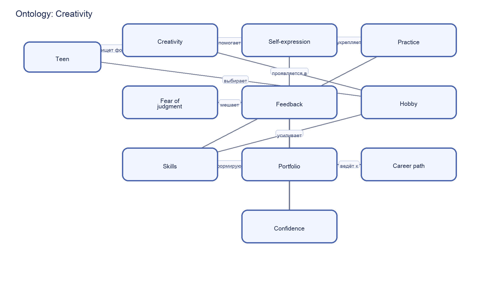

# Creativity – раздел 5 «Я и мир идей»

**Автор(ы)**:

Кучмистов Дмитрий М8О-103СВ-25

Подраздел: **Creativity**

---

## Что я делал

Кратко опишите:

- почему выбрали тему творчества;
- какие пять статей сделали (названия);
- как использовали WikiData и SPARQL;
- как строили онтологию (основные понятия и связи).

---

## Понятия и связи между ними

Опишите словами онтологию для этой темы. Например:

- **творчество**, **самовыражение**, **креативность**;
- **страх оценки**, **обратная связь**, **уверенность**;
- **хобби**, **навыки**, **портфолио**, **профессия**.

Сделайте список связей:

- A **развивает** B;
- A **поддерживает** B;
- A **может мешать** B и т.д.

---

## Схема онтологии

В папке `images/` разместите файл `ontology.png` со схемой понятий и связей.

---

## SPARQL‑запросы и данные

Опишите, какие запросы вы делали к WikiData:

- по каким понятиям искали данные (творчество, хобби, самовыражение, навыки);
- какие свойства вытягивали (описания, типы, связи между понятиями).

Скрипт с запросом: `scripts/wikidata_creativity_query.py`  
Результат выгрузки: `data/wikidata_export.json`.

---

## Как шла работа

Кратко по шагам:

- как выбирали понятия для карты темы;
- как искали сущности в WikiData;
- какие были сложности (многозначные термины, шум в выборке);
- как проверяли понятность статей для целевой аудитории.

---

## Личные ощущения

Опишите:

- что нового узнали о творчестве и самовыражении;
- что было сложнее — онтология, данные или тексты;
- что бы вы улучшили в следующей версии раздела.

