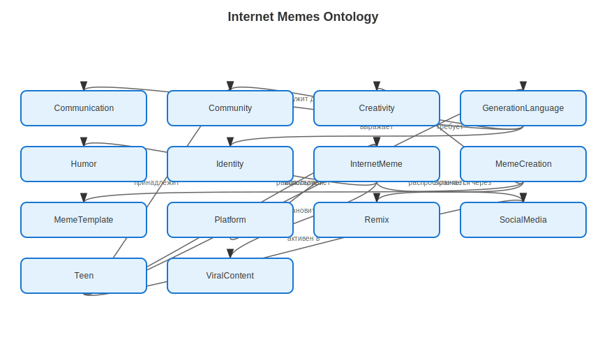

# Internet memes – раздел 5 «Я и мир идей»

**Автор(ы)**:

Ситдиков Ришат М8О-102СВ-25

Подраздел: **Internet memes**

---

## Что я делал

Кратко опишите:

- почему выбрали тему интернет-мемов;  
- какие три статьи сделали (названия);  
- как использовали WikiData и SPARQL;  
- как строили онтологию (основные понятия и связи).

---

## Понятия и связи между ними

Опишите словами онтологию для этой темы. Например:

- **интернет-мем**, **виральный контент**, **юмор**;  
- **создание мемов**, **креативность**, **шаблон**;  
- **язык поколения**, **коммуникация**, **сообщество**.

Сделайте список связей:

- A **становится** B;  
- A **использует** B;  
- A **служит для** B и т.д.

---

## Схема онтологии

В папке `images/` разместите файл, например `ontology.png`, со схемой понятий и связей.

---

## SPARQL‑запросы и данные

Опишите, какие запросы вы делали к WikiData:

- по каким понятиям искали данные (Internet meme, Viral video, Social media platforms и т.д.);  
- какие свойства интересовали (описания, типы, связи с платформами).

Скрипт с запросом: `scripts/wikidata_memes_query.py`  
Результат выгрузки: `data/wikidata_export.json`.

---

## Как шла работа

Кратко по шагам:

- как выбирали понятия для онтологии;  
- как искали их в WikiData;  
- какие были сложности (мало данных, сложные термины);  
- как придумывали примеры и объяснения в статьях.

---

## Личные ощущения

Опишите:

- изменилось ли ваше отношение к мемам и интернет-культуре;  
- что понравилось больше — код, онтология или тексты;  
- что бы вы развили дальше в этом разделе.
