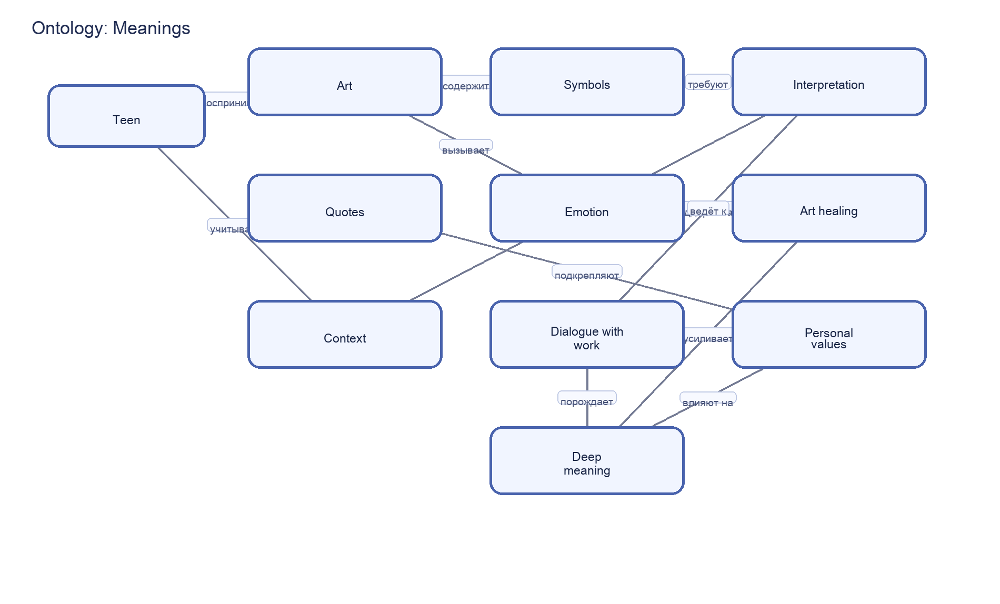

# Meanings – раздел 5 «Я и мир идей»

**Автор(ы)**:

Кучмистов Дмитрий М8О-103СВ-25

Подраздел: **Meanings**

---

## Что я делал

Кратко опишите:

- почему выбрали тему смыслов;
- какие пять статей сделали (названия);
- как использовали WikiData и SPARQL;
- как строили онтологию (основные понятия и связи).

---

## Понятия и связи между ними

Опишите словами онтологию для этой темы. Например:

- **смысл**, **интерпретация**, **контекст**;
- **цитата**, **ценности**, **личный опыт**;
- **искусство**, **эмоции**, **арт-терапия**.

Сделайте список связей:

- A **объясняется через** B;
- A **усиливает** B;
- A **влияет на** B и т.д.

---

## Схема онтологии

В папке `images/` разместите файл `ontology.png` со схемой понятий и связей.

---

## SPARQL‑запросы и данные

Опишите, какие запросы вы делали к WikiData:

- по каким понятиям искали данные (смысл, интерпретация, цитата, символика);
- какие свойства вытягивали (описания, типы, родственные понятия).

Скрипт с запросом: `scripts/wikidata_meanings_query.py`  
Результат выгрузки: `data/wikidata_export.json`.

---

## Как шла работа

Кратко по шагам:

- как выбирали ключевые термины;
- как собирали связанные сущности в WikiData;
- какие были сложности с абстрактными понятиями;
- как проверяли тексты на понятность и полезность.

---

## Личные ощущения

Опишите:

- что нового узнали о том, как люди ищут смысл;
- что оказалось самым интересным и самым сложным;
- что бы доработали в следующей версии.

