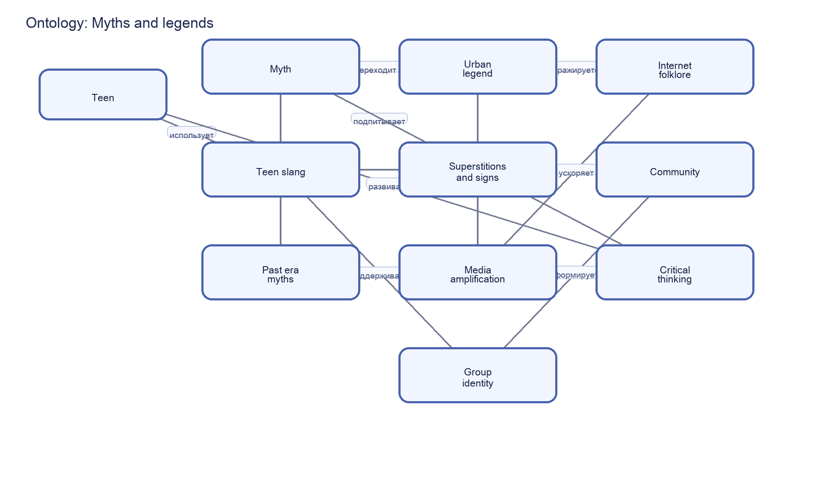

# Myths and legends – раздел 5 «Я и мир идей»

**Автор(ы)**:

Путилин Дмитрий М8О-102СВ-25

Подраздел: **Myths and legends**

---

## Что я делал

Кратко опишите:

- почему выбрали тему мифов и легенд;
- какие пять статей сделали (названия);
- как использовали WikiData и SPARQL;
- как строили онтологию (основные понятия и связи).

---

## Понятия и связи между ними

Опишите словами онтологию для этой темы. Например:

- **миф**, **городская легенда**, **фольклор**;
- **приметы**, **суеверия**, **ритуалы**;
- **подростковый сленг**, **интернет-истории**, **сообщество**.

Сделайте список связей:

- A **распространяется через** B;
- A **поддерживает** B;
- A **проверяется с помощью** B и т.д.

---

## Схема онтологии

В папке `images/` разместите файл `ontology.png` со схемой понятий и связей.

---

## SPARQL‑запросы и данные

Опишите, какие запросы вы делали к WikiData:

- по каким понятиям искали данные (мифы, фольклор, суеверия, сленг);
- какие свойства вытягивали (описания, типы, соседние сущности).

Скрипт с запросом: `scripts/wikidata_myths_legends_query.py`  
Результат выгрузки: `data/wikidata_export.json`.

---

## Как шла работа

Кратко по шагам:

- как определяли рамки темы;
- как фильтровали шумные и нерелевантные сущности;
- какие были сложности в различении мифа, факта и интерпретации;
- как делали тексты понятными и безопасными по тону.

---

## Личные ощущения

Опишите:

- что нового узнали про фольклор и интернет-культуру;
- что было самым сложным в этой теме;
- что бы добавили при следующем расширении раздела.

