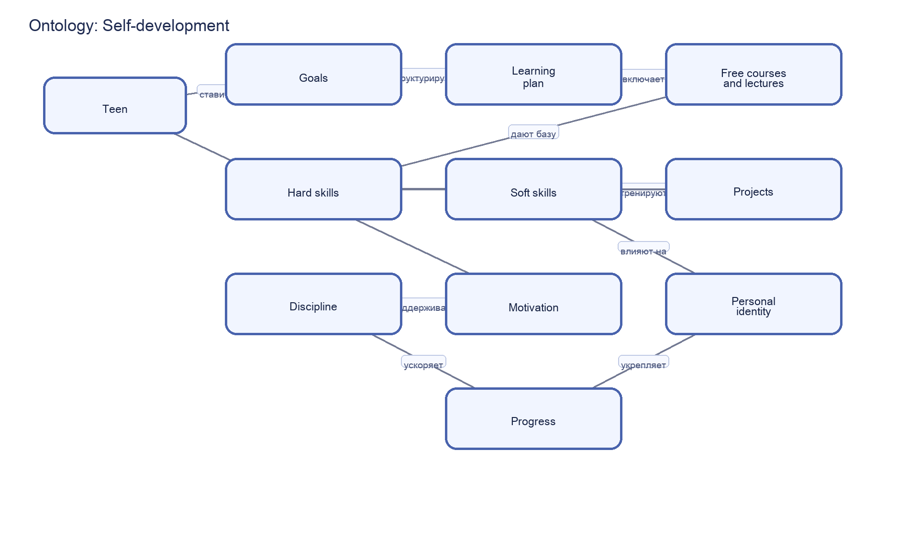

# Self-development – раздел 5 «Я и мир идей»

**Автор(ы)**:

Путилин Дмитрий М8О-102СВ-25

Подраздел: **Self-development**

---

## Что я делал

Кратко опишите:

- почему выбрали тему саморазвития;
- какие пять статей сделали (названия);
- как использовали WikiData и SPARQL;
- как строили онтологию (основные понятия и связи).

---

## Понятия и связи между ними

Опишите словами онтологию для этой темы. Например:

- **саморазвитие**, **цель**, **план обучения**;
- **hard skills**, **soft skills**, **практические проекты**;
- **мотивация**, **дисциплина**, **прогресс**.

Сделайте список связей:

- A **влияет на** B;
- A **помогает сформировать** B;
- A **проверяется через** B и т.д.

---

## Схема онтологии

В папке `images/` разместите файл `ontology.png` со схемой понятий и связей.

---

## SPARQL‑запросы и данные

Опишите, какие запросы вы делали к WikiData:

- по каким понятиям искали данные (образование, навыки, курсы, обучение);
- какие свойства интересовали (описания, instance of, связанные области).

Скрипт с запросом: `scripts/wikidata_self_development_query.py`  
Результат выгрузки: `data/wikidata_export.json`.

---

## Как шла работа

Кратко по шагам:

- как выбирали понятия и связывали их в структуру;
- как подбирали термины для SPARQL-запроса;
- какие были сложности с неоднозначными понятиями;
- как адаптировали объяснения под подростковую аудиторию.

---

## Личные ощущения

Опишите:

- что нового узнали о навыках и обучении;
- что было интереснее — онтология, сбор данных или тексты;
- что хотели бы расширить в будущем.

