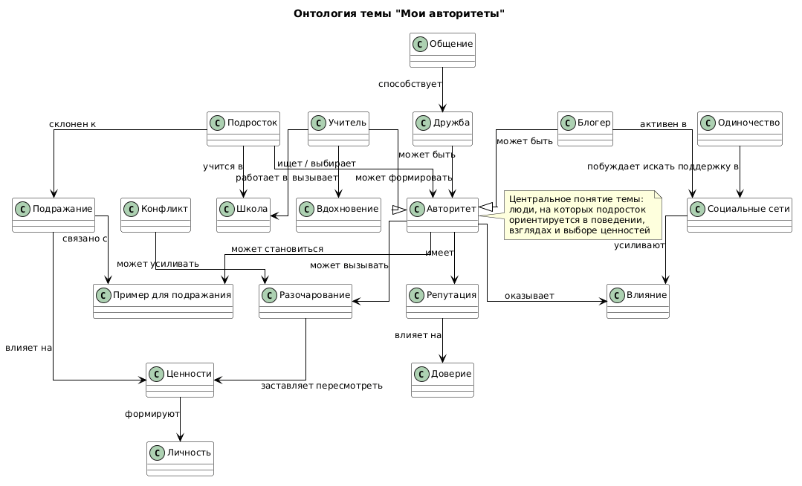

# Раздел 2: Я и ближний круг (Отношения)

# Тема 5: Мои авторитеты

## Участники и распределение обязанностей

**Журавлев Кирилл Игоревич**  
Группа **М8О-102СВ-25**

В рамках выполнения лабораторной работы были выполнены следующие задачи:

- анализ предметной области, связанной с темой авторитетов и примеров для подражания
- поиск соответствующих сущностей в базе знаний **Wikidata**
- составление **SPARQL-запросов** для извлечения информации
- получение и сохранение результатов запросов
- выделение ключевых понятий предметной области
- построение концептуальной модели (онтологии)
- создание схемы связей между выбранными темами
- генерация текстов статей с использованием **генеративных языковых моделей**
- подготовка структуры проекта и документации

В рамках темы были подготовлены статьи:

- **На кого я равняюсь и почему**
- **Блогеры как кумиры — в чем опасность**
- **Учителя, которые вдохновляют**
- **Когда авторитеты подводят (кумир оказался плохим)**
- **Как не потерять себя в подражании**

# Схема связей между темами

В рамках темы **«Мои авторитеты»** были рассмотрены различные источники влияния на подростков и способы формирования примеров для подражания.

Ключевые сущности предметной области:

- подросток  
- авторитет  
- пример для подражания  
- учитель  
- блогер  
- влияние  
- вдохновение  
- ценности  
- личность  
- доверие  
- репутация  
- разочарование  
- подражание  
- социальные сети  
- общение  
- дружба  
- конфликт  
- школа  

Основная логика связей между понятиями:

- **Подросток** ищет людей, которые могут стать для него **авторитетами**.
- **Авторитет** оказывает **влияние** на взгляды и поведение подростка.
- **Авторитет** может становиться **примером для подражания**.
- **Учитель** может становиться **авторитетом**, поскольку передает знания и способен вызывать **вдохновение**.
- **Блогер** может становиться **авторитетом** благодаря активности в **социальных сетях**.
- **Социальные сети** усиливают **влияние блогеров** на подростков.
- **Подражание** авторитетам влияет на формирование **ценностей** подростка.
- **Ценности** участвуют в формировании **личности**.
- **Репутация** человека влияет на уровень **доверия** к нему.
- Если поведение авторитета не соответствует ожиданиям, возникает **разочарование**.
- **Разочарование** может заставить подростка пересмотреть свои **ценности** и отношение к авторитетам.

Таким образом, онтология описывает систему социальных влияний и примеров, которые формируют мировоззрение подростков и их представления о том, на кого стоит равняться.

## Перекрестные связи с другими темами раздела

Поскольку тема **«Мои авторитеты»** является частью более широкого раздела **«Я и ближний круг»**, она имеет логические связи с другими темами.

### Связь с темой **«Моя дружба»**

- **Друзья** могут становиться **авторитетами** друг для друга.
- **Общение** с друзьями влияет на выбор **примеров для подражания**.

### Связь с темой **«Мои конфликты и ссоры»**

- **Разочарование** в авторитетах может приводить к **конфликтам**.
- **Конфликты** могут возникать из-за разных **ценностей** и взглядов.

### Связь с темой **«Мои отношения в школе»**

- **Учителя** играют важную роль в формировании **авторитетов**.
- **Школа** является средой, где подросток встречает людей, способных стать **вдохновляющими примерами**.

### Связь с темой **«Мое одиночество»**

- Отсутствие **авторитетов** и поддержки может усиливать чувство **одиночества**.
- В таких случаях подросток может искать авторитеты в **социальных сетях**.

# Схема онтологии

Ниже представлена визуальная схема связей между понятиями, использованными в данном разделе.



## Примеры SPARQL-запросов

Для извлечения знаний по теме **«Мои авторитеты»** использовались SPARQL-запросы к базе знаний **Wikidata**.  

С помощью запросов были получены описания сущностей и возможные связи между ними.

### Запрос 1: Получение описаний сущностей

```sparql
SELECT ?item ?itemLabel ?description WHERE {
  VALUES ?item {
    wd:Q131774
    wd:Q215627
    wd:Q37226
    wd:Q48282
    wd:Q8246794
    wd:Q2906862
    wd:Q30849
    wd:Q11024
    wd:Q3220391
    wd:Q3914
    wd:Q8434
    wd:Q659974
  }

  SERVICE wikibase:label { bd:serviceParam wikibase:language "ru,en". }

  OPTIONAL {
    ?item schema:description ?description .
    FILTER(LANG(?description) = "ru")
  }
}
```

Результат выполнения запроса сохранён в файле: [data/wikidata_export.json](data/wikidata_export.json)

### Запрос 2: Поиск связей между сущностями

```sparql
SELECT DISTINCT ?source ?sourceLabel ?property ?propertyLabel ?target ?targetLabel WHERE {
  VALUES ?source {
    wd:Q131774
    wd:Q37226
    wd:Q48282
    wd:Q11024
    wd:Q3220391
    wd:Q3914
    wd:Q8434
    wd:Q30849
  }

  VALUES ?directProp {
    wdt:P31
    wdt:P279
    wdt:P361
    wdt:P1269
    wdt:P1552
    wdt:P1889
  }

  ?source ?directProp ?target .
  FILTER(isIRI(?target))

  ?property wikibase:directClaim ?directProp .

  SERVICE wikibase:label {
    bd:serviceParam wikibase:language "ru,en"
  }
}
LIMIT 200
```

Данный запрос позволяет найти прямые связи между выбранными сущностями в базе знаний Wikidata.

Результат выполнения запроса сохранён в файле: [data/wikidata_export_contact.json](data/wikidata_export_contact.json)

### Используемые сущности Wikidata

| Сущность        | Wikidata ID | Описание                                              |
| --------------- | ----------- | ----------------------------------------------------- |
| Подросток       | Q131774     | человек в подростковом возрасте                       |
| Авторитет       | Q215627     | человек, обладающий признанным влиянием или уважением |
| Учитель         | Q37226      | человек, занимающийся обучением других                |
| Блогер          | Q48282      | человек, ведущий блог или создающий онлайн-контент    |
| Социальная сеть | Q3220391    | онлайн-платформа для общения и обмена информацией     |
| Общение         | Q11024      | процесс обмена информацией между людьми               |
| Влияние         | Q36161      | способность воздействовать на взгляды или поведение   |
| Ценности        | Q188272     | устойчивые жизненные ориентиры человека               |
| Репутация       | Q8425       | общественное мнение о человеке                        |
| Вдохновение     | Q12097      | состояние, побуждающее к творчеству или развитию      |

## Процесс работы

Работа над темой выполнялась в несколько этапов:

- Анализ раздела и выбор темы **«Мои авторитеты»**, посвященной роли людей, оказывающих влияние на подростков

- Определение ключевых понятий, связанных с формированием авторитетов и подражания в подростковой среде

- Выделение основных сущностей

- Поиск соответствующих сущностей в базе знаний **Wikidata**

- Формирование **SPARQL-запросов** для извлечения данных из базы знаний.

- Получение результатов запросов и сохранение их в формате **JSON** для дальнейшего анализа

- Построение **концептуальной модели предметной области**, описывающей влияние различных авторитетов на подростка 

- Создание **визуальной схемы онтологии** с помощью PlantUML, отображающей связи между ключевыми понятиями

- Генерация cтаей для детской энциклопедии с использованием **генеративных моделей искусственного интеллекта**. 

В результате была сформирована онтология, описывающая процесс формирования авторитетов у подростков, источники влияния (учителя, блогеры и другие значимые люди), а также возможные последствия подражания.

В ходе выполнения SPARQL-запросов было обнаружено, что в Wikidata многие социально-психологические понятия (например, подражание, авторитет или вдохновение) имеют ограниченное количество прямых связей между собой. Поэтому итоговая онтология была дополнена и структурирована вручную на основе анализа темы и логических связей между понятиями.


## Личные ощущения от работы

Работа над данной темой позволила познакомиться с базой знаний **Wikidata** и языком запросов **SPARQL**, а также понять, как можно извлекать знания из графовых баз данных.

Тема **авторитетов** оказалась интересной для анализа, поскольку она напрямую связана с формированием личности подростка и его мировоззрения. В современном обществе источниками влияния могут выступать как реальные люди (например, учителя), так и медийные личности из социальных сетей.

Особенно полезным оказалось построение **концептуальной модели**, поскольку это позволило увидеть, каким образом различные факторы — влияние, подражание, ценности и доверие — связаны между собой и формируют отношение подростка к авторитетам.

Основной сложностью стало то, что многие понятия, связанные с социальными отношениями и психологией, не имеют явных связей в базе знаний Wikidata. Поэтому значительная часть онтологии была сформирована на основе анализа предметной области и дополнена вручную.

В целом выполнение работы позволило лучше понять принципы **представления знаний**, построения **графов знаний** и использования **генеративного искусственного интеллекта** для создания образовательных текстов.