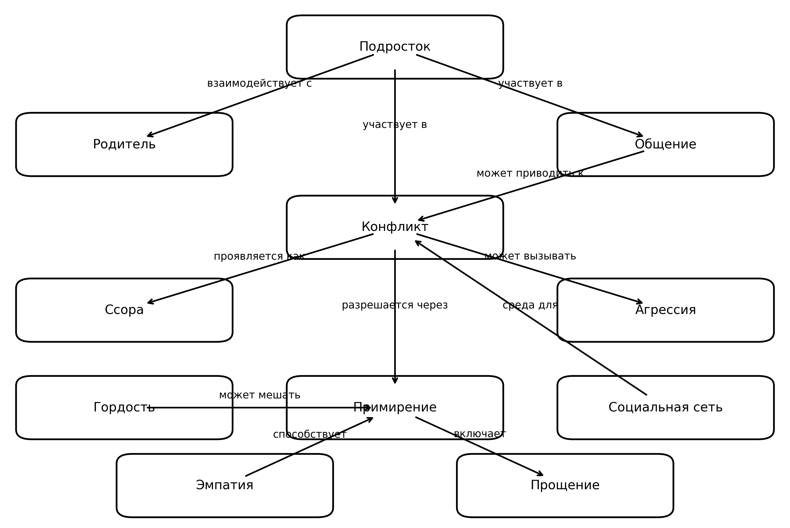

# 📘 Тема 7: Мои конфликты и ссоры

# Раздел: Мои конфликты и ссоры

## Участники и распределение обязанностей

**Русаков Александр Владиславович**  
Группа **М8О-103СВ-25**

В рамках выполнения задания были выполнены следующие задачи:

- изучение существующих знаний по теме в базе Wikidata
- составление SPARQL-запросов
- получение данных из Wikidata
- анализ полученных результатов
- выделение ключевых понятий предметной области
- построение концептуальной модели (онтологии)
- создание схемы связей между понятиями
- генерация текстов для энциклопедии с помощью ИИ
- подготовка структуры проекта и документации


## Схема связей между темами

В рамках темы **«Мои конфликты и ссоры»** были выделены основные понятия, связанные с возникновением, протеканием и разрешением конфликтов в подростковой среде.

Ключевые сущности предметной области:

- подросток  
- родитель  
- конфликт  
- ссора  
- агрессия  
- общение  
- примирение  
- прощение  
- гордость  
- эмпатия  
- социальная сеть  

Основная логика связей между понятиями:

- **Подросток** взаимодействует с **родителем** и участвует в **общении**.
- **Общение** может приводить к **конфликту**.
- **Конфликт** проявляется как **ссора** и может вызывать **агрессию**.
- **Конфликт** разрешается через **примирение**.
- **Гордость** может мешать **примирению**.
- **Эмпатия** способствует **примирению**.
- **Примирение** включает **прощение**.
- **Социальная сеть** является средой для **конфликтов**.
- **Подросток** использует **социальные сети** для общения, где также могут возникать конфликты.

Таким образом, онтология описывает полный цикл конфликта: от возникновения через эскалацию до разрешения, включая факторы, которые мешают и помогают примирению.

## Схема онтологии

Ниже представлена визуальная схема связей между понятиями.



## Примеры SPARQL-запросов

Для извлечения знаний из базы Wikidata использовались SPARQL-запросы.

### Запрос 1: Получение описаний сущностей

```sparql
SELECT ?item ?itemLabel ?description WHERE {
    VALUES ?item {
    wd:Q131774
    wd:Q180684
    wd:Q16546845
    wd:Q7566
    wd:Q191797
    wd:Q378529
    wd:Q537963
    wd:Q3071551
    wd:Q182263
    wd:Q11024
    wd:Q3220391
    }

  SERVICE wikibase:label { bd:serviceParam wikibase:language "ru,en". }
  OPTIONAL {
    ?item schema:description ?description
    FILTER(LANG(?description) = "ru")
  }
}
```

Результат выполнения запроса сохранён в файле: [data/wikidata_export.json](data/wikidata_export.json)

### Запрос 2: Поиск связей между сущностями

```sparql
SELECT ?source ?sourceLabel ?property ?propertyLabel ?target ?targetLabel WHERE {
  VALUES ?source {
    wd:Q131774
    wd:Q180684
    wd:Q16546845
    wd:Q7566
    wd:Q191797
    wd:Q378529
    wd:Q537963
    wd:Q3071551
    wd:Q182263
    wd:Q11024
    wd:Q3220391
  }

  VALUES ?target {
    wd:Q131774
    wd:Q180684
    wd:Q16546845
    wd:Q7566
    wd:Q191797
    wd:Q378529
    wd:Q537963
    wd:Q3071551
    wd:Q182263
    wd:Q11024
    wd:Q3220391
  }

  ?source ?directProp ?target .
  ?property wikibase:directClaim ?directProp .

  FILTER(?source != ?target)

  SERVICE wikibase:label {
    bd:serviceParam wikibase:language "ru,en" .
  }
}
```

Данный запрос позволяет найти прямые связи между выбранными сущностями в базе знаний Wikidata.

Результат выполнения запроса сохранён в файле: [data/wikidata_export_contact.json](data/wikidata_export_contact.json)

### Используемые сущности Wikidata

| Сущность | Wikidata ID | Описание |
|----------|-------------|----------|
| Подросток | Q131774 | человек в подростковом возрасте |
| Конфликт | Q180684 | существование и последствия взаимно несовместимых взглядов, позиций или интересов |
| Ссора | Q16546845 | акт спора |
| Родитель | Q7566 | прямой предок персоны или опекун |
| Агрессия | Q191797 | мотивированное деструктивное поведение |
| Примирение | Q378529 | восстановление дружеских отношений |
| Прощение | Q537963 | отказ от обиды и негативных чувств |
| Гордость | Q3071551 | состояние удовлетворённости собой |
| Эмпатия | Q182263 | осознанное сопереживание другому человеку |
| Общение | Q11024 | передача, обмен информацией |
| Социальная сеть | Q3220391 | онлайн-платформа для построения социальных отношений |

## Процесс работы

Работа над разделом выполнялась в несколько этапов.

Анализ предметной области и выбор темы «Мои конфликты и ссоры».

Определение ключевых понятий, описывающих конфликты, их причины и способы разрешения.

Поиск соответствующих сущностей в базе знаний Wikidata.

Формирование SPARQL-запросов для извлечения данных.

Получение результатов запросов и сохранение их в формате JSON.

Построение концептуальной модели предметной области.

Создание визуальной схемы онтологии с помощью matplotlib.

Генерация текстовых описаний понятий для энциклопедии с помощью генеративного ИИ (стиль: объяснение для десятилетнего ребёнка).

В результате была сформирована онтология, описывающая полный цикл межличностного конфликта — от его возникновения до примирения, включая деструктивные (агрессия, гордость) и конструктивные (эмпатия, прощение) факторы.

В результате выполнения SPARQL-запроса была найдена связь «частично совпадает с» между понятиями «ссора» и «конфликт». Остальные связи между абстрактными социально-психологическими понятиями в Wikidata представлены ограниченно, поэтому итоговая онтология была дополнена и структурирована вручную на основе анализа темы.


## Личные ощущения от работы

Работа над данной темой позволила познакомиться с базой знаний Wikidata и языком запросов SPARQL. Тема конфликтов оказалась интересной для анализа, поскольку она затрагивает важные для подростков вопросы — от ссор с родителями до конфликтов в социальных сетях.

Особенно полезным оказалось построение концептуальной модели, так как оно помогло увидеть конфликт как процесс с началом и возможным разрешением, а не как нечто однозначно негативное.

Основной сложностью оказалось то, что в Wikidata социально-психологические понятия не описаны явными связями. Поэтому значительная часть онтологии была выстроена на основе экспертного анализа предметной области.

В целом работа помогла лучше понять принципы построения графов знаний и их ограничения при описании абстрактных социальных явлений.
