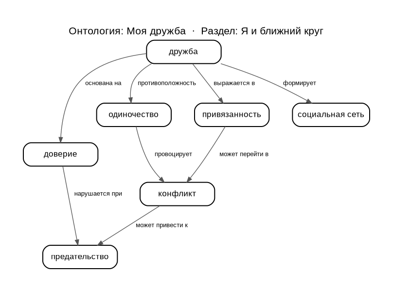

# Моя дружба

**Гришин Павел Федорович**, группа **М8О-103СВ-25**  
Раздел: Я и ближний круг (Отношения)

---

## Что я делал

Выбрал тему про дружбу — она третья в разделе про отношения. Написал три статьи, разобрался с WikiData и SPARQL, построил онтологию из понятий, которые удалось найти в базе.

## Понятия и связи между ними

Я выделил 7 понятий, которые описывают дружбу с разных сторон:

- **дружба** — центральное понятие, вокруг которого строится всё остальное
- **доверие** — без него дружба не существует
- **привязанность** — то, что удерживает людей рядом
- **социальная сеть** — пространство, в котором дружба живёт и развивается
- **одиночество** — то, от чего дружба спасает (и куда возвращает, если исчезает)
- **конфликт** — точка напряжения, которая есть в любых близких отношениях
- **предательство** — когда доверие сломалось

Как они связаны между собой:

- дружба **основана на** доверии, **выражается в** привязанности, **формирует** социальную сеть
- дружба — **противоположность** одиночества
- доверие **нарушается при** предательстве
- одиночество **провоцирует** конфликт
- привязанность **может перейти в** конфликт
- конфликт **может привести к** предательству

## Схема онтологии



## SPARQL-запрос

Использовал один запрос — на получение понятий и их описаний из WikiData:

```sparql
SELECT DISTINCT ?concept ?conceptLabel ?description WHERE {
  VALUES ?concept {
    wd:Q136685084 wd:Q659974 wd:Q223270 wd:Q2166722
    wd:Q2173366 wd:Q5283178 wd:Q180684
  }
  OPTIONAL {
    ?concept schema:description ?description
    FILTER(LANG(?description) = "ru")
  }
  SERVICE wikibase:label { bd:serviceParam wikibase:language "ru,en". }
}
```

Запрос на прямые связи между понятиями тоже писал, но WikiData вернула 0 результатов — абстрактные социальные концепты между собой там почти не связаны. Поэтому связи в онтологии расставлены вручную.

Результат запроса: [data/wikidata_export.json](data/wikidata_export.json)

## Как шла работа

Зашел Wikidata и искал там понятия похожие на те темы, по которым писались статьи в папке WEB.

Онтологию рисовал пробовал рисовать через Graphviz и Matplotlib, в итоге остановился на простой иерархической схеме на Graphviz.

Хотел сделать также автоматическое определение связей между понятиями, но прямых и очевидных связей запрос не выдавал

Статьи писал в разговорном стиле, ориентировался на подростковую аудиторию — это оказалось сложнее, чем казалось: хочется и по делу сказать, и не скатиться в занудство.

## Личные ощущения

Больше всего времени ушло не на код, а на то, чтобы найти правильные понятия в WikiData. База большая, но социальная тематика там покрыта слабо — многие очевидные связи просто отсутствуют.

Graphviz понравился, так минимум кода, результат сразу читаемый. SPARQL тоже оказался логичным, хотя поначалу синтаксис выглядит страшно.