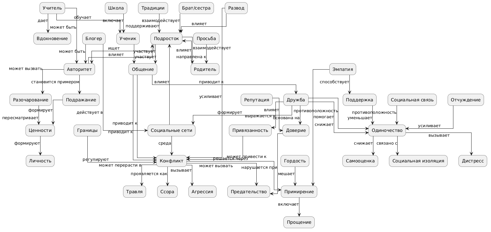

# 📘 Проект "Я и ближний круг"

Этот проект представляет собой образовательную базу знаний, посвящённую подростковым отношениям, социальному взаимодействию и формированию личности.

Материал оформлен в виде набора взаимосвязанных статей (графа знаний), объединённых общей тематикой и перекрёстными ссылками.


## 👥 Команда

- Журавлев К. И.  
- Катин И. В.  
- Кудрин Я. В.  
- Русаков А. В.  
- Суляева А. И.  
- Гришин П. Ф.  


## 🎯 Цель проекта

Создать структурированную базу знаний, которая:

- описывает важные аспекты подростковой жизни  
- показывает связи между понятиями (дружба, конфликт, семья и др.)  
- помогает лучше понять социальные процессы  
- представлена в виде связанного графа знаний  


## 🧠 Предметная область

Проект охватывает тему:

> **"Мои отношения с окружающими"**

Включает следующие направления:

- авторитеты и примеры для подражания  
- конфликты и способы их решения  
- семья и внутрисемейные отношения  
- дружба и социальные связи  
- одиночество и внутренние состояния  
- отношения в школе  


## 🗂 Структура проекта

Проект разделён на две основные части:

### 📁 WORK
Содержит:
- описание концептов (`concepts.json`)
- SPARQL-запросы к Wikidata
- скрипты обработки данных
- онтологии и промежуточные результаты

### 📁 WEB
Содержит:
- готовые статьи в формате Markdown  
- взаимосвязанные тексты (гипертекст)  
- итоговую базу знаний для пользователя  


## 🔗 Перекрёстные ссылки

В проекте реализована система автоматической расстановки ссылок между понятиями.

### Как это работает:

- используется файл `link_targets.json`
- задаются:
  - концепт
  - целевой файл
  - словоформы (aliases)
- Python-скрипт:
  - находит слова в тексте
  - заменяет их на markdown-ссылки
  - учитывает падежи и формы слов

Пример:

```md
родителями → [родителями](../../My_family/concepts/parents.md)
```

## ⚙️ Используемые технологии

- **Markdown** — для написания статей  
- **Python** — для обработки текстов и автоматизации  
- **Wikidata + SPARQL** — для извлечения знаний  
- **JSON** — для хранения концептов и связей  
- **NetworkX / matplotlib** — для визуализации графов  


## 🌐 Работа с Wikidata

Для получения данных использовались SPARQL-запросы:

- извлечение сущностей  
- поиск связей между понятиями  
- экспорт результатов в JSON  

Это позволило:

- дополнить онтологию  
- связать понятия с реальными базами знаний  


## 🧩 Онтология

В рамках проекта была разработана концептуальная модель, включающая:

- не менее 15 понятий  
- иерархические связи  
- горизонтальные связи (например: **конфликт → примирение**)  

Онтология отражает:

- процессы (например, развитие конфликта)  
- роли (ученик, родитель, учитель)  
- состояния (одиночество, доверие)



## 💡 Особенности проекта

- тексты написаны в доступном стиле  
- используется объяснение «как для подростка»  
- каждая статья связана с другими  
- проект представляет собой **граф знаний**, а не просто набор текстов  

## 📌 Вывод

В результате проекта была создана:

- структурированная база знаний  
- связанный гипертекст  
- онтология предметной области  
- инструменты автоматизации  
