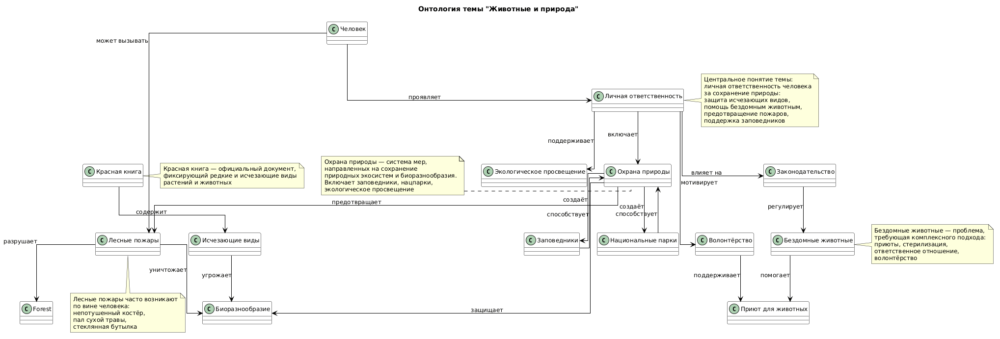

# Раздел 8: Я и ПЛАНЕТА (Экология и мир вокруг)
## Тема 4: Животные и природа

**Участники и распределение обязанностей**  
Федулов Дмитрий Андреевич

Группа М8О-103СВ-25

---

##  Выполненные задачи

В рамках выполнения лабораторной работы были выполнены следующие задачи:

- анализ предметной области, связанной с темой охраны природы, исчезающих видов, бездомных животных, лесных пожаров и заповедников
- поиск соответствующих сущностей в базе знаний Wikidata
- составление SPARQL-запросов для извлечения информации
- получение и сохранение результатов запросов
- выделение ключевых понятий предметной области
- построение концептуальной модели (онтологии)
- создание схемы связей между выбранными темами
- генерация текстов статей с использованием генеративных языковых моделей
- подготовка структуры проекта и документации

---

##  Подготовленные статьи

В рамках темы были подготовлены статьи:

1. Красная книга и исчезающие виды
2. Как помочь бездомным животным
3. Лесные пожары — кто виноват
4. Заповедники и национальные парки

---

## Схема связей между темами

В рамках темы **«Животные и природа»** были рассмотрены различные аспекты взаимодействия человека с природой, угрозы для дикой природы и способы её сохранения.

### Ключевые сущности предметной области:

| Сущность | Описание |
|----------|---------|
| человек | источник воздействия на природу |
| личная ответственность | осознанное отношение к окружающему миру |
| Красная книга | документ, фиксирующий редкие и исчезающие виды |
| исчезающие виды | виды, находящиеся под угрозой вымирания |
| бездомные животные | животные, не имеющие хозяина |
| приют для животных | учреждение для содержания бездомных животных |
| лесные пожары | неконтролируемое горение лесных массивов |
| заповедники | особо охраняемые природные территории |
| национальные парки | охраняемые территории с возможностью экотуризма |
| охрана природы | система мер по сохранению природы |
| биоразнообразие | разнообразие видов в экосистеме |
| волонтёрство | добровольная помощь природе и животным |
| экологическое просвещение | образование в области охраны природы |
| законодательство | правовые нормы защиты природы |

---

### Основная логика связей между понятиями:

1. **Человек** проявляет **личную ответственность** за сохранение природы.
2. **Личная ответственность** включает:
   - **охрану природы** (защита экосистем)
   - **волонтёрство** (помощь животным)
   - **экологическое просвещение** (образование)
   - поддержку **законодательства** (правовая защита)

3. **Красная книга** содержит перечень **исчезающих видов**, которым угрожает утрата **биоразнообразия**.

4. **Бездомные животные** нуждаются в помощи:
   - **приюты для животных** оказывают временный приют
   - **волонтёрство** поддерживает работу приютов
   - **законодательство** регулирует обращение с животными

5. **Лесные пожары**:
   - часто возникают **по вине человека**
   - приводят к **вырубке лесов**
   - уничтожают **биоразнообразие**
   - могут предотвращаться мерами **охраны природы**

6. **Заповедники** и **национальные парки**:
   - создаются в рамках **охраны природы**
   - способствуют сохранению **биоразнообразия**
   - позволяют вести экологическое просвещение

---

## Перекрестные связи с другими темами раздела

Поскольку тема **«Животные и природа»** является частью более широкого раздела **«Я и ПЛАНЕТА»**, она имеет логические связи с другими темами.

### Связь с темой **«Мой след на планете»**
- **Загрязнение пластиком и мусором** влияет на среду обитания животных
- **Углеродный след** и изменение климата угрожают экосистемам
- **Осознанное потребление** помогает сохранять природные ресурсы

### Связь с темой **«Раздельный сбор и переработка»**
- **Сортировка отходов** предотвращает попадание мусора в леса и водоёмы
- **Переработка** снижает нагрузку на природные экосистемы

### Связь с темой **«Осознанное потребление»**
- Выбор экологичных товаров помогает сохранять **биоразнообразие**
- Отказ от одноразового пластика снижает угрозу для животных

### Связь с темой **«Климат и будущее»**
- **Лесные пожары** усиливают изменение климата
- **Изменение климата** угрожает исчезающим видам
- **Заповедники** помогают сохранять виды в условиях меняющегося климата

### Связь с темой **«Что я могу сделать прямо сейчас»**
- **Помощь бездомным животным** — конкретное действие
- **Волонтёрство в заповедниках** — реальный вклад
- **Экологическое просвещение** начинается с личного примера

---

##  Схема онтологии

Ниже представлена визуальная схема связей между понятиями, использованными в данном разделе.



---

##  Примеры SPARQL-запросов

Для извлечения знаний по теме **«Животные и природа»** использовались SPARQL-запросы к базе знаний Wikidata.

### Запрос 1: Получение описаний сущностей

```sparql
SELECT DISTINCT ?item ?itemLabel ?description WHERE {
  VALUES ?item {
    wd:Q552725     # Красная книга России
    wd:Q11394      # Исчезающий вид
    wd:Q2858709    # Приют для животных
    wd:Q161700     # Бродячая собака
    wd:Q107434304  # Лесной пожар
    wd:Q169950     # Природный пожар
    wd:Q46169      # Национальный парк
    wd:Q473972     # Заповедник
    wd:Q832237     # Охрана окружающей среды
  }

  SERVICE wikibase:label { bd:serviceParam wikibase:language "ru,en". }

  OPTIONAL {
    ?item schema:description ?description .
    FILTER(LANG(?description) = "ru")
  }
}
```
Результат выполнения запроса сохранён в файлах:

data/wikidata_redbook.json — Красная книга и исчезающие виды

data/wikidata_stray.json — Бездомные животные и приюты

data/wikidata_wildfire.json — Лесные пожары

data/wikidata_protected.json — Заповедники и национальные парки

### Запрос 2: Поиск связей между сущностями

``` sparql
SELECT DISTINCT ?source ?sourceLabel ?property ?propertyLabel ?target ?targetLabel WHERE {
  VALUES ?source {
    wd:Q552725     # Красная книга России
    wd:Q11394      # Исчезающий вид
    wd:Q2858709    # Приют для животных
    wd:Q161700     # Бродячая собака
    wd:Q107434304  # Лесной пожар
    wd:Q169950     # Природный пожар
    wd:Q46169      # Национальный парк
    wd:Q473972     # Заповедник
    wd:Q832237     # Охрана окружающей среды
    wd:Q219416     # Устойчивость окружающей среды
  }

  VALUES ?directProp {
    wdt:P31        # экземпляр
    wdt:P279       # подкласс
    wdt:P361       # часть
    wdt:P1542      # влияет на
    wdt:P921       # основная тема
    wdt:P1269      # сфера деятельности
    wdt:P1889      # отличается от
  }

  ?source ?directProp ?target .
  FILTER(isIRI(?target))

  ?property wikibase:directClaim ?directProp .

  SERVICE wikibase:label {
    bd:serviceParam wikibase:language "ru,en"
  }
}
LIMIT 200
```
Данный запрос позволяет найти прямые связи между выбранными сущностями в базе знаний Wikidata.

Результат выполнения запроса сохранён в файле: data/wikidata_export.json

##  Используемые сущности Wikidata

| Сущность | Wikidata ID | Описание |
|----------|-------------|----------|
| Красная книга России | Q552725 | официальный документ о редких и исчезающих видах |
| Исчезающий вид | Q11394 | вид, находящийся под угрозой вымирания |
| Приют для животных | Q2858709 | учреждение для содержания бездомных животных |
| Бродячая собака | Q161700 | собака, не имеющая хозяина |
| Лесной пожар | Q107434304 | неконтролируемое горение в лесной зоне |
| Природный пожар | Q169950 | неконтролируемый пожар на природных территориях |
| Национальный парк | Q46169 | охраняемая природная территория |
| Заповедник | Q473972 | особо охраняемая природная территория |
| Охрана окружающей среды | Q832237 | деятельность по сохранению природы |
| Устойчивость окружающей среды | Q219416 | способность экосистем сохранять равновесие |
| Биоразнообразие | Q47041 | разнообразие видов в экосистеме |
| Вырубка лесов | Q169940 | уничтожение лесных массивов |

---

##  Процесс работы

Работа над темой выполнялась в несколько этапов:

1. **Анализ раздела** и выбор темы «Животные и природа», посвящённой взаимодействию человека с природой, угрозам для дикой природы и способам её сохранения.

2. **Определение ключевых понятий**, связанных с охраной природы, исчезающими видами, бездомными животными, лесными пожарами и заповедниками.

3. **Выделение основных сущностей** и поиск соответствующих им объектов в базе знаний Wikidata.

4. **Формирование SPARQL-запросов** для извлечения данных из базы знаний.

5. **Получение результатов запросов** и сохранение их в формате JSON для дальнейшего анализа.

6. **Построение концептуальной модели** предметной области, описывающей связи между человеком, природой, угрозами и способами защиты.

7. **Создание визуальной схемы онтологии** с помощью PlantUML, отображающей связи между ключевыми понятиями.

8. **Генерация статей** для детской энциклопедии с использованием генеративных моделей искусственного интеллекта.

9. **Оформление структуры проекта** и подготовка документации.

---

##  Личные ощущения от работы

Работа над данной темой позволила познакомиться с базой знаний **Wikidata** и языком запросов **SPARQL**, а также понять, как можно извлекать знания из графовых баз данных.

Тема **«Животные и природа»** оказалась особенно интересной для анализа, поскольку она затрагивает вопросы, волнующие многих людей: сохранение редких видов, помощь бездомным животным, предотвращение лесных пожаров и защита заповедных территорий.

Особенно полезным оказалось **построение концептуальной модели**, поскольку это позволило увидеть, каким образом различные факторы — Красная книга, лесные пожары, приюты для животных и заповедники — связаны между собой и формируют общее представление о взаимодействии человека и природы.

**Основной сложностью** стало то, что многие понятия, связанные с экологией и охраной природы, не имеют явных связей в базе знаний Wikidata. Поэтому значительная часть онтологии была сформирована на основе анализа предметной области и дополнена вручную.

В целом выполнение работы позволило лучше понять принципы представления знаний, построения графов знаний и использования генеративного искусственного интеллекта для создания образовательных текстов.