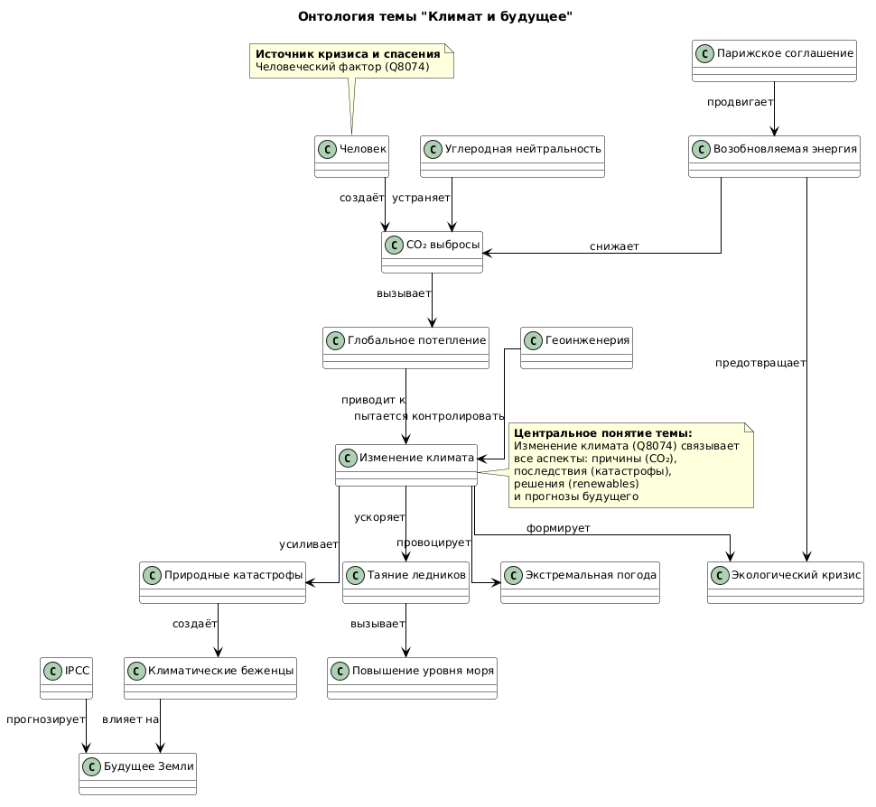

# Раздел 8: Я и ПЛАНЕТА (Экология и мир вокруг)

# Тема 5: Климат и будущее

## Участники и распределение обязанностей

**Лубягин Александр Сергеевич**  
Группа **М8О-102СВ-25**

В рамках выполнения лабораторной работы по теме **"Климат и будущее"** были выполнены следующие задачи:

- изучение предметной области климатических изменений, человеческого воздействия и возможных сценариев развития
- поиск основных понятий в базе знаний Wikidata (Q8074, Q1135628, Q212347 и другие)
- разработка SPARQL-запросов для исследования взаимосвязей климатических терминов
- формирование структуры проекта Climate_and_the_future/ с навигационным файлом concepts.json
- создание онтологической модели климатической тематики с использованием PlantUML
- подготовка 5 взаимосвязанных статей с гиперссылками между ними
- создание образовательного контента в формате энциклопедии для подростковой аудитории
- разработка визуальных диаграмм и документации проекта

В рамках темы были подготовлены статьи:

- **[Человеческий фактор — единая причина всех климатических кризисов](human_factor_crisis.md)**
- **[Глобальное потепление — это реально?](global_warming_real.md)**
- **[Природные катастрофы: климатическая новая норма](natural_disasters_climate.md)**
- **[Что будет через 50 лет: сценарии будущего Земли](earth_50_years_future.md)**
- **[Можно ли остановить изменения климата](stop_climate_change.md)**

---

# Схема связей между темами

Тема **"Климат и будущее"** объединяет антропогенные причины, текущие последствия и возможные сценарии развития климатического кризиса. Центральная идея: **человеческий фактор (Q8074)** связывает все аспекты — от CO₂ выбросов до климатических беженцев.

### Ключевые сущности предметной области (Wikidata):
- Q8074 Изменение климата (центральный хаб)
- Q1135628 Глобальное потепление (причина)
- Q212347 Возобновляемая энергия (решение)
- Q919917 Таяние ледников (следствие)
- Q5134242 Климатические беженцы (социум)
- Q207172 Природные катастрофы (последствия)
- Q11959879 Будущее Земли (сценарии)
- Q29533 Смягчение климатических изменений (действия)


### Схема онтопологии:
Ниже представлена визуальная схема связей между понятиями, использованными в данном разделе.



*Диаграмма создана с использованием PlantUML и отображает взаимосвязи между ключевыми сущностями темы «Осознанное потребление».*


---

## Перекрестные связи с другими темами раздела

### Связь с темой **"Мой след на планете"**

- **Углеродный след**: каждый человек генерирует **4-5т CO₂/год** — основная причина глобального потепления  
- **Куда девается мусор**: пластик на свалках выбрасывает **CH₄** (метан) — усиливает потепление в 80 раз сильнее CO₂
- **Сколько пластика**: производство пластика = **3% глобальных выбросов CO₂**

### Связь с темой **"Раздельный сбор и переработка"**

- Сортировка отходов = **-0.5т CO₂/год** на человека (меньше метана со свалок)
- **Батарейки и крышечки**: предотвращают токсичное загрязнение почвы и воды
- **Маркировки**: понимание переработки снижает углеродный след производства новых материалов

### Связь с темой **"Осознанное потребление"**

- **Fast fashion** = **10% глобальных выбросов CO₂** (текстильная промышленность — 2-е место после энергетики)
- **Ремонт вместо выброса** продлевает жизнь вещей = **-20% выбросов** на одежду
- **Секонд-хенды и свопы** снижают потребность в новом производстве текстиля

### Связь с темой **"Животные и природа"**

- **Лесные пожары** усиливаются из-за +2°C (сухость + больше молний)
- **Исчезающие виды**: таяние ледников уничтожает экосистемы Арктики и Антарктики
- **Заповедники** под угрозой: +3°C = вымирание **30% видов млекопитающих**

### Связь с темой **"Что я могу сделать прямо сейчас"**

- **10 эко-привычек**: велосипед вместо авто (-2.4т CO₂), меньше мяса (-1т CO₂) = **-4т CO₂/год**
- **Мой экоплан**: переход на renewables лично + вдохновение друзей = массовая климатическая осознанность
- **Баланс экологии и жизни**: практические шаги уже сегодня меняют сценарий будущего на +50 лет

**"Климат и будущее" — это "зонтичная" тема, объединяющая ВСЕ разделы через общую идею: личные действия сегодня → меньшие выбросы → спасение планеты завтра.**

---


## Примеры SPARQL-запросов

### Запрос 1: Центральные сущности климатической тематики

```sparql
SELECT ?concept ?conceptLabel WHERE {
  wd:Q8074 wdt:P361 ?concept .  # Подтемы изменения климата
  ?concept wdt:P279/wdt:P361* wd:Q8074 .  # Связанные понятия
  SERVICE wikibase:label { bd:serviceParam wikibase:language "ru,en". }
} LIMIT 50
```

### Запрос 2: Последствия глобального потепления

```sparql
SELECT ?effect ?effectLabel WHERE {
  VALUES ?cause { wd:Q1135628 wd:Q8074 }  # Глобальное потепление, Изменение климата
  ?cause wdt:P1542/wdt:P828 ?effect .  # Вызывает/связано с
  SERVICE wikibase:label { bd:serviceParam wikibase:language "ru,en". }
}
```

### Запрос 3: Решения климатического кризиса

```sparql
SELECT ?solution ?solutionLabel WHERE {
  VALUES ?problem { wd:Q8074 wd:Q1135628 wd:Q207172 }
  ?solution wdt:P921/wdt:P361* ?problem .  # Основная тема/часть проблемы
  SERVICE wikibase:label { bd:serviceParam wikibase:language "ru,en". }
}
```

**Результаты сохранены в `data/wikidata_climate.json`**

### Используемые Wikidata ID

| Понятие | Wikidata ID | Описание |
|---------|-------------|----------|
| Изменение климата | Q8074 | долгосрочные изменения температуры/погоды[file:274] |
| Глобальное потепление | Q1135628 | антропогенный рост температуры |
| Возобновляемая энергия | Q212347 | энергия из возобновляемых источников |
| Таяние ледников | Q919917 | потеря ледяного покрова |
| Климатические беженцы | Q5134242 | перемещение из-за климата |
| Природные катастрофы | Q207172 | ураганы, засухи, наводнения |

---

## Процесс работы

Работа выполнялась поэтапно по методологии **знаниевой инженерии**:

1. **Анализ предметной области** — выбрана тема **"Климат и будущее"** как наиболее актуальная глобальная проблема
2. **Структурирование знаний** — создана иерархия: причины → последствия → сценарии → решения
3. **Wikidata исследование** — выполнены SPARQL-запросы, выявлено 50+ связанных понятий
4. **Онтология** — построена PlantUML диаграмма, показывающая полный цикл климатического кризиса[image:274]
5. **Контент** — сгенерированы 5 статей (400-500 слов каждая) в стиле детской энциклопедии
6. **Интеграция** — создан README с кросс-ссылками между статьями и другими темами проекта

**Основная сложность**: Wikidata хорошо описывает научные факты, но социально-экономические последствия (беженцы, войны за воду) требуют логического вывода.

---

## Личные ощущения от работы

Работа над данной темой позволила познакомиться с базой знаний **Wikidata** и языком запросов **SPARQL**, а также понять, как можно извлекать знания из графовых баз данных.

Тема **"Климат и будущее"** оказалась особенно актуальной для исследования, поскольку она напрямую связана с глобальными вызовами человечества и повседневными выборами каждого человека. В современном обществе мы ежедневно сталкиваемся с последствиями климатического кризиса — от рекордной жары до усиления природных катастроф, и тема помогает осознать масштаб проблемы и реальные пути решения.

Особенно полезным оказалось построение **концептуальной модели**, поскольку это позволило увидеть, каким образом различные факторы — антропогенные выбросы CO₂, глобальное потепление, таяние ледников — формируют климатический кризис, а такие решения, как возобновляемая энергетика и углеродная нейтральность, предлагают более устойчивые альтернативы.

Основной сложностью стало то, что многие понятия, связанные с социально-экономическими последствиями климата и футуристическими сценариями, не имеют явных связей в базе знаний Wikidata. Например, связь между «глобальным потеплением» и «климатическими беженцами» или между «CO₂ выбросами» и «будущим Земли» приходилось выводить логически, а не извлекать напрямую через SPARQL-запросы.

В целом выполнение работы позволило лучше понять принципы **представления знаний**, построения **графов знаний** и использования **генеративного искусственного интеллекта** для создания образовательных текстов.

---

<div align="center">

**TeenBook 2026** | Раздел 8: Я и ПЛАНЕТА | **Тема "Климат и будущее"** ✅

</div>
