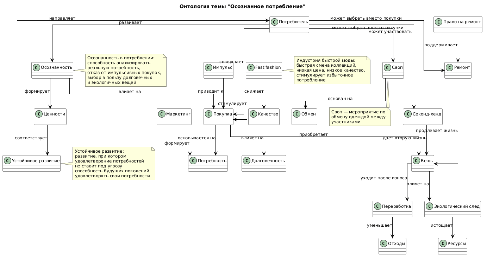

# Раздел 8: Я и ПЛАНЕТА (Экология и мир вокруг)

# Тема 3: Осознанное потребление

## Участники и распределение обязанностей

**Браташ Максим Алексеевич**  
Группа **М8О-105СВ-25**

В рамках выполнения лабораторной работы были выполнены следующие задачи:

- анализ предметной области, связанной с темой осознанного потребления, экологичного подхода к покупкам и обращению с вещами
- поиск соответствующих сущностей в базе знаний **Wikidata**
- составление **SPARQL-запросов** для извлечения информации
- получение и сохранение результатов запросов
- выделение ключевых понятий предметной области
- построение концептуальной модели (онтологии)
- создание схемы связей между выбранными темами
- генерация текстов статей с использованием **генеративных языковых моделей**
- подготовка структуры проекта и документации

В рамках темы были подготовлены статьи:

- **Нужна ли мне еще одна футболка**
- **Fast fashion — почему это проблема**
- **Ремонт вместо выброса**
- **Секонд-хенды и свопы: модно и экологично**

---

# Схема связей между темами

В рамках темы **«Осознанное потребление»** были рассмотрены различные аспекты ответственного отношения к вещам, покупкам и ресурсам, а также способы снижения личного экологического следа.

### Ключевые сущности предметной области:

- потребитель  
- осознанность  
- покупка  
- потребность  
- импульс  
- маркетинг  
- fast fashion  
- вещь  
- ремонт  
- право на ремонт  
- секонд-хенд  
- своп  
- переработка  
- экологический след  
- ресурсы  
- устойчивое развитие  

### Основная логика связей между понятиями:

- **Потребитель** совершает **покупки** под влиянием **маркетинга** или **импульса**.
- Не каждая покупка соответствует реальной **потребности** — избыточное потребление приводит к росту **экологического следа**.
- Индустрия **fast fashion** поощряет быстрое обновление гардероба и создает иллюзию доступности, что усиливает неосознанное потребление.
- Альтернативой покупке новых вещей может быть **ремонт** старых, что поддерживает движение **«право на ремонт»**.
- Другой альтернативой является приобретение вещей в **секонд-хендах** или участие в **свопах** — это позволяет продлить жизнь вещам и снизить потребление **ресурсов**.
- **Осознанное потребление** предполагает анализ собственных **потребностей**, отказ от импульсивных покупок и выбор в пользу долговечных вещей.
- **Переработка** является завершающим этапом, когда вещь уже не может быть отремонтирована или передана другим.
- **Устойчивое развитие** направляет потребителя к формированию **осознанности** и пересмотру **ценностей**.

Таким образом, онтология описывает систему потребительского поведения, альтернативные практики обращения с вещами и способы снижения экологического воздействия через осознанный выбор.

---

## Перекрестные связи с другими темами раздела

Поскольку тема **«Осознанное потребление»** является частью более широкого раздела **«Я и ПЛАНЕТА»**, она имеет логические связи с другими темами.

### Связь с темой **«Мой след на планете»**

- Осознанное потребление напрямую влияет на уменьшение **углеродного следа** и количества **отходов**.
- Покупка новых вещей увеличивает количество **мусора** из ведра.

### Связь с темой **«Раздельный сбор и переработка»**

- **Переработка** является завершающим этапом жизненного цикла вещи, когда ремонт или передача уже невозможны.
- Осознанное потребление предполагает понимание **маркировок** на упаковках и возможности переработки.

### Связь с темой **«Животные и природа»**

- Избыточное потребление **ресурсов** ведет к вырубке лесов и сокращению мест обитания **животных**.
- Производство одежды связано с загрязнением водоемов, что влияет на **животный мир**.

### Связь с темой **«Климат и будущее»**

- **Fast fashion** является одним из факторов **глобального потепления** из-за выбросов при производстве и транспортировке.
- Осознанное потребление — это один из способов замедлить **изменение климата**.

### Связь с темой **«Что я могу сделать прямо сейчас»**

- **10 простых эко-привычек** включают в себя отказ от импульсивных покупок и ремонт вместо выброса.
- Осознанное потребление — это конкретный шаг, который может сделать каждый **прямо сейчас**.

---

# Схема онтологии

Ниже представлена визуальная схема связей между понятиями, использованными в данном разделе.



*Диаграмма создана с использованием PlantUML и отображает взаимосвязи между ключевыми сущностями темы «Осознанное потребление».*

---

## Примеры SPARQL-запросов

Для извлечения знаний по теме **«Осознанное потребление»** использовались SPARQL-запросы к базе знаний **Wikidata**.  

С помощью запросов были получены описания сущностей и возможные связи между ними.

### Запрос 1: Получение описаний сущностей

```sparql
SELECT ?item ?itemLabel ?description WHERE {
  VALUES ?item {
    wd:Q477335          # Устойчивое потребление
    wd:Q2425590         # Fast fashion
    wd:Q108837947       # Право на ремонт
    wd:Q5135580         # Обмен одеждой
    wd:Q223722          # Секонд-хенд
    wd:Q740691          # Избыточное потребление
    wd:Q174708          # Потребитель
    wd:Q180631          # Переработка
    wd:Q212310          # Реклама / Маркетинг
    wd:Q355305          # Запланированное устаревание
    wd:Q497743          # Циркулярная экономика
  }

  SERVICE wikibase:label { bd:serviceParam wikibase:language "ru,en". }

  OPTIONAL {
    ?item schema:description ?description .
    FILTER(LANG(?description) = "ru")
  }
}
```
Результат выполнения запроса сохранён в файле: data/wikidata_export.json

## Запрос 2: Поиск связей между сущностями

```sparql
SELECT DISTINCT ?source ?sourceLabel ?property ?propertyLabel ?target ?targetLabel WHERE {
  VALUES ?source {
    wd:Q477335          # Устойчивое потребление
    wd:Q2425590         # Fast fashion
    wd:Q108837947       # Право на ремонт
    wd:Q5135580         # Обмен одеждой
    wd:Q223722          # Секонд-хенд
    wd:Q740691          # Избыточное потребление
    wd:Q174708          # Потребитель
    wd:Q180631          # Переработка
    wd:Q497743          # Циркулярная экономика
    wd:Q355305          # Запланированное устаревание
    wd:Q212310          # Реклама / Маркетинг
  }

  VALUES ?directProp {
    wdt:P31             # экземпляр
    wdt:P279            # подкласс
    wdt:P361            # часть
    wdt:P1542           # влияет на
    wdt:P921            # основная тема
    wdt:P1269           # сфера деятельности
    wdt:P1552           # имеет характеристику
    wdt:P1889           # отличается от
  }

  ?source ?directProp ?target .
  FILTER(isIRI(?target))

  ?property wikibase:directClaim ?directProp .

  SERVICE wikibase:label {
    bd:serviceParam wikibase:language "ru,en"
  }
}
LIMIT 300
```

Данный запрос позволяет найти прямые связи между выбранными сущностями в базе знаний Wikidata.

Результат выполнения запроса сохранён в файле: [data/wikidata_export.json](data/wikidata_export.json)

### Используемые сущности Wikidata

| Сущность | Wikidata ID | Описание |
|----------|-------------|----------|
| Устойчивое потребление | Q477335 | потребление товаров и услуг с минимальным воздействием на окружающую среду |
| Fast fashion | Q2425590 | индустрия быстрой моды с быстрой сменой коллекций |
| Право на ремонт | Q108837947 | движение за возможность самостоятельно ремонтировать технику |
| Обмен одеждой | Q5135580 | мероприятие по обмену одеждой между участниками |
| Секонд-хенд | Q223722 | магазин подержанных вещей |
| Избыточное потребление | Q740691 | потребление ресурсов сверх необходимого уровня |
| Потребитель | Q174708 | человек, приобретающий товары и услуги для личного использования |
| Переработка | Q180631 | процесс превращения отходов во вторичное сырье |
| Реклама / Маркетинг | Q212310 | распространение информации для привлечения внимания к товару |
| Запланированное устаревание | Q355305 | стратегия производителя, при которой изделие выходит из строя через определенное время |
| Циркулярная экономика | Q497743 | экономическая модель, основанная на повторном использовании ресурсов |

---

## Процесс работы

Работа над темой выполнялась в несколько этапов:

1. **Анализ раздела и выбор темы** «Осознанное потребление», посвященной экологичному подходу к покупкам и обращению с вещами

2. **Определение ключевых понятий**, связанных с устойчивым потреблением, проблемами fast fashion, альтернативными способами приобретения вещей и культурой ремонта

3. **Выделение основных сущностей** предметной области

4. **Поиск соответствующих сущностей** в базе знаний Wikidata

5. **Формирование SPARQL-запросов** для извлечения данных из базы знаний

6. **Получение результатов запросов** и сохранение их в формате JSON для дальнейшего анализа

7. **Построение концептуальной модели** предметной области, описывающей влияние различных факторов на потребительское поведение и альтернативные экологичные практики

8. **Создание визуальной схемы онтологии** с помощью PlantUML, отображающей связи между ключевыми понятиями

9. **Генерация статей** для детской энциклопедии с использованием генеративных моделей искусственного интеллекта

В результате была сформирована онтология, описывающая:

- причины избыточного потребления (маркетинг, fast fashion, импульсивные покупки)
- экологические последствия неосознанного потребления
- альтернативные практики: ремонт, секонд-хенды, свопы
- роль осознанности в формировании устойчивого потребительского поведения

В ходе выполнения SPARQL-запросов было обнаружено, что в Wikidata многие социально-экономические понятия имеют различную степень детализации. Прямые связи между понятиями «потребитель», «покупка» и «потребность» в Wikidata отсутствуют, поскольку это скорее социально-психологические категории. Поэтому итоговая онтология была дополнена и структурирована вручную на основе анализа предметной области и логических связей между понятиями.

---

## Личные ощущения от работы

Работа над данной темой позволила познакомиться с базой знаний **Wikidata** и языком запросов **SPARQL**, а также понять, как можно извлекать знания из графовых баз данных.

Тема **осознанного потребления** оказалась особенно актуальной для исследования, поскольку она напрямую связана с повседневными выборами каждого человека и глобальными экологическими проблемами. В современном обществе потребитель ежедневно сталкивается с маркетинговыми уловками, стимулирующими ненужные покупки, и тема помогает осознать альтернативные пути.

Особенно полезным оказалось построение **концептуальной модели**, поскольку это позволило увидеть, каким образом различные факторы — маркетинг, импульсивность, fast fashion — формируют неосознанное потребление, а такие практики, как ремонт, секонд-хенды и свопы, предлагают более экологичные альтернативы.

Основной сложностью стало то, что многие понятия, связанные с психологией потребления и социальными практиками, не имеют явных связей в базе знаний Wikidata. Например, связь между «покупкой» и «потребностью» или между «маркетингом» и «формированием спроса» приходилось выводить логически, а не извлекать напрямую через SPARQL-запросы.

В целом выполнение работы позволило лучше понять принципы **представления знаний**, построения **графов знаний** и использования **генеративного искусственного интеллекта** для создания образовательных текстов.

---

<div align="center">

**TeenBook 2026** | Раздел 8: Я и ПЛАНЕТА

</div>
