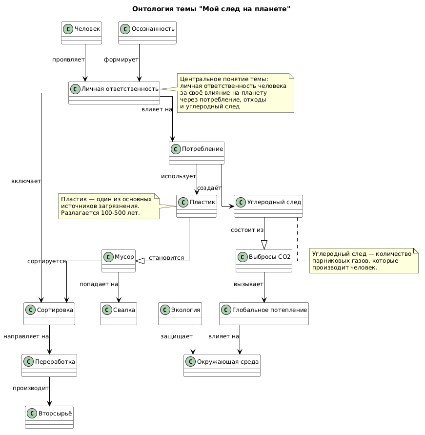

# Раздел 8: Я и ПЛАНЕТА (Экология и мир вокруг)

# Тема 1: Мой след на планете

## Участники и распределение обязанностей

**Смирнов Константин Андреевич**  
Группа **М8О-102СВ-25**

В рамках выполнения лабораторной работы были выполнены следующие задачи:

- анализ предметной области, связанной с темой экологического следа и личной ответственности
- поиск соответствующих сущностей в базе знаний **Wikidata**
- составление **SPARQL-запросов** для извлечения информации
- получение и сохранение результатов запросов
- выделение ключевых понятий предметной области
- построение концептуальной модели (онтологии)
- создание схемы связей между выбранными темами
- генерация текстов статей с использованием **генеративных языковых моделей**
- подготовка структуры проекта и документации

В рамках темы были подготовлены статьи:

- **Куда девается мусор из моего ведра**
- **Сколько пластика я использую за день**
- **Что такое углеродный след**
- **Личная ответственность перед планетой**

# Схема связей между темами

В рамках темы **«Мой след на планете»** были рассмотрены различные аспекты личного влияния человека на окружающую среду и способы снижения экологического воздействия.

Ключевые сущности предметной области:

- человек  
- личная ответственность  
- мусор  
- пластик  
- углеродный след  
- переработка  
- потребление  
- сортировка  
- экология  
- глобальное потепление  
- окружающая среда  
- осознанность  
- вторсырьё  
- свалка  
- выбросы CO2  

Основная логика связей между понятиями:

- **Человек** проявляет **личную ответственность** за своё влияние на планету.
- **Личная ответственность** влияет на **потребление** и включает **сортировку** отходов.
- **Потребление** использует **пластик** и создаёт **углеродный след**.
- **Пластик** становится **мусором** после использования.
- **Мусор** сортируется и направляется на **переработку** или попадает на **свалку**.
- **Переработка** производит **вторсырьё** из отходов.
- **Углеродный след** состоит из **выбросов CO2**.
- **Выбросы CO2** вызывают **глобальное потепление**.
- **Глобальное потепление** влияет на **окружающую среду**.
- **Осознанность** формирует **личную ответственность** человека.

Таким образом, онтология описывает систему личного влияния человека на окружающую среду через потребление, отходы и углеродный след, а также способы снижения этого влияния.

## Перекрестные связи с другими темами раздела

Поскольку тема **«Мой след на планете»** является частью более широкого раздела **«Я и ПЛАНЕТА»**, она имеет логические связи с другими темами.

### Связь с темой **«Раздельный сбор и переработка»**

- **Сортировка** мусора является основой для **раздельного сбора**.
- **Переработка** отходов превращает **мусор** во **вторсырьё**.

### Связь с темой **«Осознанное потребление»**

- **Потребление** напрямую влияет на количество **пластика** и **углеродный след**.
- **Осознанность** помогает снизить избыточное **потребление**.

### Связь с темой **«Животные и природа»**

- **Загрязнение** от **мусора** и **пластика** влияет на среду обитания **животных**.
- **Глобальное потепление** угрожает экосистемам и **исчезающим видам**.

### Связь с темой **«Климат и будущее»**

- **Углеродный след** и **выбросы CO2** являются основными причинами **изменения климата**.
- **Личная ответственность** может помочь **снизить влияние** на климат в будущем.

### Связь с темой **«Что я могу сделать прямо сейчас»**

- **Личная ответственность** побуждает к **конкретным действиям**.
- **Эко-привычки** помогают уменьшить **экологический след** уже сегодня.

# Схема онтологии

Ниже представлена визуальная схема связей между понятиями, использованными в данном разделе.



## Примеры SPARQL-запросов

Для извлечения знаний по теме **«Мой след на планете»** использовались SPARQL-запросы к базе знаний **Wikidata**.  

С помощью запросов были получены описания сущностей и возможные связи между ними.

### Запрос 1: Получение описаний сущностей

```sparql
SELECT ?item ?itemLabel ?description WHERE {
  VALUES ?item {
    wd:Q11474
    wd:Q107161
    wd:Q310667
    wd:Q832237
    wd:Q7366
    wd:Q12517127
    wd:Q40821
    wd:Q180388
  }

  SERVICE wikibase:label { bd:serviceParam wikibase:language "ru,en". }

  OPTIONAL {
    ?item schema:description ?description .
    FILTER(LANG(?description) = "ru")
  }
}
```

Результат выполнения запроса сохранён в файле: [data/wikidata_export.json](data/wikidata_export.json)

### Запрос 2: Поиск связей между сущностями

```sparql
SELECT DISTINCT ?source ?sourceLabel ?property ?propertyLabel ?target ?targetLabel WHERE {
  VALUES ?source {
    wd:Q11474
    wd:Q107161
    wd:Q310667
    wd:Q832237
    wd:Q7366
    wd:Q12517127
    wd:Q40821
    wd:Q180388
  }

  VALUES ?directProp {
    wdt:P31
    wdt:P279
    wdt:P361
    wdt:P1542
    wdt:P921
    wdt:P1269
  }

  ?source ?directProp ?target .
  FILTER(isIRI(?target))

  ?property wikibase:directClaim ?directProp .

  SERVICE wikibase:label {
    bd:serviceParam wikibase:language "ru,en"
  }
}
LIMIT 300
```

Данный запрос позволяет найти прямые связи между выбранными сущностями в базе знаний Wikidata.

Результат выполнения запроса сохранён в файле: [data/wikidata_export.json](data/wikidata_export.json)

### Используемые сущности Wikidata

| Сущность | Wikidata ID | Описание |
|----------|-------------|----------|
| Пластик | Q11474 | материал из полимеров |
| Отходы | Q107161 | материалы, потерявшие потребительские свойства |
| Углеродный след | Q310667 | количество парниковых газов, производимое человеком |
| Защита окружающей среды | Q832237 | деятельность по сохранению природы |
| Окружающая среда | Q7366 | природные условия и окружающий мир |
| Устойчивое развитие | Q12517127 | развитие без ущерба для будущих поколений |
| Переработка отходов | Q40821 | процесс превращения отходов во вторсырьё |
| Управление отходами | Q180388 | система сбора и утилизации отходов |

## Процесс работы

Работа над темой выполнялась в несколько этапов:

- Анализ раздела и выбор темы **«Мой след на планете»**, посвященной личному влиянию человека на окружающую среду

- Определение ключевых понятий, связанных с экологическим следом и личной ответственностью

- Выделение основных сущностей

- Поиск соответствующих сущностей в базе знаний **Wikidata**

- Формирование **SPARQL-запросов** для извлечения данных из базы знаний.

- Получение результатов запросов и сохранение их в формате **JSON** для дальнейшего анализа

- Построение **концептуальной модели предметной области**, описывающей влияние человека на планету через потребление, отходы и углеродный след

- Создание **визуальной схемы онтологии** с помощью PlantUML, отображающей связи между ключевыми понятиями

- Генерация статей для детской энциклопедии с использованием **генеративных моделей искусственного интеллекта**. 

В результате была сформирована онтология, описывающая процесс личного влияния на окружающую среду, источники воздействия (пластик, углеродный след, отходы), а также способы снижения этого влияния через переработку и осознанное потребление.

В ходе выполнения SPARQL-запросов было обнаружено, что в Wikidata многие экологические понятия имеют ограниченное количество прямых связей между собой. Поэтому итоговая онтология была дополнена и структурирована вручную на основе анализа темы и логических связей между понятиями.

## Личные ощущения от работы

Работа над данной темой позволила познакомиться с базой знаний **Wikidata** и языком запросов **SPARQL**, а также понять, как можно извлекать знания из графовых баз данных.

Тема **экологического следа** оказалась интересной для анализа, поскольку она напрямую связана с повседневной жизнью каждого человека и его влиянием на планету. В современном мире вопросы экологии становятся всё более важными, и каждый может внести свой вклад через осознанное потребление и ответственное отношение к отходам.

Особенно полезным оказалось построение **концептуальной модели**, поскольку это позволило увидеть, каким образом различные факторы — пластик, углеродный след, переработка и личная ответственность — связаны между собой и формируют общее представление об экологическом воздействии.

Основной сложностью стало то, что многие понятия, связанные с экологией и устойчивым развитием, не имеют явных связей в базе знаний Wikidata. Поэтому значительная часть онтологии была сформирована на основе анализа предметной области и дополнена вручную.

В целом выполнение работы позволило лучше понять принципы **представления знаний**, построения **графов знаний** и использования **генеративного искусственного интеллекта** для создания образовательных текстов.

---

<div align="center">

**TeenBook 2026** | Раздел 8: Я и ПЛАНЕТА

</div>
