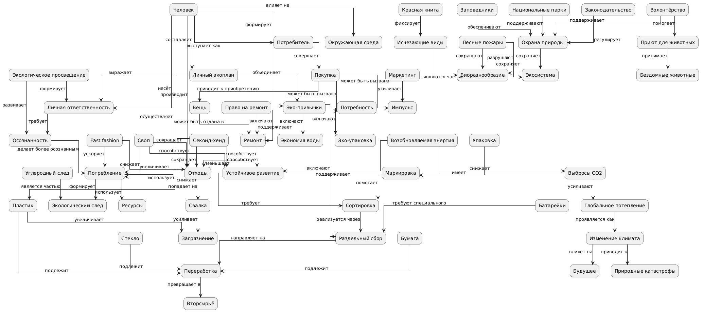

# 🌍 Проект "Я и планета"

Этот проект представляет собой образовательную базу знаний, посвящённую экологии, осознанному потреблению и влиянию человека на окружающий мир.

Материал оформлен в виде набора взаимосвязанных статей (графа знаний), объединённых общей тематикой и системой перекрёстных ссылок.

## 👥 Команда

* Смирнов К. А. — подтема 1 (Мой след на планете)
* Иванов И. Д. — подтема 2 (Раздельный сбор и переработка)
* Браташ М. А. — подтема 3 (Осознанное потребление)
* Федулов Д. А. — подтема 4 (Животные и природа)
* Лубягин А. С. — подтема 5 (Климат и будущее)
* Лазутин А. В. — подтема 6 (Что я могу сделать прямо сейчас)

## 🎯 Цель проекта

Создать структурированную базу знаний, которая:

* объясняет экологические проблемы простым и понятным языком
* показывает влияние человека на планету
* формирует экологическое мышление
* объединяет знания в виде связанного графа

## 🧠 Предметная область

Проект охватывает тему:

> **"Я и планета: экология и мир вокруг"**

Включает следующие направления:

* влияние человека на окружающую среду
* переработка и обращение с отходами
* осознанное потребление
* защита природы и животных
* изменение климата
* личные экологические действия

## 📚 Тематическая структура

### 1. Мой след на планете

* Куда девается мусор из моего ведра
* Сколько пластика я использую за день
* Что такое углеродный след
* Личная ответственность перед планетой

### 2. Раздельный сбор и переработка

* Как сортировать мусор дома
* Куда сдавать батарейки, крышечки, одежду
* Что происходит с вещами после переработки
* Маркировки на упаковках — как читать

### 3. Осознанное потребление

* Нужна ли мне еще одна футболка
* Fast fashion — почему это проблема
* Ремонт вместо выброса
* Секонд-хенды и свопы: модно и экологично

### 4. Животные и природа

* Красная книга и исчезающие виды
* Как помочь бездомным животным
* Лесные пожары — кто виноват
* Заповедники и национальные парки

### 5. Климат и будущее

* Глобальное потепление — это реально?
* Природные катастрофы
* Что будет через 50 лет
* Можно ли остановить изменения

### 6. Что я могу сделать прямо сейчас

* 10 простых эко-привычек
* Как вдохновить друзей и семью
* Баланс экологии и жизни
* Мой личный экоплан

## 🗂 Структура проекта

Проект разделён на две основные части:

### 📁 WORK

Содержит:

* описание концептов (`concepts.json`, `concepts_all.json`)
* онтологию предметной области
* файл `link_targets.json`
* Python-скрипты автоматизации
* промежуточные результаты

### 📁 WEB

Содержит:

* статьи в формате Markdown
* взаимосвязанные тексты (гипертекст)
* финальную базу знаний

## 🔗 Перекрёстные ссылки

В проекте реализована автоматическая система связывания понятий между статьями.

Как это работает:

* используется файл `link_targets.json`

* задаются:

  * концепт
  * файл назначения
  * словоформы (aliases)

* Python-скрипт:

  * находит слова в тексте
  * автоматически превращает их в ссылки
  * учитывает падежи и формы слов

## ⚙️ Используемые технологии

* **Markdown** — написание статей
* **Python** — автоматизация и обработка текстов
* **JSON** — хранение концептов и связей
* **Wikidata + SPARQL** — для извлечения знаний

* **PlantUML** — построение онтологии
* **NetworkX / matplotlib** — визуализация графа

## 🧩 Онтология

В рамках проекта была разработана концептуальная модель, включающая:

* ключевые экологические понятия
* связи между ними
* причинно-следственные зависимости

Онтология отражает:

* влияние человека на природу
* процессы (переработка, загрязнение, изменение климата)
* решения (эко-привычки, осознанное потребление)

## 💡 Особенности проекта

* тексты написаны в понятном и доступном стиле
* ориентированы на подростковую аудиторию
* каждая статья связана с другими
* проект представляет собой **граф знаний**, а не просто набор текстов
* реализована автоматическая система линковки

## 📌 Вывод

В результате проекта была создана:

* структурированная база знаний по экологии
* связанный гипертекст
* онтология предметной области
* система автоматической генерации связей

Проект показывает, что даже сложные экологические темы можно объяснить просто, логично и наглядно.
