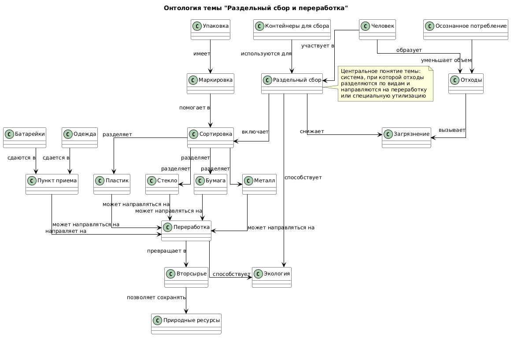

# Раздел 8: Я и планета (Экология и мир вокруг)

# Тема 2: Раздельный сбор и переработка

## Участники и распределение обязанностей

**Иванов Иван Денисович**  
Группа **М8О-105СВ-25**

В рамках выполнения лабораторной работы были выполнены следующие задачи:

- анализ предметной области, связанной с экологией и переработкой отходов
- поиск соответствующих сущностей в базе знаний **Wikidata**
- составление **SPARQL-запросов** для извлечения информации
- получение и сохранение результатов запросов
- выделение ключевых понятий предметной области
- построение концептуальной модели (онтологии)
- создание схемы связей между выбранными темами
- генерация текстов статей с использованием **генеративных языковых моделей**
- подготовка структуры проекта и документации

В рамках темы были подготовлены статьи:

- **Как сортировать мусор дома**
- **Куда сдавать батарейки, крышечки, одежду**
- **Что происходит с вещами после переработки**
- **Маркировки на упаковках — как читать**

---

# Схема связей между темами

В рамках темы **«Раздельный сбор и переработка»** были рассмотрены процессы обращения с отходами и влияние экологичных привычек на окружающую среду.

Ключевые сущности предметной области:

- отходы  
- переработка  
- сортировка  
- пластик  
- стекло  
- бумага  
- батарейки  
- вторсырье  
- контейнеры  
- экология  
- загрязнение  
- ресурсы  
- потребление  
- упаковка  
- маркировка  

---

### Основная логика связей между понятиями:

- Человек ежедневно производит **отходы**.
- **Сортировка отходов** позволяет разделять мусор на категории (пластик, стекло, бумага).
- **Переработка** превращает отходы во **вторсырье**.
- **Контейнеры для раздельного сбора** помогают правильно распределять отходы.
- **Батарейки** и опасные отходы требуют специальной утилизации.
- **Маркировка упаковки** помогает определить способ переработки.
- Переработка снижает уровень **загрязнения окружающей среды**.
- Осознанное потребление уменьшает количество отходов.
- Снижение отходов помогает сохранять **природные ресурсы**.

Таким образом, онтология описывает систему обращения с отходами и влияние экологического поведения человека на окружающую среду.

---

# Перекрестные связи с другими темами раздела

### Связь с темой **«Мой след на планете»**

- Образование отходов напрямую влияет на **экологический и углеродный след** человека.
- Количество используемого пластика определяет нагрузку на систему переработки.
- Осознанное обращение с отходами снижает негативное влияние на окружающую среду.

### Связь с темой **«Осознанное потребление»**

- Сокращение покупок уменьшает объем образуемых отходов.
- Отказ от **fast fashion** снижает нагрузку на переработку текстиля.
- Повторное использование и ремонт вещей уменьшают необходимость переработки.

### Связь с темой **«Животные и природа»**

- Загрязнение окружающей среды отходами влияет на **животных и экосистемы**.
- Пластик и мусор могут попадать в природные среды и наносить вред животным.
- Переработка и снижение отходов помогают сохранять природные территории и биоразнообразие.

### Связь с темой **«Климат и будущее»**

- Переработка отходов снижает выбросы **парниковых газов**.
- Сокращение мусора уменьшает нагрузку на полигоны и предотвращает экологические кризисы.
- Экологичные практики способствуют более устойчивому будущему.

### Связь с темой **«Что я могу сделать прямо сейчас»**

- Раздельный сбор отходов является одной из базовых **эко-привычек**.
- Сортировка мусора — простой способ внести вклад в экологию.
- Личный пример помогает формировать экологическое поведение у окружающих.

---

# Схема онтологии

Ниже представлена визуальная схема связей между понятиями, использованными в рамках темы **«Раздельный сбор и переработка»**.

Схема отражает процесс обращения с отходами — от их образования человеком до переработки и влияния на окружающую среду.



## Примеры SPARQL-запросов

Для извлечения знаний по теме **«Раздельный сбор и переработка»** использовались SPARQL-запросы к базе знаний **Wikidata**.

С помощью запросов были получены описания сущностей и их взаимосвязи.

### Запрос 1: Получение описаний сущностей

```sparql
SELECT ?item ?itemLabel ?description WHERE {
VALUES ?item {
  wd:Q132580
  wd:Q2684232
  wd:Q931389
  wd:Q45701
  wd:Q219534
}

  SERVICE wikibase:label { bd:serviceParam wikibase:language "ru,en". }

  OPTIONAL {
    ?item schema:description ?description .
    FILTER(LANG(?description) = "ru")
  }
}
```

Результат выполнения запроса сохранён в файле: [data/wikidata_export.json](data/wikidata_export.json)

### Запрос 2: Поиск связей между сущностями

```sparql
SELECT DISTINCT ?source ?sourceLabel ?property ?propertyLabel ?target ?targetLabel WHERE {
VALUES ?source {
  wd:Q132580
  wd:Q2684232
  wd:Q931389
  wd:Q45701
  wd:Q219534
}

VALUES ?directProp {
  wdt:P31
  wdt:P279
  wdt:P361
}

  ?source ?directProp ?target .
  FILTER(isIRI(?target))

  ?property wikibase:directClaim ?directProp .

  SERVICE wikibase:label {
    bd:serviceParam wikibase:language "ru,en"
  }
}
LIMIT 200
```

Данный запрос позволяет найти прямые связи между выбранными сущностями в базе знаний Wikidata.

Результат выполнения запроса сохранён в файле: [data/wikidata_export_contact.json](data/wikidata_export_contact.json)

### Используемые сущности Wikidata

| Сущность            | Wikidata ID | Описание                                              |
|---------------------|-------------|-------------------------------------------------------|
| Переработка отходов | Q132580     | процесс преобразования отходов во вторичное сырьё     |
| Утилизация отходов  | Q2684232    | процесс удаления или обезвреживания отходов           |
| Сортировка отходов  | Q931389     | процесс разделения отходов по категориям              |
| Отходы              | Q45701      | ненужные вещества или предметы, подлежащие удалению   |
| Знак переработки    | Q219534     | маркировка, связанная с переработкой и сортировкой    |

## Процесс работы

Работа над темой выполнялась в несколько этапов:

- анализ раздела и выбор темы **«Раздельный сбор и переработка»**, посвящённой обращению с отходами и экологическому поведению человека
- определение ключевых понятий, связанных с сортировкой, переработкой и специальной утилизацией отходов
- выделение основных сущностей предметной области
- поиск соответствующих сущностей в базе знаний **Wikidata**
- формирование **SPARQL-запросов** для извлечения данных из базы знаний
- получение результатов запросов и сохранение их в формате **JSON** для дальнейшего анализа
- построение **концептуальной модели предметной области**, описывающей путь отходов от сортировки до переработки
- создание **визуальной схемы онтологии** с помощью PlantUML, отображающей связи между ключевыми понятиями
- генерация статей для детской энциклопедии с использованием **генеративных моделей искусственного интеллекта**

В результате была сформирована онтология, описывающая процессы раздельного сбора, сортировки, переработки и утилизации отходов, а также их влияние на окружающую среду.

В ходе выполнения SPARQL-запросов было обнаружено, что в Wikidata не все экологические и бытовые понятия имеют достаточное количество прямых связей между собой. Поэтому итоговая онтология была дополнена и структурирована вручную на основе анализа темы и логических связей между понятиями.

## Личные ощущения от работы

Работа над данной темой позволила лучше понять, как устроены процессы раздельного сбора и переработки отходов, а также какую роль играет человек в снижении загрязнения окружающей среды.

Тема **раздельного сбора и переработки** оказалась полезной для анализа, поскольку она напрямую связана с повседневной жизнью и экологической ответственностью. В процессе работы стало понятнее, как сортировка мусора, маркировка упаковки и специальные пункты приёма помогают сократить количество отходов и сохранить природные ресурсы.

Основной сложностью стало то, что не все понятия, связанные с бытовой экологией и переработкой, имеют явные связи в базе знаний Wikidata. Поэтому часть онтологии была сформирована на основе анализа предметной области и дополнена вручную.

В целом выполнение работы позволило лучше понять принципы **представления знаний**, построения **графов знаний** и использования **генеративного искусственного интеллекта** для создания образовательных текстов.
