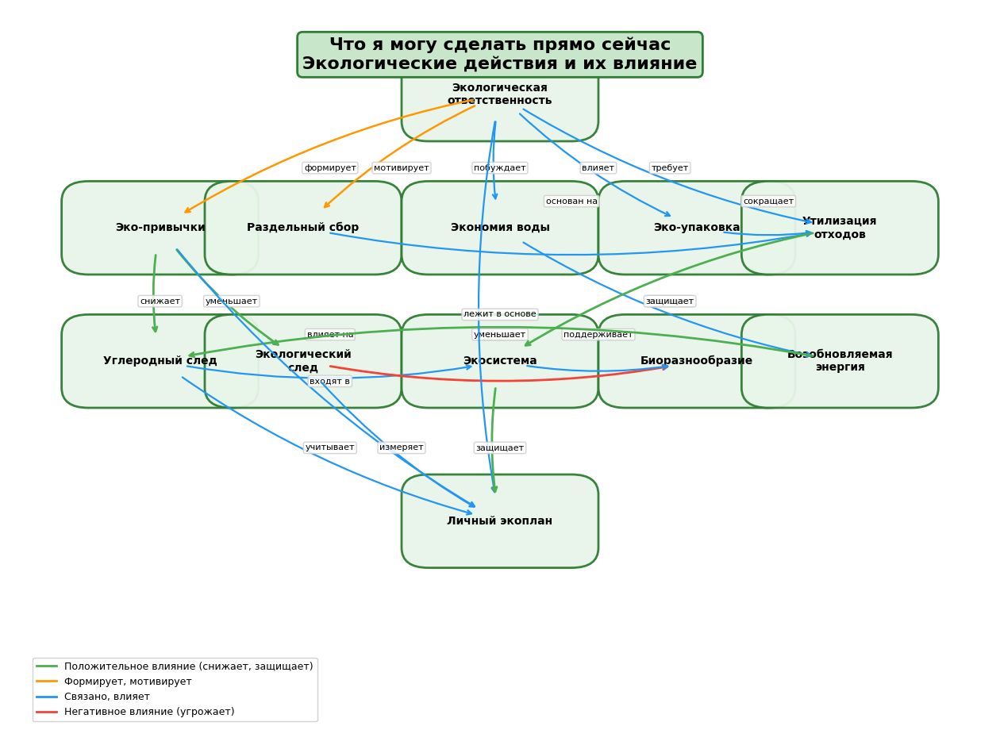

# Тема: Что я могу сделать прямо сейчас
## Раздел: Экологическая ответственность

### Участники и распределение обязанностей
**Лазутин Александр Владимирович**  
**Группа М8О-102СВ-25**

---

### Выполненные задачи

В рамках выполнения задания были выполнены следующие задачи:

1. **Изучение существующих знаний по теме в базе Wikidata**
   - Анализ экологических концепций: устойчивый образ жизни, углеродный след, экологический след
   - Поиск связей между понятиями экологической ответственности
   - Изучение структуры данных о влиянии человека на природу

2. **Составление SPARQL-запросов**
   - Запросы для извлечения подклассов устойчивого образа жизни
   - Запросы для поиска связей между экологическими понятиями
   - Запросы для получения описаний и свойств концепций

3. **Получение данных из Wikidata**
   - Экспорт фрагментов графов знаний в формате JSON
   - Сохранение результатов для дальнейшего анализа

4. **Анализ полученных результатов**
   - Выявление иерархических связей между понятиями
   - Определение горизонтальных связей (влияет, уменьшает, требует)
   - Классификация понятий по категориям

5. **Выделение ключевых понятий предметной области**
   - 15 основных понятий, описывающих экологические действия подростка
   - Распределение по категориям: действия, влияние, природа, планирование

6. **Построение концептуальной модели (онтологии)**
   - Определение сущностей и их атрибутов
   - Установление типов связей между понятиями
   - Создание иерархической структуры

7. **Создание схемы связей между понятиями**
   - Визуализация онтологии с помощью Python (matplotlib)
   - Документирование всех связей

8. **Подготовка структуры проекта и документации**
   - Создание concepts.json со списком понятий
   - Подготовка промптов для генерации статей
   - Настройка системы перекрестных ссылок

---

### Схема связей между темами

В рамках темы **«Что я могу сделать прямо сейчас»** были выделены основные понятия, связанные с экологической ответственностью и действиями, которые может предпринять подросток.

#### Ключевые сущности предметной области:

- **экологическая ответственность** — осознание своей роли в заботе о планете
- **эко-привычки** — повседневные действия для защиты окружающей среды
- **раздельный сбор** — сортировка отходов для переработки
- **экономия воды** — бережное отношение к водным ресурсам
- **эко-упаковка** — выбор продуктов с минимальной упаковкой
- **утилизация отходов** — путь мусора от ведра до переработки
- **углеродный след** — влияние действий на изменение климата
- **экологический след** — общее воздействие человека на природу
- **экосистема** — взаимосвязи живых организмов в природе
- **биоразнообразие** — разнообразие видов животных и растений
- **возобновляемая энергия** — чистая энергия от солнца, ветра и воды
- **личный экоплан** — персональный план экологических действий

#### Основная логика связей между понятиями:

1. **Экологическая ответственность** является основой для всех экологических действий
2. **Эко-привычки** формируют повседневное экологичное поведение
3. **Эко-привычки** включают конкретные действия:
   - **Раздельный сбор** мусора
   - **Экономию воды**
   - Использование **эко-упаковки**
4. **Знания об утилизации отходов** помогают правильно сортировать мусор
5. **Углеродный след** и **экологический след** показывают влияние человека на природу
6. **Возобновляемая энергия** помогает снизить углеродный след
7. **Экосистема** и **биоразнообразие** — то, что мы защищаем
8. **Личный экоплан** объединяет все действия в систему

Таким образом, онтология описывает систему экологических действий и их взаимосвязи в жизни подростка.

---

### Схема онтологии

---

## Процесс работы

Работа над разделом выполнялась в несколько этапов:

1. **Анализ предметной области** и выбор темы «Что я могу сделать прямо сейчас» (экологическая ответственность подростков)

2. **Определение ключевых понятий**, описывающих экологические действия в повседневной жизни

3. **Поиск соответствующих сущностей** в базе знаний Wikidata (15 понятий с соответствующими QID)

4. **Формирование SPARQL-запроса** для извлечения данных и связей между понятиями

5. **Получение результата запроса** и сохранение его в формате JSON

6. **Построение концептуальной модели** предметной области

7. **Создание визуальной схемы онтологии** с помощью Python (matplotlib)

8. **Подготовка текстовых описаний** всех 15 понятий для энциклопедии

9. **Генерация статей** с использованием LLM (промпты для детей 10-14 лет)

10. **Расстановка перекрестных ссылок** между статьями

В результате была сформирована онтология, описывающая экологические действия подростка и их влияние на окружающую среду.

---

## Анализ полученных данных

В результате выполнения SPARQL-запроса удалось получить связи между экологическими понятиями. Однако некоторые связи оказались недостаточно полными для построения содержательной схемы, поэтому итоговая онтология была дополнена и структурирована вручную на основе анализа темы и здравого смысла.

### Наиболее полезные связи, найденные в Wikidata:

| Понятие | Связь | Связанное понятие |
|---------|-------|-------------------|
| sustainable living | подкласс | lifestyle |
| renewable energy | подкласс | energy source |
| waste sorting | часть | waste management |
| ecosystem | часть | environment |
| biodiversity | подкласс | biology |

Эти связи помогли сформировать правильную иерархию понятий в онтологии.

---

## Используемые инструменты

| Инструмент | Назначение |
|------------|------------|
| **Wikidata** | База знаний для извлечения данных |
| **SPARQL** | Язык запросов для Wikidata |
| **Python (requests)** | Выполнение SPARQL-запросов |
| **Python (matplotlib)** | Визуализация онтологии |
| **GigaChat / LLM** | Генерация статей для детей |
| **Git / GitHub** | Хранение и версионирование проекта |

---

## Заключение

В ходе работы был создан полноценный раздел энциклопедии **«Что я могу сделать прямо сейчас»**, включающий:

- **Визуальную схему онтологии** с цветовой дифференциацией связей
- **Систему перекрестных ссылок** между понятиями
- **Экспортированные данные** из Wikidata
- **Полную документацию** о процессе работы

