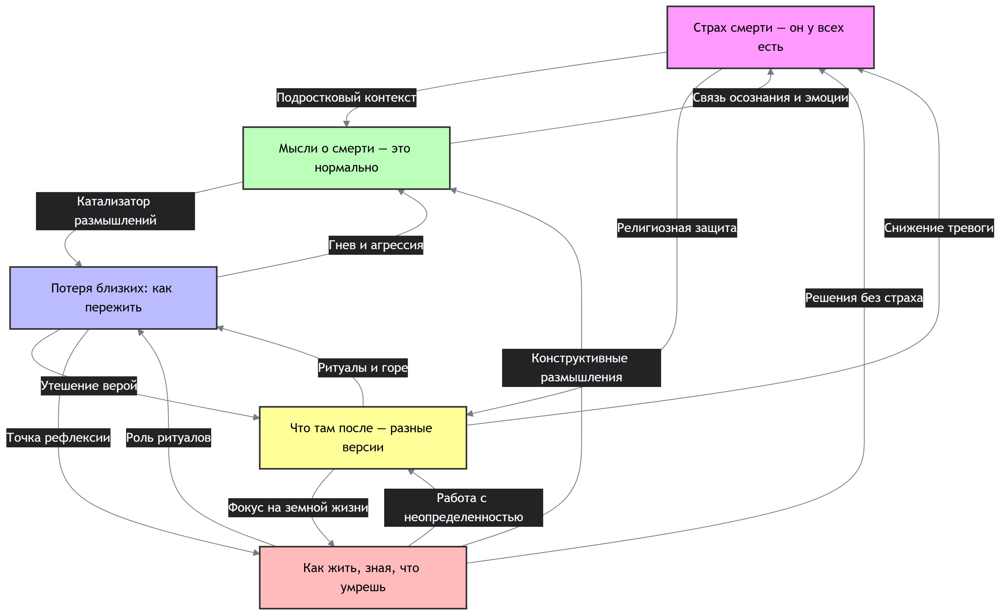

## Ответственный: Крючков Артемий

## Схема связей:


## Пример запроса:
```
"""# Смерть и страхи
SELECT DISTINCT ?item ?itemLabel WHERE {
  { ?item wdt:P31/wdt:P279* wd:Q4 . 
    ?item rdfs:label ?label .
    FILTER(LANG(?label) IN ("ru", "en"))
  }
  UNION
  { ?item wdt:P31/wdt:P279* wd:Q44619 .
    ?item rdfs:label ?label .
    FILTER(LANG(?label) IN ("ru", "en"))
  }
  UNION
  { ?item wdt:P31/wdt:P279* wd:Q3519556 .
    ?item rdfs:label ?label .
    FILTER(LANG(?label) IN ("ru", "en"))
  }
  SERVICE wikibase:label { bd:serviceParam wikibase:language "ru,en". }
}
ORDER BY ?itemLabel
LIMIT 100"""
```
## Сгенерированная суммаризация
В предоставленных статьях выстроена логическая цепочка: от признания универсальности страха смерти и нормальности размышлений о ней («Страх смерти — он у всех есть», «Мысли о смерти — это нормально») через анализ реакции на утрату («Потеря близких: как пережить») и обзор различных версий посмертного существования («Что там после») к практическим стратегиям осмысленной жизни в условиях неизбежного конца («Как жить, зная, что умрешь»). Общая суть материалов заключается в том, что осознание смертности является не патологией, а адаптивным механизмом и экзистенциальным ресурсом, который при правильной интеграции трансформирует тревогу в мотивацию для ценностно-ориентированного поведения. Ключевой особенностью подхода является смещение фокуса с поиска доказательств загробной жизни или подавления страха на развитие психологической устойчивости, использование культурных ритуалов и философских практик (например, memento mori) для повышения качества текущей жизни и глубины человеческих отношений.