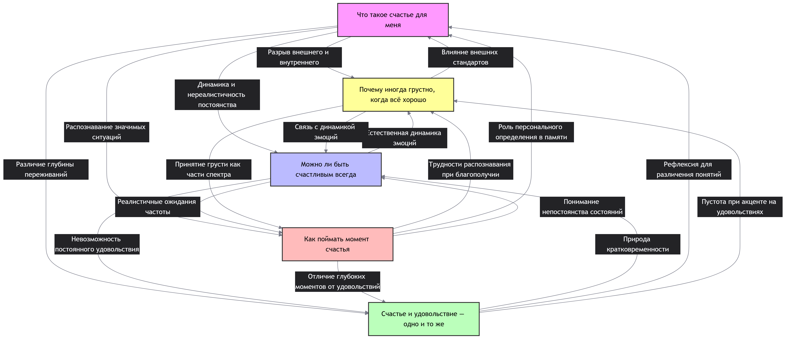

## Ответственный: Руднев Виктор

## Схема связей:


## Пример запроса:
```
"""# Счастье
SELECT DISTINCT ?item ?itemLabel WHERE {
  { ?item wdt:P31/wdt:P279* wd:Q8 . 
    ?item rdfs:label ?label .
    FILTER(LANG(?label) IN ("ru", "en"))
  }
  UNION
  { ?item wdt:P31/wdt:P279* wd:Q208195 .
    ?item rdfs:label ?label .
    FILTER(LANG(?label) IN ("ru", "en"))
  }
  SERVICE wikibase:label { bd:serviceParam wikibase:language "ru,en". }
}
ORDER BY ?itemLabel
LIMIT 100"""
```

## Сгенерированная суммаризация
В предоставленных статьях выстроена последовательная схема: от определения субъективной природы счастья («Что такое счастье для меня») через развенчание мифа о его постоянстве («Можно ли быть счастливым всегда») и уточнение различий с кратковременным удовольствием («Счастье и удовольствие — одно и то же») к анализу причин парадоксальной грусти («Почему иногда грустно, когда всё хорошо») и практическим методам фиксации позитивных переживаний («Как поймать момент счастья»). Общая суть материалов заключается в том, что счастье является не непрерывным состоянием эйфории, а динамическим навыком осознанного восприятия жизни, требующим баланса между гедонистическими удовольствиями и глубоким смысловым удовлетворением. Ключевой особенностью подхода является опора на нейробиологические механизмы (гедонистическая адаптация, работа системы вознаграждения) и психологические практики (осознанность, благодарность), которые позволяют легализовать негативные эмоции как норму и научиться интегрировать краткие моменты радости в общую картину благополучия.