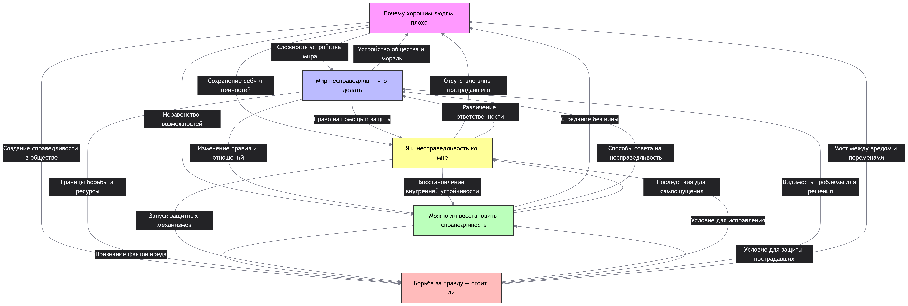

## Ответственный: Королев Павел

## Схема связей:


## Пример запроса:
```
"""# Справедливость
SELECT DISTINCT ?item ?itemLabel WHERE {
  { ?item wdt:P31/wdt:P279* wd:Q13189320 . 
    ?item rdfs:label ?label .
    FILTER(LANG(?label) IN ("ru", "en"))
  }
  UNION
  { ?item wdt:P31/wdt:P279* wd:Q7949 .
    ?item rdfs:label ?label .
    FILTER(LANG(?label) IN ("ru", "en"))
  }
  SERVICE wikibase:label { bd:serviceParam wikibase:language "ru,en". }
}
ORDER BY ?itemLabel
LIMIT 100"""

```

## Сгенерированная суммаризация
В предоставленных статьях выстроена логическая цепочка: от анализа причин страданий добрых людей и разрушения иллюзии «справедливого мира» («Почему хорошим людям плохо») через стратегии личного совладания и восстановления контроля («Мир несправедлив — что делать», «Я и несправедливость ко мне») к оценке возможностей частичного восстановления справедливости («Можно ли восстановить справедливость») и взвешенному анализу рисков публичной борьбы за истину («Борьба за правду — стоит ли»). Общая суть материалов сводится к тому, что справедливость не является автоматическим свойством природы, а представляет собой сложную задачу, требующую сочетания внутренней психологической устойчивости, социальной поддержки и использования правовых процедур. Ключевой особенностью подхода является смещение фокуса с поиска вины жертвы или ожидания полного возврата прошлого на практические действия по минимизации вреда, признанию нарушения и созданию безопасных условий для восстановления достоинства человека.