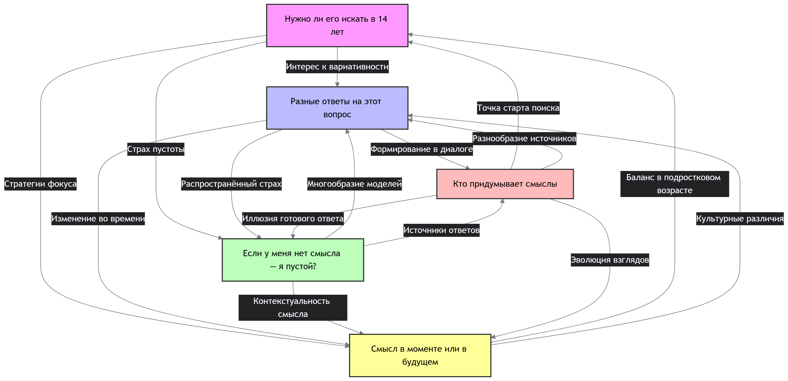

## Ответственный: Соколов Арсений

## Схема связей:


## Пример запроса:
```
"""# Смысл жизни: философские концепции, литературные произведения, философы
SELECT DISTINCT ?item ?itemLabel ?description WHERE {
  {
    # Философские концепции, связанные со смыслом жизни
    ?item wdt:P31/wdt:P279* wd:Q5389993 .
    ?item rdfs:label ?label .
    FILTER(LANG(?label) IN ("ru", "en"))
    FILTER( CONTAINS(LCASE(?label), "смысл жизни") || CONTAINS(LCASE(?label), "meaning of life") )
  }
  UNION
  {
    # Литературные произведения
    ?item wdt:P31 wd:Q7725634 .
    ?item rdfs:label ?label .
    FILTER(LANG(?label) IN ("ru", "en"))
    FILTER( CONTAINS(LCASE(?label), "смысл") || CONTAINS(LCASE(?label), "meaning") )
  }
  UNION
  {
    # Философы, чьи труды связаны с темой смысла жизни
    ?item wdt:P31 wd:Q4964182 .
    ?item wdt:P101 ?field .
    ?field rdfs:label ?fieldLabel .
    FILTER(LANG(?fieldLabel) = "en" && CONTAINS(LCASE(?fieldLabel), "meaning of life"))
  }
  SERVICE wikibase:label { bd:serviceParam wikibase:language "ru,en" }
}
ORDER BY ?itemLabel
LIMIT 100"""

```

## Сгенерированная суммаризация
В предоставленных статьях прослеживается четкая логическая схема: от констатации естественности поиска смысла в подростковом возрасте («Нужно ли его искать в 14 лет») через анализ множественности возможных ответов («Разные ответы») и снятия тревоги из-за их отсутствия («Если у меня нет смысла — я пустой?») к рассмотрению временнóго баланса («Смысл в моменте или в будущем») и механизмов формирования ценностей («Кто придумывает смыслы»). Общая суть материалов сводится к тому, что осмысленность является не статичным результатом, а динамическим процессом, зависящим от взаимодействия нейробиологического созревания, рефлексии и социального контекста. Ключевой особенностью подхода является смещение фокуса с поиска единственно верного ответа на развитие гибкости мышления, принятие неопределенности и понимание смысла как конструкта, создаваемого в диалоге между личным опытом и культурной средой.