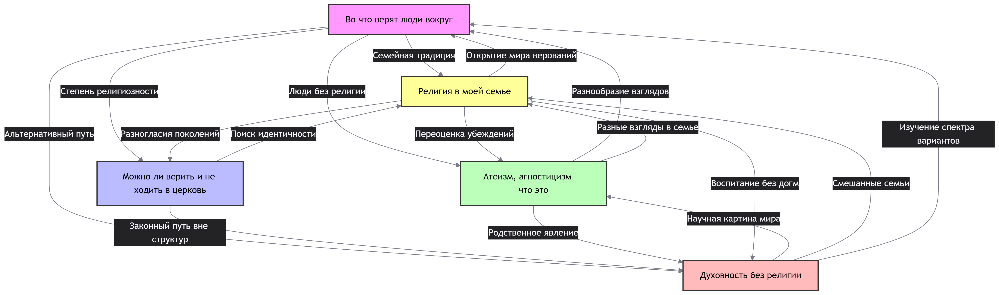

## Ответственный: Крючков Артемий

## Схема связей:


## Пример запроса:
```
"""# Религия
SELECT DISTINCT ?item ?itemLabel WHERE {
  { ?item wdt:P31/wdt:P279* wd:Q9174 . 
    ?item rdfs:label ?label .
    FILTER(LANG(?label) IN ("ru", "en"))
  }
  UNION
  { ?item wdt:P31/wdt:P279* wd:Q7066 .
    ?item rdfs:label ?label .
    FILTER(LANG(?label) IN ("ru", "en"))
  }
  UNION
  { ?item wdt:P31/wdt:P279* wd:Q288928 .
    ?item rdfs:label ?label .
    FILTER(LANG(?label) IN ("ru", "en"))
  }
  SERVICE wikibase:label { bd:serviceParam wikibase:language "ru,en". }
}
ORDER BY ?itemLabel
LIMIT 100"""

```

## Сгенерированная суммаризация
В предоставленных статьях прослеживается четкая схема перехода от обзора традиционных религиозных систем («Во что верят люди вокруг», «Религия в моей семье») к анализу индивидуализированных форм мировоззрения, таких как вера без институциональной принадлежности («Можно ли верить и не ходить в церковь»), светский гуманизм («Атеизм, агностицизм — что это») и автономный духовный поиск («Духовность без религии»). Общая суть материалов заключается в том, что современное религиозное поле трансформируется от жесткой передачи догматов по наследству к гибкому личному выбору, где авторитет смещается от внешних ритуалов и церковных структур к внутреннему опыту, разуму и этической ответственности индивида. Ключевой особенностью описанного процесса является нормализация разнообразия: отсутствие единого стандарта веры больше не воспринимается как кризис, а рассматривается как естественный этап взросления и поиска идентичности, требующий толерантности и диалога между представителями разных взглядов.