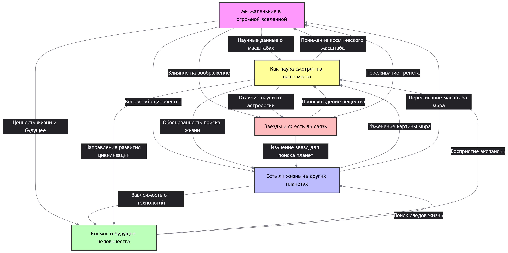

## Ответственный: Королев Павел

## Схема связей:


## Пример запроса:
```
"""# Космос и человечество
SELECT DISTINCT ?item ?itemLabel WHERE {
  { ?item wdt:P31/wdt:P279* wd:Q1 . 
    ?item rdfs:label ?label .
    FILTER(LANG(?label) IN ("ru", "en"))
  }
  UNION
  { ?item wdt:P31/wdt:P279* wd:Q181508 .
    ?item rdfs:label ?label .
    FILTER(LANG(?label) IN ("ru", "en"))
  }
  SERVICE wikibase:label { bd:serviceParam wikibase:language "ru,en". }
}
ORDER BY ?itemLabel
LIMIT 100"""

```

## Сгенерированная суммаризация
В предоставленных статьях выстроена логическая схема от осознания физической малости человека перед масштабом Вселенной («Мы маленькие в огромной вселенной») и научного описания нашего места в ней («Как наука смотрит на наше место») к анализу реальной физической связи через происхождение вещества и влияние Солнца («Звезды и я: есть ли связь»), что затем перетекает в поиск потенциальных соседей («Есть ли жизнь на других планетах») и определение реалистичных перспектив экспансии («Космос и будущее человечества»). Общая суть материалов заключается в том, что научный взгляд, отвергая геоцентризм и астрологические мифы, не обесценивает человека, а переопределяет его значимость через способность познавать космос, из которого он состоит, и ответственность за сохранение Земли как единственного известного дома. Ключевой особенностью подхода является баланс между «космическим смирением» (признание случайности и хрупкости жизни) и «космическим оптимизмом» (использование этого знания для развития технологий, международного сотрудничества и поиска жизни), где страх перед бесконечностью трансформируется в мотивацию для исследования и бережного отношения к будущему цивилизации.