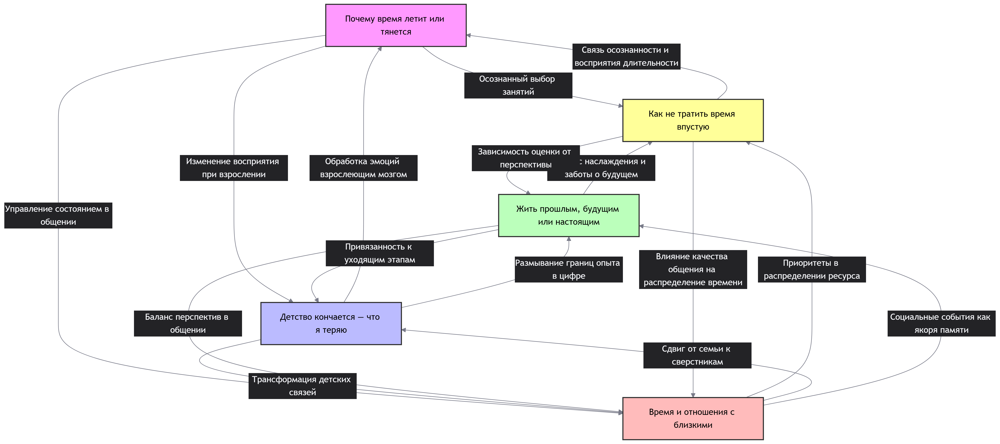

## Ответственный: Руднев Виктор

## Схема связей:


## Пример запроса:
```
"""# Время
SELECT DISTINCT ?item ?itemLabel WHERE {
  { ?item wdt:P31/wdt:P279* wd:Q11471 . 
    ?item rdfs:label ?label .
    FILTER(LANG(?label) IN ("ru", "en"))
  }
  UNION
  { ?item wdt:P31/wdt:P279* wd:Q192630 .
    ?item rdfs:label ?label .
    FILTER(LANG(?label) IN ("ru", "en"))
  }
  UNION
  { ?item wdt:P31/wdt:P279* wd:Q344 .
    ?item rdfs:label ?label .
    FILTER(LANG(?label) IN ("ru", "en"))
  }
  SERVICE wikibase:label { bd:serviceParam wikibase:language "ru,en". }
}
ORDER BY ?itemLabel
LIMIT 100"""

```

## Сгенерированная суммаризация
В предоставленных статьях выстроена последовательная схема: от анализа биологических и психологических механизмов искажения времени («Почему время летит или тянется») и неизбежной утраты детского восприятия при взрослении («Детство кончается — что я теряю») к выбору стратегии временной ориентации («Жить прошлым, будущим или настоящим»), которая затем конкретизируется через методы осознанного планирования («Как не тратить время впустую») и приоритизацию социальных связей («Время и отношения с близкими»). Общая суть материалов заключается в том, что субъективное ощущение времени не является данностью, а управляемым ресурсом, эффективность которого зависит от способности балансировать между памятью о прошлом, целями будущего и глубиной проживания настоящего момента. Ключевой особенностью подхода является смещение фокуса с количественной продуктивности на качественное наполнение опыта, где главным критерием «непустой» траты времени выступают осознанность, эмоциональная вовлеченность и инвестиции в отношения с близкими, формирующие устойчивую идентичность и психологическое благополучие.