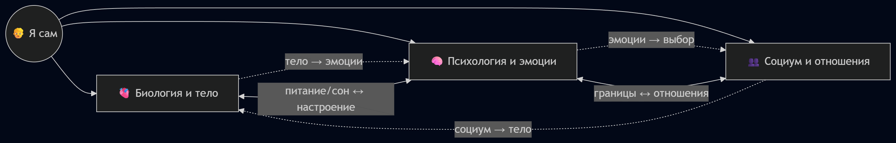
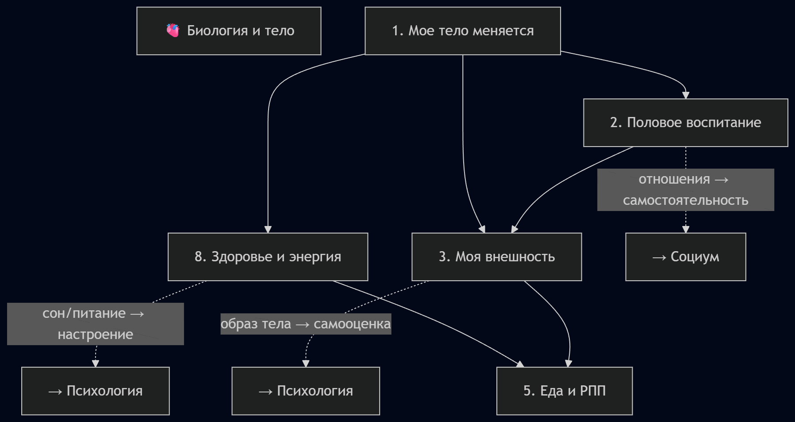
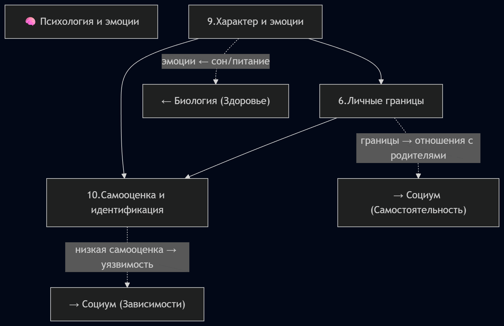
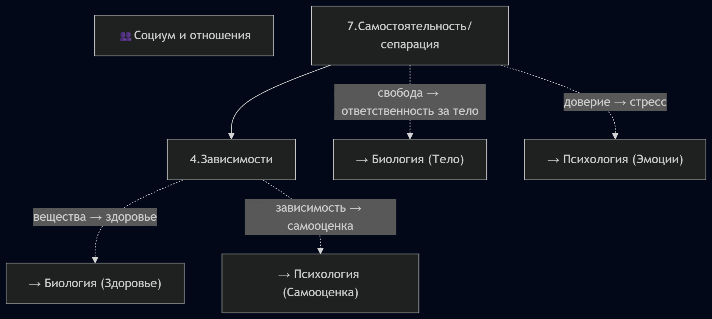
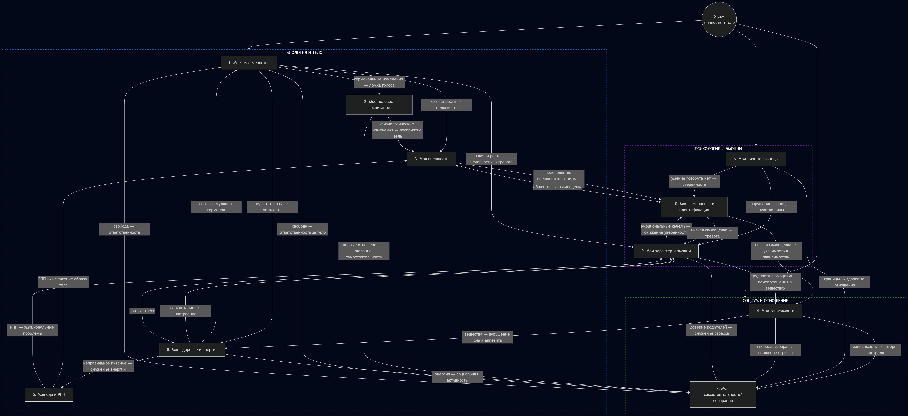

# Отчет РАЗДЕЛ 1. Я САМ (Личность и тело)

Лабораторная работа по курсу «Искусственный интеллект»

## Состав команды

| ФИО         |Группа| Что делал           |
|-------------|------|----------------|
| Кривотулов Егор         |М8О-103СВ-25| Тема 1: Мое тело меняется  |
| Чуркин Алексей Андреевич  |М8О-103СВ-25| Тема 6: Мои личные границы|
| Мусаелян Ярослав Александрович |М8О-103СВ-25| Тема 3: Моя внешность  |
| Жеребцов Сергей Сергеевич |М8О-103СВ-25| Тема 8: Мое здоровье и энергия; создание общей онтологии раздела; создание SPARQL-запросов |
| Щепкин Александр Игоревич |М8О-103СВ-25| Темы 2, 5, 7; написание отчета; написание скрипта для SPARQL-запросов |
| Шангин Даниил Денисович |М8О-105СВ-25| Тема 9: Мои характер и эмоции; написание скрипта для расстановки ссылок |
| Стенин Константин Алексеевич |М8О-105СВ-25| Тема 4: Мои зависимости; написание скрипта для генерации статей|
| Сухарев Александр Игоревич |М8О-105СВ-25| Тема 10: Моя самооценка и идентификация|

## Концептуализация предметной области

В процессе данной лабораторной работы наша команда занималась концептуализацией и построением онтологии предметной области `Личность и тело`.
Для построения концептуальной модели мы использовали `Wikidata`, а для построения графов `Mermaid.js`. Результатом работы команды стали `89` статей


### Детализация кластеров: Биология и тело (темы 1, 2, 3, 5, 8)

### Детализация кластеров: Психология и эмоции (темы 6, 9, 10)

### Детализация кластеров: Социум и отношения (темы 4, 7)

### Более общая схема


Данные и графы с ресурса `Wikidata` были получены с помощью SPARQL-запросов, простейший из них представлен ниже:
```sparql
PREFIX wd: <http://www.wikidata.org/entity/>
PREFIX wdt: <http://www.wikidata.org/prop/direct/>
PREFIX rdfs: <http://www.w3.org/2000/01/rdf-schema#>
PREFIX bd: <http://www.bigdata.com/rdf#>

SELECT ?item ?itemLabel ?itemDescription ?concept_ru WHERE {
  VALUES (?item ?concept_ru) {
    (wd:Q373822  "Расстройство пищевого поведения")
    (wd:Q131749 "Анорексия")
    (wd:Q254327 "Анорексия")
    (wd:Q64513386 "Булимия")
    (wd:Q209522  "Компульсивное переедание")
    (wd:Q448191 "Диета")
    (wd:Q121670  "Недоедание")
  }
  OPTIONAL {
    ?item schema:description ?itemDescription
    FILTER(LANG(?itemDescription) IN ("ru", "en"))
  }
  SERVICE wikibase:label {
    bd:serviceParam wikibase:language "ru,en"
  }
}
ORDER BY ?concept_ru
```

Данный запрос использовался для выборки понятий, связанных с расстройствами пищевого поведения.

Особенности:
- Использование `VALUES` для задания фиксированного списка сущностей
- Получение описаний через `schema:description`
- Автоматическое получение меток через `wikibase:label`

## Написание текстов

Следующим этапом стало написание текстов для статей. Был использован скрипт на Python для получения markdown-файлов с помощью API `GigaChat-2`.
Было принято решение использовать два типа промптов: один для объемных статей, отвечающих на сложные вопросы, и другой для статей, описывающих конкретные термины. Промпты:

```
Ты — дружелюбный эксперт, который объясняет сложные вещи детям 10 лет.
Задача: Напиши статью на тему [ТЕМА. СТАТЬЯ/ВОПРОС] для подростковой энциклопедии.
Требования:
1. Язык: простой, дружелюбный, без сложных терминов (или с пояснениями), термины, описанные в других статьях указаны ниже
2. Стиль: как будто объясняешь другу, можно с юмором и примерами из жизни
3. Структура:
- Заголовок (цепляющий, не скучный)
- Введение (почему это важно именно для подростка)
- Основная часть (2-3 ключевых факта с примерами)
- Практические советы (что можно сделать прямо сейчас)
- Заключение (позитивный вывод)
1. Объём: 500-1000 слов
2. Формат: Markdown (используй # для заголовков, жирный для акцентов, списки)
Важно:
- Не пугай, не запугивай
- Не давай медицинских рекомендаций, только общую информацию
- Если упоминаешь проблемы — обязательно пиши, куда обратиться за помощью
Термины из других статей, на которые можно сослаться: [НАЗВАНИЯ_СТАТЕЙ]
Тема: [ТЕМА. СТАТЬЯ/ВОПРОС]
```        

```
Ты — дружелюбный эксперт, который объясняет сложные вещи детям 10 лет.
Задача: Напиши статью на тему [ТЕМА. ТЕРМИН] для подростковой энциклопедии.
Требования:
1. Язык: простой, дружелюбный, без сложных терминов (или с пояснениями)
2. Стиль: как будто объясняешь другу, можно с юмором и примерами из жизни
3. Структура:
- Заголовок (цепляющий, не скучный)
- Введение (почему это важно именно для подростка)
- Основная часть (2-3 ключевых факта с примерами)
- Практические советы (что можно сделать прямо сейчас)
- Заключение (позитивный вывод)
1. Объём: 300-500 слов
2. Формат: Markdown (используй # для заголовков, жирный для акцентов, списки)
Важно:
- Не пугай, не запугивай
- Не давай медицинских рекомендаций, только общую информацию
- Если упоминаешь проблемы — обязательно пиши, куда обратиться за помощью
Тема: [ТЕМА. ТЕРМИН.]
```

## Расстановка ссылок

Для более удобной навигации между статьями необходимо было расставить ссылки между файлами. Для данной задачи также был написан Python-скрипт. Для каждой статьи был составлен `link_map` со списком слов, к которым прикреплять ссылки.

## Итоги работы

1. Получен опыт работы с `Wikidata`, составлением SPARQL-запросы и выгрузкой результатов в `json`
2. Составлена онтология раздела, визуализированная с помощью `Mermaid.js`
3. Также визуализированы более мелкие онтологии для каждой темы с использованием `PlantUML` и `Mermaid.js`
4. Написан скрипт для генерации статей через API `GigaChat-2` и составлены промты
5. Написан скрипт для расстановки кросс-статейных ссылок
6. Сгенерировано `89` статей и более `150+` связей между ними
7. Сформирована общая директория со всеми статьями и результатами!

## Личные ощущения

Работа над проектом оказалась значительно сложнее, чем ожидалось изначально.

### Наиболее сложным было:

* Построение онтологии — не в виде простого дерева, а именно графа с множеством перекрёстных связей
* Понять, как работает `Wikidata` и научиться создавать SPARQL-запросы
* Учет всевозможных пересечений между темами
* Написание скрипта для расстановки ссылок, продумывание `link_map`
* Определение границ между близкими понятиями (например: *эмоции* и *самооценка*, *внешность* и *идентичность*)

### Наиболее полезным оказалось:

* Практика работы с `SPARQL` и `Wikidata` — понимание, как извлекать структурированные знания
* Навык построения связей между понятиями, а не просто их перечисления
* Использование `LLM` для генерации объяснений, продумывание общего промпта
* Осознание того, как можно автоматизировать создание образовательного контента


При этом остаётся ощущение, что построение идеальной структуры знаний является итеративным процессом и требует многократного уточнения модели.
Это позволило лучше понять, что в реальных системах знаний не существует единственно правильного разбиения — важнее баланс между логикой, удобством восприятия и связностью.

## Дополнительно

Код онтологии:
```FlowChart
flowchart TB
    %% Центральный узел
    Podrostok((Я сам<br>Личность и тело))

    %% КЛАСТЕР 1: Биология и тело
    subgraph Биология["БИОЛОГИЯ И ТЕЛО"]
        direction TB
        Telo["1. Мое тело меняется"]
        Polovoe["2. Мое половое воспитание"]
        Vneshnost["3. Моя внешность"]
        Eda_RPP["5. Моя еда и РПП"]
        Zdorove["8. Мое здоровье и энергия"]
    end

    %% КЛАСТЕР 2: Психология и эмоции
    subgraph Психология["ПСИХОЛОГИЯ И ЭМОЦИИ"]
        direction TB
        Granici["6. Мои личные границы"]
        Emocii["9. Мои характер и эмоции"]
        Samootsenka["10. Моя самооценка и идентификация"]
    end

    %% КЛАСТЕР 3: Социум и отношения
    subgraph Социум["СОЦИУМ И ОТНОШЕНИЯ"]
        direction TB
        Zavisimosti["4. Мои зависимости"]
        Samostoyatelnost["7. Моя самостоятельность/сепарация"]
    end

    %% Связи от центра к кластерам
    Podrostok --> Биология
    Podrostok --> Психология
    Podrostok --> Социум

    %% ВНУТРИКЛАСТЕРНЫЕ СВЯЗИ (биология)
    Telo -->|скачки роста → неловкость| Vneshnost
    Telo -->|гормональные изменения → ломка голоса| Polovoe
    Telo -->|недостаток сна → усталость| Zdorove
    Polovoe -->|физиологические изменения → восприятие тела| Vneshnost
    Zdorove -->|неправильное питание → снижение энергии| Eda_RPP
    Zdorove -->|сон → регуляция гормонов| Telo
    Eda_RPP -->|РПП → искажение образа тела| Vneshnost

    %% ВНУТРИКЛАСТЕРНЫЕ СВЯЗИ (психология)
    Emocii -->|эмоциональные качели → снижение уверенности| Samootsenka
    Granici -->|нарушение границ → чувство вины| Emocii
    Samootsenka -->|низкая самооценка → тревога| Emocii
    Granici -->|умение говорить нет → уверенность| Samootsenka

    %% ВНУТРИКЛАСТЕРНЫЕ СВЯЗИ (социум)
    Samostoyatelnost -->|свобода выбора → снижение стресса| Zavisimosti
    Zavisimosti -->|зависимость → потеря контроля| Samostoyatelnost

    %% МЕЖКЛАСТЕРНЫЕ СВЯЗИ (биология → психология)
    Telo -->|скачки роста → неловкость → тревога| Emocii
    Vneshnost -->|недовольство внешностью → низкая самооценка| Samootsenka
    Zdorove -->|сон/питание → настроение| Emocii
    Eda_RPP -->|РПП → эмоциональные проблемы| Emocii

    %% МЕЖКЛАСТЕРНЫЕ СВЯЗИ (биология → социум)
    Polovoe -->|первые отношения → желание самостоятельности| Samostoyatelnost
    Zdorove -->|энергия → социальная активность| Samostoyatelnost

    %% МЕЖКЛАСТЕРНЫЕ СВЯЗИ (психология → социум)
    Granici -->|границы → здоровые отношения| Samostoyatelnost
    Samootsenka -->|низкая самооценка → уязвимость к зависимостям| Zavisimosti
    Emocii -->|трудности с эмоциями → поиск утешения в веществах| Zavisimosti

    %% МЕЖКЛАСТЕРНЫЕ СВЯЗИ (социум → биология/психология)
    Zavisimosti -->|вещества → нарушение сна и аппетита| Zdorove
    Samostoyatelnost -->|доверие родителей → снижение стресса| Emocii
    Samostoyatelnost -->|свобода → ответственность за тело| Telo

    %% ЦИКЛИЧЕСКИЕ СВЯЗИ (обратные влияния)
    Vneshnost <-->|образ тела ↔ самооценка| Samootsenka
    Zdorove <-->|сон ↔ стресс| Emocii
    Samostoyatelnost <-->|свобода ↔ ответственность| Telo

    %% Стилизация
    style Биология stroke:#1565c0,stroke-width:3px,stroke-dasharray:5 5,fill:none
    style Психология stroke:#6a1b9a,stroke-width:3px,stroke-dasharray:5 5,fill:none
    style Социум stroke:#2e7d32,stroke-width:3px,stroke-dasharray:5 5,fill:none
    
    classDef bio fill:#e3f2fd,stroke:#1565c0
    classDef psycho fill:#f3e5f5,stroke:#6a1b9a
    classDef social fill:#e8f5e8,stroke:#2e7d32
    classDef center fill:#fffde7,stroke:#f57f17,stroke-width:4px
```