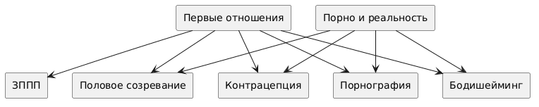

# Тема 2: Моё половое воспитание


Над данной темой работал:

- Щепкин Александр Игоревич (М8О-103СВ-25) 

---

## Схема связей между темами

В рамках темы «Моё половое воспитание» была построена структура, включающая два ключевых смысловых блока:

- **Первые отношения**
- **Порно и реальность**

Эти блоки находятся на одном уровне и представляют два разных подхода к пониманию сексуальности:

- первый — через личный опыт и взаимодействие с людьми  
- второй — через медиапространство и искажённые представления  

С ними связаны следующие понятия:

- Контрацепция  
- ЗППП  
- Порнография  
- Бодишейминг  
- Половое созревание  

При этом:
- часть понятий (например, «Порнография», «Бодишейминг») связаны сразу с двумя блоками  
- это создаёт **не только иерархические, но и горизонтальные связи**, что важно для онтологии  

Таким образом, модель представляет собой **граф, а не дерево**.



```PlantUML
@startuml
top to bottom direction

' Верхний уровень (одна строка)
together {
  rectangle "Первые отношения" as A
  rectangle "Порно и реальность" as B
}

' Нижний уровень
rectangle "Контрацепция" as C
rectangle "ЗППП" as D
rectangle "Порнография" as E
rectangle "Бодишейминг" as F
rectangle "Половое созревание" as G

' Связи сверху вниз
A --> C
A --> D
A --> E
A --> F
A --> G

B --> E
B --> F
B --> G
B --> C

@enduml
```

---

## Пример запросов (SPARQL)

Пример запроса для получения связанных понятий из WikiData:

```sparql
PREFIX wd: <http://www.wikidata.org/entity/>
PREFIX wdt: <http://www.wikidata.org/prop/direct/>
PREFIX rdfs: <http://www.w3.org/2000/01/rdf-schema#>
PREFIX bd: <http://www.bigdata.com/rdf#>

SELECT ?item ?itemLabel ?itemDescription ?concept_ru WHERE {
  VALUES (?item ?concept_ru) {
    (wd:Q101065 "Половое созревание")
    (wd:Q1189047 "Романтические отношения")
    (wd:Q764527 "Согласие")
    (wd:Q231043 "Согласие")
    (wd:Q122224  "Контрацепция")
    (wd:Q67867650 "Возраст начала половой жизни")
    (wd:Q1190058 "Физическая близость")
    (wd:Q5373791 "Эмоциональная близость")
    (wd:Q12198 "ЗППП")
    (wd:Q291 "Порнография")
    (wd:Q63522120 "Бодишейминг")
  }
  OPTIONAL {
    ?item schema:description ?itemDescription
    FILTER(LANG(?itemDescription) IN ("ru", "en"))
  }
  SERVICE wikibase:label {
    bd:serviceParam wikibase:language "ru,en"
  }
}
ORDER BY ?concept_ru
```

##  Процесс работы

1. **Определение ключевых понятий** - выделены основные темы и связанные термины

2. **Работа с данными**

   * изучены WikiData и DBpedia
   * выполнены SPARQL-запросы
   * построение онтологии

3. **Визуализация**

   * граф построен с помощью PlantUML
   * зафиксирована структура: верхний уровень + связанные понятия

4. **Генерация текстов** - использовались LLM с промптом:

     * для ответов на вопросы/больших статей:
     * ```
            Ты — дружелюбный эксперт, который объясняет сложные вещи детям 10 лет.
            Задача: Напиши статью на тему [ТЕМА. СТАТЬЯ/ВОПРОС] для подростковой энциклопедии.
            Требования:
            1. Язык: простой, дружелюбный, без сложных терминов (или с пояснениями), термины, описанные в других статьях указаны ниже
            2. Стиль: как будто объясняешь другу, можно с юмором и примерами из жизни
            3. Структура:
            - Заголовок (цепляющий, не скучный)
            - Введение (почему это важно именно для подростка)
            - Основная часть (2-3 ключевых факта с примерами)
            - Практические советы (что можно сделать прямо сейчас)
            - Заключение (позитивный вывод)
            1. Объём: 500-1000 слов
            2. Формат: Markdown (используй # для заголовков, жирный для акцентов, списки)
            Важно:
            - Не пугай, не запугивай
            - Не давай медицинских рекомендаций, только общую информацию
            - Если упоминаешь проблемы — обязательно пиши, куда обратиться за помощью
            Термины из других статей, на которые можно сослаться: [НАЗВАНИЯ_СТАТЕЙ]
            Тема: [ТЕМА. СТАТЬЯ/ВОПРОС]
            ```        

     *  для терминов:
     *  ```
           Ты — дружелюбный эксперт, который объясняет сложные вещи детям 10 лет.
           Задача: Напиши статью на тему [ТЕМА. ТЕРМИН] для подростковой энциклопедии.
           Требования:
           1. Язык: простой, дружелюбный, без сложных терминов (или с пояснениями)
           2. Стиль: как будто объясняешь другу, можно с юмором и примерами из жизни
           3. Структура:
           - Заголовок (цепляющий, не скучный)
           - Введение (почему это важно именно для подростка)
           - Основная часть (2-3 ключевых факта с примерами)
           - Практические советы (что можно сделать прямо сейчас)
           - Заключение (позитивный вывод)
           1. Объём: 300-500 слов
           2. Формат: Markdown (используй # для заголовков, жирный для акцентов, списки)
           Важно:
           - Не пугай, не запугивай
           - Не давай медицинских рекомендаций, только общую информацию
           - Если упоминаешь проблемы — обязательно пиши, куда обратиться за помощью
           Тема: [ТЕМА. ТЕРМИН.]
           ```
        

5. **Автоматизация**

   * написан Python-скрипт для расстановки перекрёстных ссылок
   * написан Python-скрипт для построения графа онтологии
   * создана JSON-структура для навигации по статьям

---

## Личные ощущения

Работа оказалась интересной, так как тема сочетает:

* биологию
* психологию
* социальные аспекты

Наиболее сложным было:

* корректно сформировать онтологию (не просто дерево, а граф)
* учесть пересечения тем (например, влияние порнографии на восприятие тела и отношений)

Наиболее полезным:

* опыт работы с SPARQL и WikiData
* построение связей между понятиями
* использование LLM для генерации понятных текстов

В целом, задание помогло лучше понять, как структурировать знания и представлять их в виде графа.
