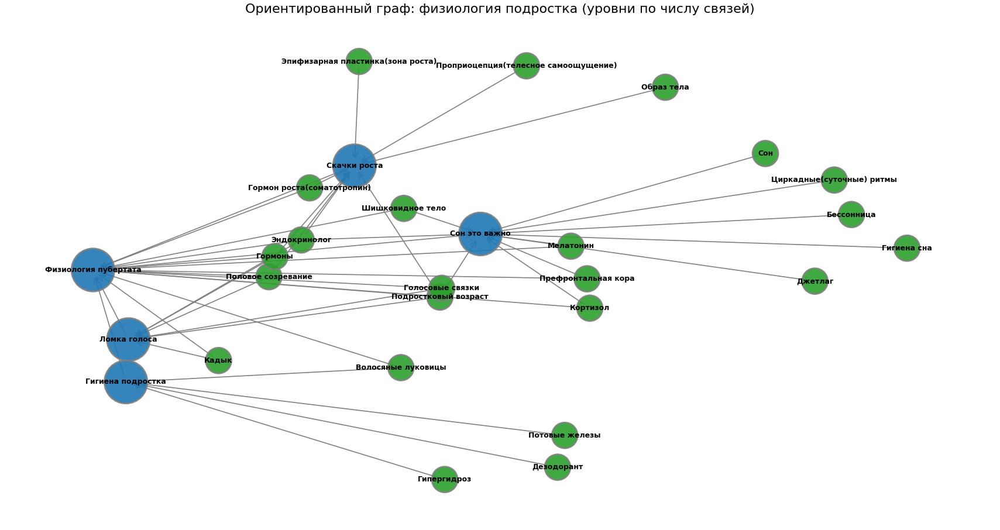

# Тема 1: Мое тело меняется

Над данной темой работал:

- Кривотулов Егор Владимирович М8О-103СВ-25

---

## Схема связей между понятиями

Выделена основная статья "Физиология пубертата", раскрывающаяся четыремя более конкретными статьями "Ломка голоса", "Гигиена подростка", "Сон -- это важно!", "Скачки роста".
Каждая из пяти статей связана с набором терминов из wikidata.



---

## Пример запросов (SPARQL)

Пример запроса для получения связанных понятий из WikiData:

```sparql
PREFIX wd: <http://www.wikidata.org/entity/>
PREFIX wdt: <http://www.wikidata.org/prop/direct/>
PREFIX rdfs: <http://www.w3.org/2000/01/rdf-schema#>
PREFIX bd: <http://www.bigdata.com/rdf#>

SELECT ?item ?itemLabel ?itemDescription ?concept_ru WHERE {
  VALUES (?item ?concept_ru) {
    (wd:Q35831 "Сон")
    (wd:Q101065 "Половое созревание")
    (wd:Q502689 "Ломка голоса")
    (wd:Q131774 "Подростковый возраст")
    (wd:Q11364 "Гормоны")
    (wd:Q352045 "Кадык")
  }
  OPTIONAL {
    ?item schema:description ?itemDescription
    FILTER(LANG(?itemDescription) IN ("ru"))
  }
  SERVICE wikibase:label {
    bd:serviceParam wikibase:language "ru"
  }
}
ORDER BY ?concept_ru
```

### Пример результата:

{"item":{"type":"uri","value":"http://www.wikidata.org/entity/Q35831"},"itemDescription":{"xml:lang":"ru","type":"literal","value":"физиологический процесс; последовательность образов, формируемых во время этого процесса"},"concept_ru":{"type":"literal","value":"Сон"},"itemLabel":{"xml:lang":"ru","type":"literal","value":"сон"}},

##  Процесс работы

1. **Определение ключевых понятий** - выделены основные темы и связанные термины

2. **Работа с данными**

   * проверка наличия термов на WikiData (~20% не нашлись, ~20% пришлось поменять на близкие по смысле)
   * написание и отладка SPARQL-запроса
   * использования скрипта другого участника команды для расстановки ссылок
   * построение онтологии (networkx)

3. **Визуализация**

   * граф построен с помощью matplotlib

4. **Генерация текстов** - использовались LLM с промптом:

     * для ответов на вопросы/больших статей:
     * ```
            Ты — дружелюбный эксперт, который объясняет сложные вещи детям 10 лет.
            Задача: Напиши статью на тему [ТЕМА. СТАТЬЯ/ВОПРОС] для подростковой энциклопедии.
            Требования:
            1. Язык: простой, дружелюбный, без сложных терминов (или с пояснениями), термины, описанные в других статьях указаны ниже
            2. Стиль: как будто объясняешь другу, можно с юмором и примерами из жизни
            3. Структура:
            - Заголовок (цепляющий, не скучный)
            - Введение (почему это важно именно для подростка)
            - Основная часть (2-3 ключевых факта с примерами)
            - Практические советы (что можно сделать прямо сейчас)
            - Заключение (позитивный вывод)
            1. Объём: 500-1000 слов
            2. Формат: Markdown (используй # для заголовков, жирный для акцентов, списки)
            Важно:
            - Не пугай, не запугивай
            - Не давай медицинских рекомендаций, только общую информацию
            - Если упоминаешь проблемы — обязательно пиши, куда обратиться за помощью
            Термины из других статей, на которые можно сослаться: [НАЗВАНИЯ_СТАТЕЙ]
            Тема: [ТЕМА. СТАТЬЯ/ВОПРОС]
            ```        

     *  для терминов:
     *  ```
           Ты — дружелюбный эксперт, который объясняет сложные вещи детям 10 лет.
           Задача: Напиши статью на тему [ТЕМА. ТЕРМИН] для подростковой энциклопедии.
           Требования:
           1. Язык: простой, дружелюбный, без сложных терминов (или с пояснениями)
           2. Стиль: как будто объясняешь другу, можно с юмором и примерами из жизни
           3. Структура:
           - Заголовок (цепляющий, не скучный)
           - Введение (почему это важно именно для подростка)
           - Основная часть (2-3 ключевых факта с примерами)
           - Практические советы (что можно сделать прямо сейчас)
           - Заключение (позитивный вывод)
           1. Объём: 300-500 слов
           2. Формат: Markdown (используй # для заголовков, жирный для акцентов, списки)
           Важно:
           - Не пугай, не запугивай
           - Не давай медицинских рекомендаций, только общую информацию
           - Если упоминаешь проблемы — обязательно пиши, куда обратиться за помощью
           Тема: [ТЕМА. ТЕРМИН.]
           ```

---

## Личные ощущения

Работа оказалась не такой простой, как думалось вначале, и материал оказался не очевидным, примерно пополам того, что уже знал, и того, что прочитал впервые

Наиболее сложным было разбить тему на статьи так, чтобы не повторять одно и то же по три раза.

В целом, стало более понятно, как разбить знания, и где проводить границу между двумя схожими статьями, но все равно остается ощущение, что идеального представления я не нащупал.