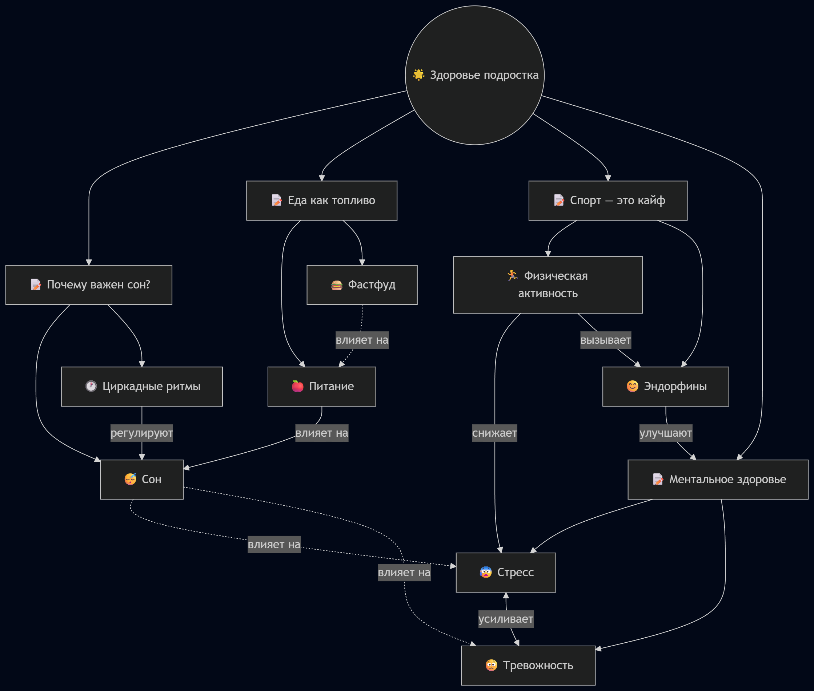
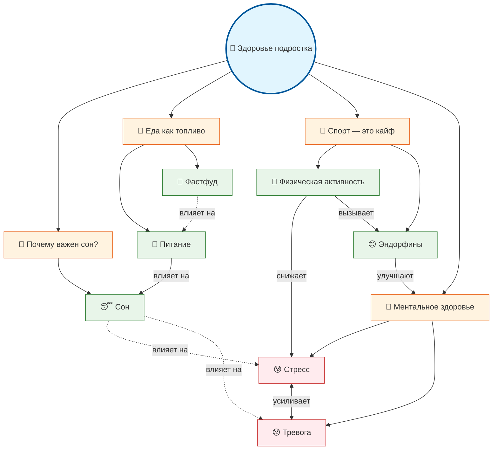

# Тема 8: Мое здоровье и энергия

**Над данной темой работал:**

- Жеребцов Сергей М8О-103СВ-25

---

## Схема связей между темами

В рамках темы «Мое здоровье и энергия» была построена структура, включающая **четыре ключевых вопроса подросткового возраста**:

- **Почему важен сон?** — про биологические ритмы и мифы про «отоспаться в выходные»
- **Еда как топливо** — про питание, фастфуд и метаболизм подростка
- **Спорт — это кайф** — про физическую активность и эндорфины
- **Ментальное здоровье** — про стресс, тревогу и когда нужна помощь

Эти блоки объединены общей идеей: **здоровье подростка — это система**, где всё взаимосвязано.

С ними связаны следующие понятия из структурированных источников (WikiData):

- Сон
- Питание
- Фастфуд
- Физическая активность
- Эндорфины
- Стресс
- Тревога

При этом:

- часть понятий (например, «Сон», «Физическая активность») влияют сразу на несколько блоков
- биологические процессы (сон, питание) влияют на ментальное состояние
- физическая активность создаёт позитивную цепочку: движение → эндорфины → снижение стресса
- это создаёт **не только иерархические, но и горизонтальные связи**, что важно для онтологии

Таким образом, модель представляет собой **граф**, а не дерево — изменения в одной области (например, недосып) влияют на другие (стресс, питание, настроение).

---

## Онтология





---

## Пример запросов (SPARQL)

Пример запроса для получения связанных понятий из WikiData:

```sparql
PREFIX wd: <http://www.wikidata.org/entity/>
PREFIX schema: <http://schema.org/>
PREFIX skos: <http://www.w3.org/2004/02/skos/core#>
PREFIX bd: <http://www.bigdata.com/rdf#>

SELECT ?item ?itemLabel ?itemDescription ?altLabel WHERE {
  VALUES ?item {
    wd:Q35831    # Сон
    wd:Q2138622  # Питание
    wd:Q81799    # Фастфуд
    wd:Q747883   # Физическая активность
    wd:Q190528   # Эндорфины
    wd:Q123414   # Стресс
    wd:Q154430   # Тревога
  }
  
  OPTIONAL {
    ?item schema:description ?itemDescription .
    FILTER(LANG(?itemDescription) IN ("ru", "en"))
  }
  
  OPTIONAL {
    ?item skos:altLabel ?altLabel .
    FILTER(LANG(?altLabel) IN ("ru", "en"))
  }
  
  SERVICE wikibase:label {
    bd:serviceParam wikibase:language "ru,en"
  }
}
ORDER BY ?itemLabel
```

**Пример найденных данных:**
- **Эндорфины** → синоним: «Гормон радости»
- **Стресс** → синонимы: «эустресс» (полезный стресс), «дистресс» (вредный стресс)
- **Фастфуд** → описание: «питание и пища с уменьшенным временем употребления»
- **Сон** → описание: «физиологический процесс; последовательность образов»

Результат запроса сохранён в файле `data/wikidata_export.json`.

---

## Процесс работы

### 1. Определение ключевых понятий
Выделены основные темы и связанные термины:
- 4 вопроса подростков (сон, питание, спорт, ментальное здоровье)
- 7 терминов из WikiData с проверкой корректности ID
- Отобраны понятия, которые можно объяснить 10-летнему ребёнку простыми словами

### 2. Работа с данными
- Изучены структурированные источники: WikiData, DBpedia
- Выполнен SPARQL-запрос для получения описаний и синонимов
- Проверены все WikiData ID на корректность и релевантность теме
- Сохранены результаты в формате JSON для дальнейшей обработки

### 3. Построение онтологии
- Определена центральная концепция: «Здоровье подростка»
- Выделены 4 смысловых блока (вопросы)
- Построены иерархические связи: вопросы → термины
- Добавлены горизонтальные связи между терминами (сон → стресс, спорт → эндорфины → ментальное здоровье)
- Учтены как биологические (сон, питание), так и психологические (стресс, тревога) аспекты

### 4. Визуализация
- Граф построен с помощью Mermaid.js
- Добавлена цветовая кодировка для разных типов узлов:
  - Голубой — центральная концепция
  - Оранжевый — вопросы подростков
  - Зелёный — позитивные термины (сон, питание, эндорфины)
  - Красный — негативные состояния (стресс, тревога)
- Сохранена схема в PNG для документации

### 5. Генерация текстов
Создано **11 статей** с помощью генеративных моделей:

**4 большие статьи (ответы на вопросы):**
- «Почему важен сон и почему "посплю на выходных" не работает»
- «Еда как топливо: что будет, если питаться дошираком»
- «Спорт — это не только "физра", это про кайф движения»
- «Ментальное здоровье: когда уже пора к психологу»

**7 коротких статей (термины):**
- Сон
- Питание
- Фастфуд
- Физическая активность
- Эндорфины
- Стресс
- Тревога

Использовался промпт с требованием «объясни для 10-летнего ребёнка»:
```
Ты — дружелюбный эксперт, который объясняет сложные вещи детям 10 лет.
Задача: Напиши статью на тему "[ТЕМА]" для подростковой энциклопедии.
...
```

Ключевые требования к текстам:
- Простой язык без сложных терминов
- Примеры из жизни подростка
- Позитивный тон без запугивания
- Практические советы вместо медицинских рекомендаций
- Упоминание, куда обратиться за помощью при проблемах

### 6. Автоматизация
- Написан Python-скрипт `sparql_query.py` для выполнения запроса к WikiData
- Создана структура папок в соответствии с требованиями проекта
- Сформирован файл `concepts.json` со списком всех статей и путями
- Подготовлены все артефакты для интеграции в репозиторий через Pull Request

---

## Выводы

Задание помогло глубже понять, как структурировать знания не как набор изолированных фактов, а как **связную систему**. Тема «Мое здоровье и энергия» оказалась особенно практичной — она напрямую касается жизни каждого подростка.

Самым интересным стал процесс адаптации научных понятий (эндорфины, циркадные ритмы) для детской аудитории: вместо терминов пришлось искать метафоры («эндорфины — это внутренние союзники», «сон — это ночной апгрейд для мозга»).

Сложнее всего было сохранить баланс:
- между научной точностью и простотой изложения
- между информативностью и отсутствием запугивания
- между полнотой охвата и объёмом статьи

В целом, проект показал, что даже сложные темы (стресс, тревога) можно объяснять детям — главное подобрать правильный язык, примеры и тон. А структурирование знаний в виде графа помогает увидеть связи, которые в обычном тексте остаются незамеченными: например, как недосып влияет не только на усталость, но и на питание, и на стресс, и на самооценку.