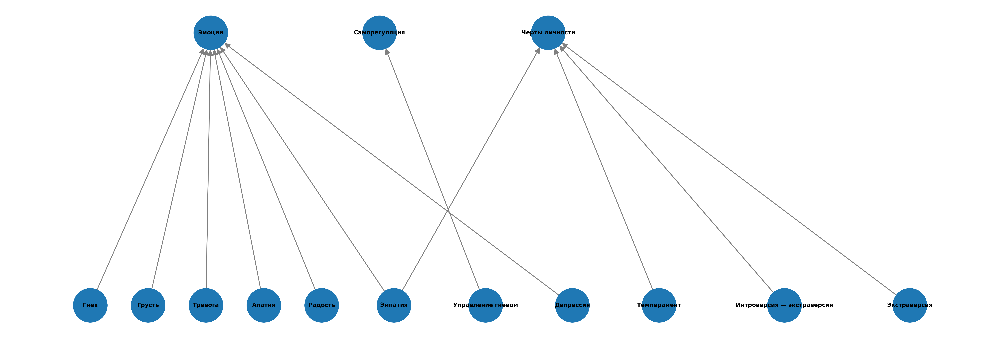
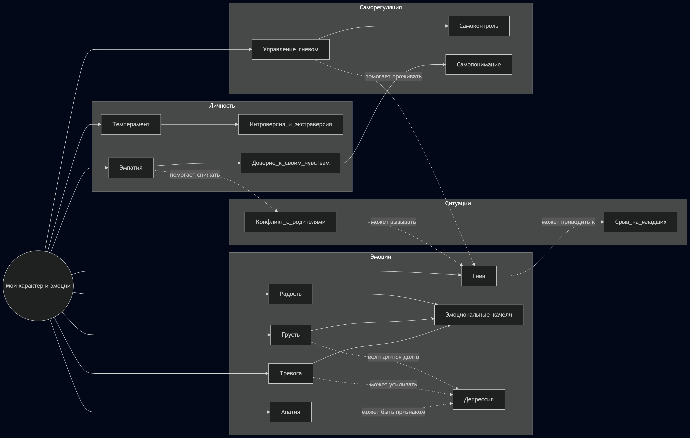

# Тема 9: Мои характер и эмоции

Над данной темой работал:

* Шангин Даниил Денисович (М8О-105СВ-25)

---

## Схема связей между темами

В рамках темы **«Мои характер и эмоции»** были построены **две онтологии**, каждая из которых решала свою задачу.

### 1. Онтология на основе внешних данных (WikiData + Python)

Первая онтология строилась на основе понятий, которые удалось найти и сопоставить с сущностями из **WikiData**. Для этого был составлен список ключевых терминов темы, после чего с помощью **SPARQL-запросов** были получены названия, описания и идентификаторы соответствующих сущностей.

Далее на основе этих данных был написан **Python-скрипт**, который позволил автоматически построить граф понятий и визуализировать его. Такой подход был полезен тем, что:

* позволил опереться на внешний источник знаний;
* помог формально зафиксировать понятия;
* дал возможность попробовать автоматически получить связи между сущностями.

Однако в процессе работы стало видно, что через **SPARQL** и **WikiData** удаётся найти **не все нужные понятия и не все нужные связи**. Для подростковой энциклопедии важны не только формальные сущности, но и смысловые отношения между ними: например, что **конфликт с родителями** может вызывать **гнев**, а **гнев** — приводить к **срыву на младших**. Подобные связи в WikiData либо отсутствуют, либо представлены не в том виде, который полезен для данной темы.

Поэтому первая онтология оказалась полезной как формальная опора на внешние данные, но недостаточной как полноценная смысловая модель темы.

### 2. Ручная онтология на основе структуры темы (Mermaid)

Вторая онтология была построена **вручную с помощью Mermaid**. В отличие от графа, собранного на основе внешней базы знаний, здесь структура задавалась не автоматически, а исходя из логики самой темы и содержания будущих статей.

Именно этот вариант позволил **более осмысленно разложить понятия по блокам** и показать реальные связи между ними.

В центре структуры находится базовое понятие:

* **Мои характер и эмоции**

От него отходят четыре ключевых смысловых блока:

* **Эмоции**
* **Личность**
* **Ситуации**
* **Саморегуляция**

В блок **«Эмоции»** входят:

* Гнев
* Грусть
* Тревога
* Апатия
* Радость
* Эмоциональные качели
* Депрессия

В блок **«Личность»** входят:

* Темперамент
* Интроверсия — экстраверсия
* Эмпатия
* Доверие к своим чувствам

В блок **«Ситуации»** входят:

* Конфликт с родителями
* Срыв на младших

В блок **«Саморегуляция»** входят:

* Управление гневом
* Самоконтроль
* Самопонимание

Кроме иерархии, в Mermaid-онтологии были зафиксированы и **смысловые связи между понятиями**:

* **Радость**, **Грусть** и **Тревога** связаны с понятием **Эмоциональные качели**
* **Грусть**, **Тревога** и **Апатия** по-разному связаны с **Депрессией**
* **Темперамент** связан с осью **Интроверсия — экстраверсия**
* **Эмпатия** связана с **Доверием к своим чувствам**
* **Конфликт с родителями** может вызывать **Гнев**
* **Гнев** может приводить к **Срыву на младших**
* **Управление гневом** помогает проживать **Гнев** и связано с **Самоконтролем**
* **Доверие к своим чувствам** связано с **Самопониманием**
* **Эмпатия** помогает снижать вероятность **Конфликта с родителями**

Таким образом, итоговая модель представляет собой **граф, а не дерево**: понятия не просто перечислены, а связаны между собой по смыслу.

### Вывод по двум онтологиям

В результате были получены два разных, но полезных подхода:

* **Python + WikiData + SPARQL** дали формальную онтологию, основанную на внешних данных;

* **Mermaid** позволил вручную построить более содержательную и точную **смысловую онтологию**.


Итоговый вывод состоит в том, что автоматический подход оказался полезным как вспомогательный инструмент, но для раскрытия темы **«Мои характер и эмоции»** более удачной оказалась именно **ручная Mermaid-онтология**, потому что она лучше отражает реальную психологическую логику темы.


Код для mermaid-онтологии
```Mermaid
graph LR


    Характер_и_эмоции((Мои характер и эмоции))


    subgraph Эмоции
        Гнев
        Грусть
        Тревога
        Апатия
        Радость
        Эмоциональные_качели
        Депрессия
    end


    subgraph Личность
        Темперамент
        Интроверсия_и_экстраверсия
        Эмпатия
        Доверие_к_своим_чувствам
    end


    subgraph Ситуации
        Конфликт_с_родителями
        Срыв_на_младших
    end


    subgraph Саморегуляция
        Управление_гневом
        Самоконтроль
        Самопонимание
    end


    Характер_и_эмоции --> Гнев
    Характер_и_эмоции --> Грусть
    Характер_и_эмоции --> Тревога
    Характер_и_эмоции --> Апатия
    Характер_и_эмоции --> Радость
    Характер_и_эмоции --> Темперамент
    Характер_и_эмоции --> Эмпатия
    Характер_и_эмоции --> Управление_гневом


    Радость --> Эмоциональные_качели
    Грусть --> Эмоциональные_качели
    Тревога --> Эмоциональные_качели


    Грусть -.->|если длится долго| Депрессия
    Тревога -.->|может усиливать| Депрессия
    Апатия -.->|может быть признаком| Депрессия


    Темперамент --> Интроверсия_и_экстраверсия
    Эмпатия --> Доверие_к_своим_чувствам


    Конфликт_с_родителями -.->|может вызывать| Гнев
    Гнев -.->|может приводить к| Срыв_на_младших


    Управление_гневом --> Самоконтроль
    Доверие_к_своим_чувствам --> Самопонимание
    Управление_гневом -.->|помогает проживать| Гнев


    Эмпатия -.->|помогает снижать| Конфликт_с_родителями


    class Характер_и_эмоции main
    class Гнев,Грусть,Тревога,Апатия,Радость,Эмоциональные_качели,Темперамент,Интроверсия_и_экстраверсия,Эмпатия,Доверие_к_своим_чувствам,Управление_гневом main
    class Конфликт_с_родителями,Срыв_на_младших,Депрессия negative
    class Самоконтроль,Самопонимание positive
```

---

## Пример запросов (SPARQL)

Для работы с внешней базой знаний использовался список ключевых понятий темы, сопоставленных с сущностями WikiData, которые я смог найти. В него вошли, например:

* Гнев
* Грусть
* Тревога
* Апатия
* Радость
* Темперамент
* Эмпатия
* Управление гневом
* Депрессия
* Интроверсия — экстраверсия
* Экстраверсия

Использованный SPARQL-запрос:

```sparql
SELECT ?item ?itemLabel ?itemDescription ?concept_ru
WHERE {
  VALUES (?item ?concept_ru) {
    (wd:Q79871 "Гнев")
    (wd:Q169251 "Грусть")
    (wd:Q154430 "Тревога")
    (wd:Q309406 "Апатия")
    (wd:Q935526 "Радость")
    (wd:Q80157 "Темперамент")
    (wd:Q182263 "Эмпатия")
    (wd:Q574559 "Управление гневом")
    (wd:Q4340209 "Депрессия")
    (wd:Q127588 "Интроверсия — экстраверсия")
    (wd:Q26214118 "Экстраверсия")
  }

  OPTIONAL {
    ?item schema:description ?itemDescription .
    FILTER(LANG(?itemDescription) IN ("ru", "en"))
  }

  SERVICE wikibase:label {
    bd:serviceParam wikibase:language "ru,en" .
  }
}
ORDER BY ?concept_ru
```

Этот запрос использовался не для построения полной смысловой структуры темы, а для получения справочной информации по заранее выбранным понятиям:

* идентификаторов;
* названий;
* описаний.

Смысловая логика темы всё равно формировалась вручную, потому что одних данных WikiData, по моему мнению, было недостаточно.

---

## Процесс работы

1. **Определение ключевых понятий**
   Сначала были выделены основные понятия темы и сгруппированы в четыре блока:

   * эмоции;
   * личность;
   * ситуации;
   * саморегуляция.

2. **Работа с внешними данными**
   Для части понятий были найдены соответствия в **WikiData**. Затем с помощью **SPARQL-запросов** были получены сведения о сущностях. На этом этапе была построена первая онтология, визуализированная через Python-код.

3. **Построение первой онтологии (Python)**
   После выполнения SPARQL-запросов был написан Python-скрипт, который позволил на основе найденных сущностей построить граф. Эта версия онтологии показала, как можно использовать внешнюю базу знаний для представления темы.

4. **Построение второй онтологии (Mermaid)**
   Затем вручную была собрана вторая онтология с помощью **Mermaid**. Она позволила точнее описать смысловые связи между понятиями и сделать структуру темы более понятной.

5. **Сравнение двух подходов**
   В ходе работы стало ясно, что онтология на основе **WikiData** не покрывает всех нужных понятий и связей. Mermaid-онтология оказалась более содержательной, потому что позволила вручную задать именно те связи, которые важны для раскрытия темы.

6. **Генерация текстов**
   Для написания статей использовались LLM. Для этого были подготовлены два типа промптов:

   * для больших статей и тематических разборов;
   * для терминов и более компактных энциклопедических материалов.

   ### Пример промпта для больших статей

   ```
   Ты — дружелюбный эксперт, который объясняет сложные вещи детям 10 лет.
   Задача: Напиши статью на тему [ТЕМА. СТАТЬЯ/ВОПРОС] для подростковой энциклопедии.
   Требования:
   1. Язык: простой, дружелюбный, без сложных терминов (или с пояснениями), термины, описанные в других статьях указаны ниже
   2. Стиль: как будто объясняешь другу, можно с юмором и примерами из жизни
   3. Структура:
   - Заголовок
   - Введение
   - Основная часть
   - Практические советы
   - Заключение
   4. Объём: 500-1000 слов
   5. Формат: Markdown
   ```

   ### Пример промпта для терминов

   ```
   Ты — дружелюбный эксперт, который объясняет сложные вещи детям 10 лет.
   Задача: Напиши статью на тему [ТЕМА. ТЕРМИН] для подростковой энциклопедии.
   Требования:
   1. Язык: простой, дружелюбный, без сложных терминов (или с пояснениями)
   2. Стиль: как будто объясняешь другу, можно с юмором и примерами из жизни
   3. Структура:
   - Заголовок
   - Введение
   - Основная часть
   - Практические советы
   - Заключение
   4. Объём: 300-500 слов
   5. Формат: Markdown
   ```

7. **Автоматизация**
   Дополнительно был написан Python-скрипт для расстановки перекрёстных ссылок между статьями. Это позволило связать материалы энциклопедии через общие понятия и сделать переходы между статьями более естественными для читателя.

---

## Личные ощущения

Работа над темой **«Мои характер и эмоции»** оказалась интересной и полезной, потому что она объединяет сразу несколько уровней подросткового опыта:

* внутренние эмоции;
* особенности личности;
* способы самопонимания;
* поведение в отношениях с близкими.

Наиболее сложным было:
* построить содержательную и понятную онтологию
* представить онтологию в таком виде, чтобы взаимное расположение и влияние частей онтологии было легко воспринимаемым.

Наиболее полезным в работе было:

* работа с WikiData и SPARQL;
* ручная смысловая декомпозиция темы через Mermaid;
* использование LLM для генерации статей в едином стиле;
* автоматизация перекрёстных ссылок между статьями.

В целом задание помогло лучше понять, что при работе с базами данных важно не только функциональное представление данных, но и их смысловая организация. Недостаточно просто найти сущности, получить их идентификаторы и построить формальный граф связей — важно ещё уметь интерпретировать эти данные в контексте конкретной темы. На примере работы над темой «Мои характер и эмоции» стало видно, что автоматическое извлечение данных из внешних источников полезно, но не всегда достаточно.
