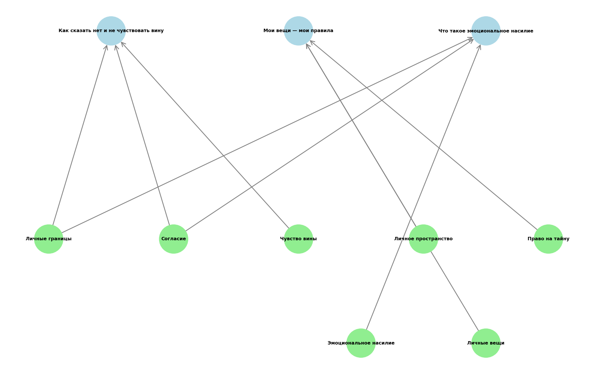

# Тема 6: Мои личные границы

Над данной темой работал:

- Чуркин Алексей Андреевич М8О-103СВ-25

---

## Схема связей между понятиями

В рамках подтемы «Мои личные границы» была построена структура, включающая два ключевых смысловых блока:

- **Что такое личные границы**
- **Нарушение границ и защита**

Эти блоки помогают понять:
- первый — что входит в понятие личных границ (физические, эмоциональные, психологические)
- второй — как распознать нарушение и как защищать свои границы

С ними связаны следующие понятия:

- Согласие
- Личное пространство
- Право на тайну
- Чувство вины
- Эмоциональное насилие
- Личные вещи

При этом:
- **Согласие** является ключевым понятием, связывающим оба блока
- **Чувство вины** часто возникает при нарушении границ, поэтому связано с блоком о нарушении
- **Личные вещи** (например, телефон) — это материальное выражение личных границ
- Это создаёт **не только иерархические, но и горизонтальные связи**, что важно для онтологии

Таким образом, модель представляет собой **граф, а не дерево**.



```PlantUML
@startuml
top to bottom direction

' Верхний уровень (два ключевых блока)
together {
  rectangle "Что такое личные границы" as A
  rectangle "Нарушение границ и защита" as B
}

' Нижний уровень (ключевые понятия)
rectangle "Личные границы" as C
rectangle "Согласие" as D
rectangle "Личное пространство" as E
rectangle "Право на тайну" as F
rectangle "Чувство вины" as G
rectangle "Эмоциональное насилие" as H
rectangle "Личные вещи" as I

' Связи от блока "Что такое личные границы"
A --> C
A --> D
A --> E
A --> F
A --> I

' Связи от блока "Нарушение границ и защита"
B --> D
B --> G
B --> H
B --> F
B --> I

' Горизонтальные связи между понятиями
C <--> D
E <--> H
F <--> H
G <--> H

@enduml
```

---

## Пример запросов (SPARQL)

Пример запроса для получения связанных понятий из WikiData:

```sparql
PREFIX wd: <http://www.wikidata.org/entity/>
PREFIX wdt: <http://www.wikidata.org/prop/direct/>
PREFIX rdfs: <http://www.w3.org/2000/01/rdf-schema#>
PREFIX bd: <http://www.bigdata.com/rdf#>

SELECT ?item ?itemLabel ?itemDescription ?concept_ru WHERE {
  VALUES (?item ?concept_ru) {
    (wd:Q7002058 "Личные границы")
    (wd:Q231043 "Согласие")
    (wd:Q628939 "Чувство вины")
    (wd:Q26270533 "Личное пространство")
    (wd:Q8354932 "Право на тайну")
    (wd:Q1339137 "Эмоциональное насилие")
    (wd:Q3702971 "Личные вещи")
  }
  OPTIONAL {
    ?item schema:description ?itemDescription
    FILTER(LANG(?itemDescription) IN ("ru", "en"))
  }
  SERVICE wikibase:label {
    bd:serviceParam wikibase:language "ru,en"
  }
}
ORDER BY ?concept_ru
```

### Результаты SPARQL-запроса (по вашему JSON):

| Понятие (рус.) | WikiData ID | Описание |
|----------------|-------------|----------|
| Личные границы | Q7002058 | психологические, эмоциональные или физические границы, которые человек устанавливает для себя |
| Согласие | Q231043 | выражение, дающее разрешение на продолжение предложения или инициативы |
| Чувство вины | Q628939 | эмоциональное переживание, возникающее при нарушении собственных моральных норм |
| Личное пространство | Q26270533 | физическое или символическое пространство, которое человек считает своим |
| Право на тайну | Q8354932 | одно из прав человека, защищающее его личную сферу от вмешательства |
| Эмоциональное насилие | Q1339137 | форма насильственного поведения, которая может приводить к психологической травме |
| Личные вещи | Q3702971 | устройство связи, часто содержащее личную информацию владельца |

---

##  Процесс работы

1. **Определение ключевых понятий** - выделены основные темы и связанные термины

2. **Работа с данными**

   * изучены WikiData и DBpedia
   * выполнены SPARQL-запросы
   * построение онтологии

3. **Визуализация**

   * граф построен с помощью PlantUML
   * зафиксирована структура: верхний уровень + связанные понятия

4. **Генерация текстов** - использовались LLM с промптом:

     * для ответов на вопросы/больших статей:
     * ```
            Ты — дружелюбный эксперт, который объясняет сложные вещи детям 10 лет.
            Задача: Напиши статью на тему [ТЕМА. СТАТЬЯ/ВОПРОС] для подростковой энциклопедии.
            Требования:
            1. Язык: простой, дружелюбный, без сложных терминов (или с пояснениями), термины, описанные в других статьях указаны ниже
            2. Стиль: как будто объясняешь другу, можно с юмором и примерами из жизни
            3. Структура:
            - Заголовок (цепляющий, не скучный)
            - Введение (почему это важно именно для подростка)
            - Основная часть (2-3 ключевых факта с примерами)
            - Практические советы (что можно сделать прямо сейчас)
            - Заключение (позитивный вывод)
            1. Объём: 500-1000 слов
            2. Формат: Markdown (используй # для заголовков, жирный для акцентов, списки)
            Важно:
            - Не пугай, не запугивай
            - Не давай медицинских рекомендаций, только общую информацию
            - Если упоминаешь проблемы — обязательно пиши, куда обратиться за помощью
            Термины из других статей, на которые можно сослаться: [НАЗВАНИЯ_СТАТЕЙ]
            Тема: [ТЕМА. СТАТЬЯ/ВОПРОС]
            ```        

     *  для терминов:
     *  ```
           Ты — дружелюбный эксперт, который объясняет сложные вещи детям 10 лет.
           Задача: Напиши статью на тему [ТЕМА. ТЕРМИН] для подростковой энциклопедии.
           Требования:
           1. Язык: простой, дружелюбный, без сложных терминов (или с пояснениями)
           2. Стиль: как будто объясняешь другу, можно с юмором и примерами из жизни
           3. Структура:
           - Заголовок (цепляющий, не скучный)
           - Введение (почему это важно именно для подростка)
           - Основная часть (2-3 ключевых факта с примерами)
           - Практические советы (что можно сделать прямо сейчас)
           - Заключение (позитивный вывод)
           1. Объём: 300-500 слов
           2. Формат: Markdown (используй # для заголовков, жирный для акцентов, списки)
           Важно:
           - Не пугай, не запугивай
           - Не давай медицинских рекомендаций, только общую информацию
           - Если упоминаешь проблемы — обязательно пиши, куда обратиться за помощью
           Тема: [ТЕМА. ТЕРМИН.]
           ```
        

5. **Автоматизация**

   * написан Python-скрипт для построения графа онтологии
   * написан Python-скрипт для расстановки перекрёстных ссылок
   * создана JSON-структура для навигации по статьям

---

## Личные ощущения

Работа оказалась интересной и полезной, так как тема личных границ:

* актуальна для подросткового возраста
* помогает сформировать здоровое самовосприятие
* учит выстраивать здоровые отношения с окружающими

Наиболее сложным было:

* корректно сформировать онтологию
* учесть пересечения понятий (например, связь между личными границами и чувством вины)
* подобрать правильные WikiData ID для всех понятий

Наиболее полезным:

* опыт работы с SPARQL и WikiData
* построение связей между понятиями
* использование LLM для генерации понятных текстов для подростков
* автоматизация перекрёстных ссылок между статьями

В целом, задание помогло лучше понять, как структурировать знания и представлять их в виде графа, а также научило работать с открытыми базами знаний.
