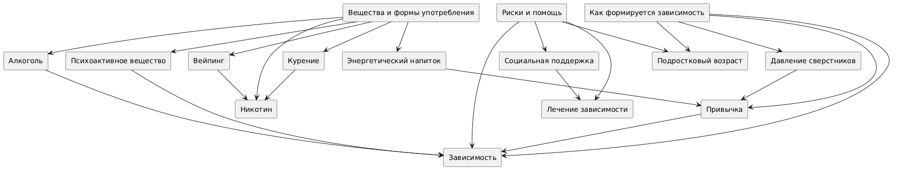
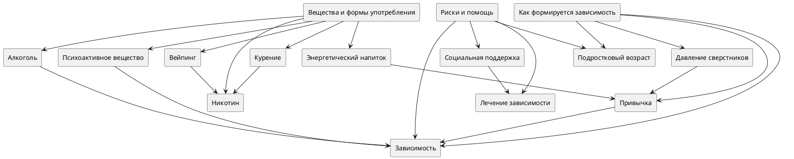

# Тема 3: Мои зависимости

**Над данной темой работал:**

Стенин Константин М8О-105СВ-25

## Схема связей между темами

В рамках темы «Мои зависимости» была построена структура, включающая три ключевых смысловых блока:

- **Как формируется зависимость**
- **Вещества и формы употребления**
- **Риски и помощь**

Эти блоки находятся на одном уровне и представляют три разных аспекта темы:

- **первый** — через то, как начинается употребление и как формируется зависимость
- **второй** — через конкретные вещества, продукты и формы употребления
- **третий** — через последствия для подростка и способы преодоления проблемы

С ними связаны следующие понятия:

- Давление сверстников
- Привычка
- Зависимость
- Подростковый возраст
- Алкоголь
- Курение
- Вейпинг
- Никотин
- Психоактивное вещество
- Энергетический напиток
- Социальная поддержка
- Лечение зависимости

При этом:

- часть понятий (например, «Подростковый возраст», «Зависимость») связаны сразу с несколькими блоками
- это создаёт не только иерархические, но и горизонтальные связи, что важно для онтологии
- социальные факторы влияют на начало употребления
- химические и поведенческие факторы влияют на формирование зависимости
- поддержка и лечение связаны уже не с началом проблемы, а с её преодолением

Таким образом, модель представляет собой **граф**, а не дерево.

## Онтология



## Онтология



---

## Пример запросов (SPARQL)

Пример запроса для получения связанных понятий из WikiData:

```sparql
PREFIX wd: <http://www.wikidata.org/entity/>
PREFIX wdt: <http://www.wikidata.org/prop/direct/>
PREFIX rdfs: <http://www.w3.org/2000/01/rdf-schema#>
PREFIX bd: <http://www.bigdata.com/rdf#>

SELECT ?item ?itemLabel ?itemDescription ?concept_ru WHERE {
  VALUES (?item ?concept_ru) {
    (wd:Q784843 "Давление сверстников")
    (wd:Q1299714 "Привычка")
    (wd:Q12029 "Зависимость")
    (wd:Q7632070 "Расстройство, связанное с употреблением веществ")
    (wd:Q131774 "Подростковый возраст")
    (wd:Q8059302 "Здоровье подростков")
    (wd:Q2297111 "Социальная поддержка")
    (wd:Q1260022 "Лечение зависимости")
    (wd:Q47146337 "Алкоголь")
    (wd:Q2647488 "Употребление алкоголя")
    (wd:Q662860 "Курение")
    (wd:Q1578 "Сигарета")
    (wd:Q189511 "Электронная сигарета")
    (wd:Q27186512 "Вейпинг")
    (wd:Q12144 "Никотин")
    (wd:Q3706669 "Психоактивное вещество")
    (wd:Q1309388 "Теория стартовых наркотиков")
    (wd:Q215754 "Энергетический напиток")
  }
  OPTIONAL {
    ?item schema:description ?itemDescription
    FILTER(LANG(?itemDescription) IN ("ru", "en"))
  }
  SERVICE wikibase:label {
    bd:serviceParam wikibase:language "ru,en"
  }
}
ORDER BY ?concept_ru
```

---

## Процесс работы

### 1. Определение ключевых понятий

Выделены основные темы и связанные термины:

- 3 центральных концепта (Как формируется зависимость, Вещества и формы употребления, Риски и помощь)
- 4 понятия, описывающие механизм формирования зависимости (Давление сверстников, Привычка, Зависимость, Подростковый возраст)
- 4 понятия, связанные с наиболее распространёнными веществами и формами употребления (Алкоголь, Курение, Вейпинг, Никотин)
- 2 понятия, описывающие более широкий контекст веществ и рисков (Психоактивное вещество, Энергетический напиток)
- 2 понятия, связанные с преодолением проблемы (Социальная поддержка, Лечение зависимости)

### 2. Работа с данными

- изучены WikiData и DBpedia
- выполнены SPARQL-запросы для получения ID и описаний
- проверены корректности всех WikiData ID

### 3. Построение онтологии

- зафиксирована структура: центральный уровень + связанные понятия
- определены логические связи между понятиями

### 4. Визуализация

- граф построен с помощью PlantUML
- сохранена схема в PNG для документации
- добавлена легенда по типам узлов

### 5. Генерация текстов

Использовались LLM с промптом:

**Для ответов на вопросы/больших статей:**

```text
Ты — дружелюбный эксперт, который объясняет сложные вещи детям 10 лет.
Задача: Напиши статью на тему [ТЕМА. СТАТЬЯ/ВОПРОС] для подростковой энциклопедии.

Требования:
1. Язык: простой, дружелюбный, без сложных терминов (или с пояснениями),
   термины, описанные в других статьях указаны ниже
2. Стиль: как будто объясняешь другу, можно с юмором и примерами из жизни
3. Структура:
   - Заголовок (цепляющий, не скучный)
   - Введение (почему это важно именно для подростка)
   - Основная часть (2-3 ключевых факта с примерами)
   - Практические советы (что можно сделать прямо сейчас)
   - Заключение (позитивный вывод)
4. Объём: 500-1000 слов
5. Формат: Markdown (используй # для заголовков, жирный для акцентов, списки)

Важно:
- Не пугай, не запугивай
- Не давай медицинских рекомендаций, только общую информацию
- Если упоминаешь проблемы — обязательно пиши, куда обратиться за помощью

Термины из других статей, на которые можно сослаться: [НАЗВАНИЯ_СТАТЕЙ]
Тема: [ТЕМА. СТАТЬЯ/ВОПРОС]
```

**Для терминов:**

```text
Ты — дружелюбный эксперт, который объясняет сложные вещи детям 10 лет.
Задача: Напиши статью на тему [ТЕМА. ТЕРМИН] для подростковой энциклопедии.

Требования:
1. Язык: простой, дружелюбный, без сложных терминов (или с пояснениями)
2. Стиль: как будто объясняешь другу, можно с юмором и примерами из жизни
3. Структура:
   - Заголовок (цепляющий, не скучный)
   - Введение (почему это важно именно для подростка)
   - Основная часть (2-3 ключевых факта с примерами)
   - Практические советы (что можно сделать прямо сейчас)
   - Заключение (позитивный вывод)
4. Объём: 300-500 слов
5. Формат: Markdown (используй # для заголовков, жирный для акцентов, списки)

Важно:
- Не пугай, не запугивай
- Не давай медицинских рекомендаций, только общую информацию
- Если упоминаешь проблемы — обязательно пиши, куда обратиться за помощью

Тема: [ТЕМА. ТЕРМИН]
```

### 6. Автоматизация

- написан Python-скрипт для построения графа онтологии
- написан Python-скрипт для расстановки перекрёстных ссылок
- создана JSON-структура для навигации по статьям

---

### Выводы:

Задание помогло лучше понять, как структурировать знания и представлять их в виде графа. Тема «Мои зависимости» оказалась гораздо глубже, чем казалось на первый взгляд — она находится на пересечении нескольких областей знания. Она оказалась особенно чувствительной для подростков, поэтому важно было сохранить баланс между информативностью и поддержкой. Сочетание интересной темы и интересного задания помогло увлекательно погрузиться в выполнение лабораторной работы.
