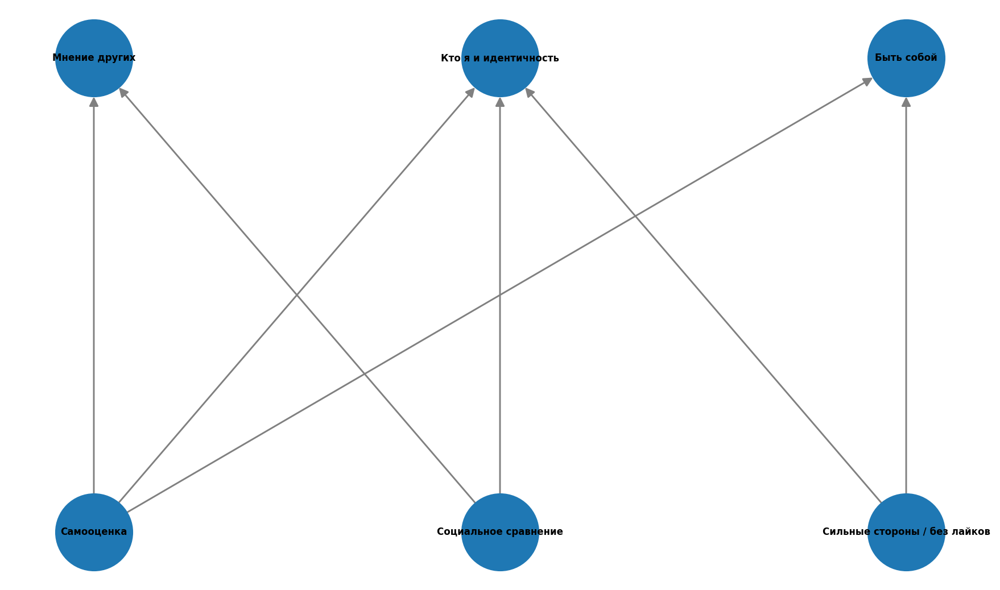
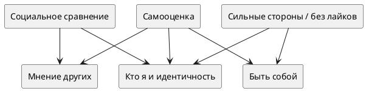

# Тема: Моя самооценка и идентификация

**Над данной темой работал:**

Сухарев Александр Игоревич М8О-105СВ-25

## Схема связей между темами

В рамках темы «Моя самооценка и идентификация» была построена структура, включающая три ключевых смысловых блока (статьи верхнего уровня в графе):

- **Кто я и идентичность**
- **Мнение других**
- **Быть собой**

Они связаны с опорными понятиями, через которые подросток проживает тему:

- **Самооценка**
- **Социальное сравнение**
- **Сильные стороны / «классность» без лайков**

При этом:

- часть связей ведёт от «базовых» понятий сразу к нескольким смысловым блокам (например, самооценка связана и с «Кто я», и с «Мнение других», и с «Быть собой»);
- это создаёт **не только иерархические, но и горизонтальные связи**, что важно для онтологии;
- эмоциональная вовлечённость в чужое мнение усиливает сравнение с другими, а опора на свои сильные стороны смягчает зависимость от одобрения.

Таким образом, модель представляет собой **граф**, а не дерево.

Подробнее связи между статьями см. в [ontology.md](./ontology.md).

## Онтология





---

## Пример запросов (SPARQL)

Пример запроса для получения меток выбранных понятий из Wikidata (результат сохраняется в `data/moya_samootsenka_i_identifikaciya.json` при запуске `scripts/sparql_query.py`):

```sparql
PREFIX wd: <http://www.wikidata.org/entity/>
PREFIX rdfs: <http://www.w3.org/2000/01/rdf-schema#>
PREFIX bd: <http://www.bigdata.com/rdf#>

SELECT ?item ?itemLabel WHERE {
  VALUES ?item {
    wd:Q120675
    wd:Q185573
    wd:Q175862
    wd:Q1963141
    wd:Q2717571
    wd:Q1860
  }
  SERVICE wikibase:label {
    bd:serviceParam wikibase:language "ru,en" .
    ?item rdfs:label ?itemLabel .
  }
}
ORDER BY ?item
```

---

## Процесс работы

### 1. Определение ключевых понятий

Выделены вопросы темы и статьи в `WEB/.../concepts/` (см. `concepts.json`):

- кто я в реальности и идентичность;
- почему важно мнение других;
- сравнение с другими;
- быть собой, когда себя ещё не знаешь;
- сильные стороны и «классность» без лайков.

### 2. Работа с данными

- изучены Wikidata (и при необходимости другие источники);
- выполнены SPARQL-запросы; ответы выгружаются в JSON;
- для отчёта подобраны QID понятий (самооценка, самообраз, идентичность, социальное сравнение, социальная идентичность, подростковый возраст и др.).

### 3. Построение онтологии

- зафиксированы узлы (статьи) и смысловые рёбра между ними;
- дублирование структуры — в `ontology.md` и `ontology_graph.py`;
- визуальный граф строится в `scripts/sparql_query.py` (синтетический, для наглядности) и сохраняется в `images/ontology.png`.

### 4. Визуализация

- схема в PlantUML — в этом README;
- PNG — из скрипта построения графа (networkx + matplotlib).

### 5. Генерация текстов

Использовались LLM с промптом:

**Для ответов на вопросы/больших статей:**

```
Ты — дружелюбный эксперт, который объясняет сложные вещи детям 10 лет.
Задача: Напиши статью на тему [ТЕМА. СТАТЬЯ/ВОПРОС] для подростковой энциклопедии.

Требования:
1. Язык: простой, дружелюбный, без сложных терминов (или с пояснениями), 
   термины, описанные в других статьях указаны ниже
2. Стиль: как будто объясняешь другу, можно с юмором и примерами из жизни
3. Структура:
   - Заголовок (цепляющий, не скучный)
   - Введение (почему это важно именно для подростка)
   - Основная часть (2-3 ключевых факта с примерами)
   - Практические советы (что можно сделать прямо сейчас)
   - Заключение (позитивный вывод)
4. Объём: 500-1000 слов
5. Формат: Markdown (используй # для заголовков, жирный для акцентов, списки)

Важно:
- Не пугай, не запугивай
- Не давай медицинских рекомендаций, только общую информацию
- Если упоминаешь проблемы — обязательно пиши, куда обратиться за помощью

Термины из других статей, на которые можно сослаться: [НАЗВАНИЯ_СТАТЕЙ]
Тема: [ТЕМА. СТАТЬЯ/ВОПРОС]
```

**Для терминов:**

```
Ты — дружелюбный эксперт, который объясняет сложные вещи детям 10 лет.
Задача: Напиши статью на тему [ТЕМА. ТЕРМИН] для подростковой энциклопедии.

Требования:
1. Язык: простой, дружелюбный, без сложных терминов (или с пояснениями)
2. Стиль: как будто объясняешь другу, можно с юмором и примерами из жизни
3. Структура:
   - Заголовок (цепляющий, не скучный)
   - Введение (почему это важно именно для подростка)
   - Основная часть (2-3 ключевых факта с примерами)
   - Практические советы (что можно сделать прямо сейчас)
   - Заключение (позитивный вывод)
4. Объём: 300-500 слов
5. Формат: Markdown (используй # для заголовков, жирный для акцентов, списки)

Важно:
- Не пугай, не запугивай
- Не давай медицинских рекомендаций, только общую информацию
- Если упоминаешь проблемы — обязательно пиши, куда обратиться за помощью

Тема: [ТЕМА. ТЕРМИН]
```

### 6. Автоматизация

- Python-скрипт `scripts/sparql_query.py` — запрос к Wikidata, сохранение JSON, построение графа и `images/ontology.png`;
- Python-скрипт `scripts/link_states.py` и `link_map.json` — перекрёстные ссылки между статьями (обязательно с флагом записи: `python -m link_states --write --yes` из папки `scripts`; без `--write` скрипт только показывает, что изменилось бы, и файлы не трогает);
- `concepts.json` — навигация по статьям энциклопедии.

См. также общее описание лабораторной в [README_TeenBook_lab.md](./README_TeenBook_lab.md) (шаблон курса).

---

### Выводы

Задание помогло структурировать знания о том, как подросток опирается на самооценку, идентичность и социальное сравнение. Тема лежит на стыке психологии и повседневного опыта (школа, соцсети, отношения с близкими), поэтому важно было сочетать ясность формулировок с поддерживающим тоном. Сочетание явной модели (онтология + Wikidata) и текстов для читателя сделало работу и содержательной, и прикладной.
