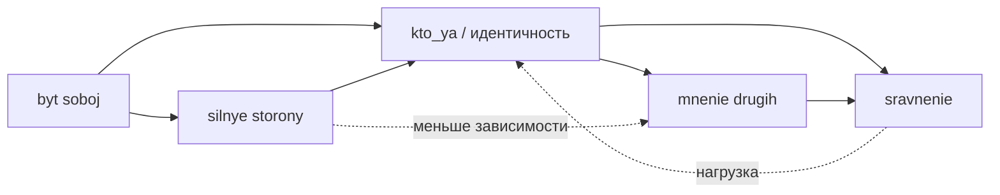

# Онтология темы «Моя самооценка и идентификация»

Узлы — статьи в `WEB/.../concepts/`. Связи — смысловые (для навигации и понимания темы, не формальная OWL-онтология).

## Узлы (статьи)

| id | файл | кратко |
|----|------|--------|
| A | `kto_ya_realnyi_i_identichnost.md` | Кто я, самооценка, личная идентичность |
| B | `mnenie_drugih_pochemu_vazhno.md` | Зачем нужно одобрение, мнение других |
| C | `sravnenie_s_drugimi.md` | Социальное сравнение, «все лучше меня» |
| D | `byt_soboi_kogda_ne_znaesh_sebya.md` | Быть собой, самопознание, эксперименты |
| E | `silnye_storony_i_klassnost_bez_laykov.md` | Сильные стороны, внутренняя ценность без метрик |

## Рёбра (направленные смыслы)

```
A --[влияет на]--> B    (идентичность и самооценка связаны с чувствительностью к мнению других)
A --[влияет на]--> C    (низкая самооценка усиливает сравнение)
B --[усиливает]--> C    (важность мнения других подкармливает сравнение)
C --[снижает]--> A      (постоянное сравнение бьёт по самооценке)
D --[развивает]--> A    (самопознание укрепляет представление о себе)
D --[помогает]--> E     (знание себя помогает заметить сильные стороны)
E --[поддерживает]--> A (опора на свои качества поддерживает самооценку)
E --[снижает зависимость от]--> B (внутренняя «классность» смягчает гонку за одобрением)
```

## Ключевые термины между статьями

- **Самооценка**, **личная идентичность** — узел A  
- **мнение других**, **одобрение** — B  
- **социальное сравнение** — C  
- **быть собой**, **самопознание** — D  
- **сильные стороны**, **лайки**, **внутренняя опора** — E  

## Mermaid (схема)


