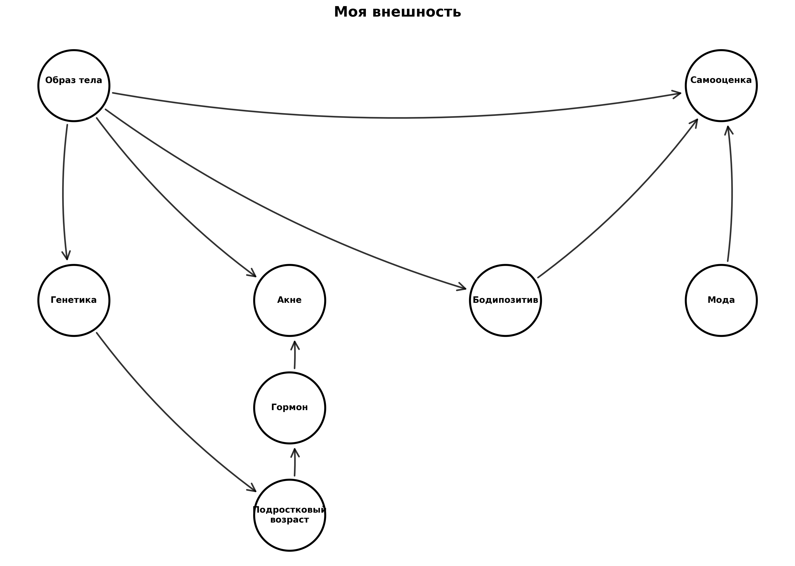
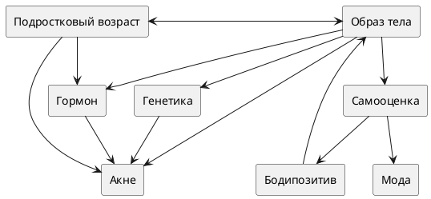

# Тема 3: Моя внешность

**Над данной темой работал:**

Мусаелян Ярослав М8О-103СВ-25

## Схема связей между темами

В рамках темы «Моя внешность» была построена структура, включающая два ключевых смысловых блока:

- **Образ тела**
- **Самооценка**

Эти блоки находятся на одном уровне и представляют два разных аспекта восприятия себя:

- **первый** — через то, как человек видит своё тело в зеркале и в голове
- **второй** — через то, как человек оценивает себя как личность

С ними связаны следующие понятия:

- Акне
- Гормон
- Генетика
- Подростковый возраст
- Бодипозитив
- Мода

При этом:

- часть понятий (например, «Акне», «Подростковый возраст») связаны сразу с несколькими блоками
- это создаёт не только иерархические, но и горизонтальные связи, что важно для онтологии
- биологические факторы влияют на образ тела, социальные — на самооценку

Таким образом, модель представляет собой **граф**, а не дерево.

## Онтология



## Онтология



---

## Пример запросов (SPARQL)

Пример запроса для получения связанных понятий из WikiData:

```sparql
PREFIX wd: <http://www.wikidata.org/entity/>
PREFIX wdt: <http://www.wikidata.org/prop/direct/>
PREFIX rdfs: <http://www.w3.org/2000/01/rdf-schema#>
PREFIX bd: <http://www.bigdata.com/rdf#>

SELECT ?item ?itemLabel ?itemDescription ?concept_ru WHERE {
  VALUES (?item ?concept_ru) {
    (wd:Q15733239 "Образ тела")
    (wd:Q10981881 "Самооценка")
    (wd:Q79928 "Акне")
    (wd:Q23013372 "Бодипозитив")
    (wd:Q12684 "Мода")
    (wd:Q7162 "Генетика")
    (wd:Q131774 "Подростковый возраст")
    (wd:Q11364 "Гормон")
  }
  OPTIONAL {
    ?item schema:description ?itemDescription
    FILTER(LANG(?itemDescription) IN ("ru", "en"))
  }
  SERVICE wikibase:label {
    bd:serviceParam wikibase:language "ru,en"
  }
}
ORDER BY ?concept_ru
```

---

## Процесс работы

### 1. Определение ключевых понятий
Выделены основные темы и связанные термины:
- 2 центральных концепта (Образ тела, Самооценка)
- 4 биологических фактора (Генетика, Гормон, Акне, Подростковый возраст)
- 2 социальных фактора (Бодипозитив, Мода)

### 2. Работа с данными
- изучены WikiData и DBpedia
- выполнены SPARQL-запросы для получения ID и описаний
- проверены корректности всех WikiData ID

### 3. Построение онтологии
- зафиксирована структура: центральный уровень + факторы влияния
- определены логические связи между понятиями

### 4. Визуализация
- граф построен с помощью PlantUML
- сохранена схема в PNG для документации
- добавлена легенда по типам узлов

### 5. Генерация текстов
Использовались LLM с промптом:

**Для ответов на вопросы/больших статей:**
```
Ты — дружелюбный эксперт, который объясняет сложные вещи детям 10 лет.
Задача: Напиши статью на тему [ТЕМА. СТАТЬЯ/ВОПРОС] для подростковой энциклопедии.

Требования:
1. Язык: простой, дружелюбный, без сложных терминов (или с пояснениями), 
   термины, описанные в других статьях указаны ниже
2. Стиль: как будто объясняешь другу, можно с юмором и примерами из жизни
3. Структура:
   - Заголовок (цепляющий, не скучный)
   - Введение (почему это важно именно для подростка)
   - Основная часть (2-3 ключевых факта с примерами)
   - Практические советы (что можно сделать прямо сейчас)
   - Заключение (позитивный вывод)
4. Объём: 500-1000 слов
5. Формат: Markdown (используй # для заголовков, жирный для акцентов, списки)

Важно:
- Не пугай, не запугивай
- Не давай медицинских рекомендаций, только общую информацию
- Если упоминаешь проблемы — обязательно пиши, куда обратиться за помощью

Термины из других статей, на которые можно сослаться: [НАЗВАНИЯ_СТАТЕЙ]
Тема: [ТЕМА. СТАТЬЯ/ВОПРОС]
```

**Для терминов:**
```
Ты — дружелюбный эксперт, который объясняет сложные вещи детям 10 лет.
Задача: Напиши статью на тему [ТЕМА. ТЕРМИН] для подростковой энциклопедии.

Требования:
1. Язык: простой, дружелюбный, без сложных терминов (или с пояснениями)
2. Стиль: как будто объясняешь другу, можно с юмором и примерами из жизни
3. Структура:
   - Заголовок (цепляющий, не скучный)
   - Введение (почему это важно именно для подростка)
   - Основная часть (2-3 ключевых факта с примерами)
   - Практические советы (что можно сделать прямо сейчас)
   - Заключение (позитивный вывод)
4. Объём: 300-500 слов
5. Формат: Markdown (используй # для заголовков, жирный для акцентов, списки)

Важно:
- Не пугай, не запугивай
- Не давай медицинских рекомендаций, только общую информацию
- Если упоминаешь проблемы — обязательно пиши, куда обратиться за помощью

Тема: [ТЕМА. ТЕРМИН]
```

### 6. Автоматизация
- написан Python-скрипт для построения графа онтологии
- написан Python-скрипт для расстановки перекрёстных ссылок
- создана JSON-структура для навигации по статьям

---

### Выводы:
Задание помогло лучше понять, как структурировать знания и представлять их в виде графа. Тема «Моя внешность» оказалась гораздо глубже, чем казалось на первый взгляд — она находится на пересечении нескольких областей знания. Она оказалась особенно чувствительной для подростков, поэтому важно было сохранить баланс между информативностью и поддержкой. Сочетание интересной темы и интересного задания помогло увлекательно погрузиться в выполнение лабораторной работы. 
