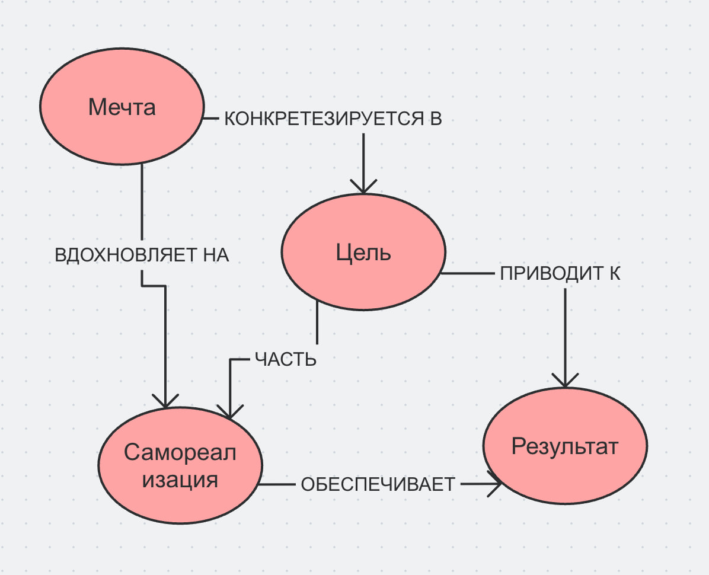

## Ответственный: Хасанов Даниил (М8О-102СВ-25)

## Схема связей:


## Пример запроса:
```
SELECT ?item ?itemLabel ?description WHERE {
  VALUES ?item {
    wd:Q6028924    # мечта
    wd:Q4503831    # цель 
    wd:Q2995644    # результат
    wd:Q16874480   # самореализация
  }

  SERVICE wikibase:label { bd:serviceParam wikibase:language "ru,en". }

  OPTIONAL {
    ?item schema:description ?description .
    FILTER(LANG(?description) = "ru")
  }
}
```
## Ощущения от работы
Работа над темой оказалась неожиданно личной — сложно писать о мечтах и целях, не примеряя всё это на себя. Интереснее всего было разбираться с тем, где заканчивается мечта и начинается настоящая цель: оказывается, граница куда тоньше, чем казалось. Немного сложно было найти нужный баланс между глубиной и доступностью для подросткового читателя, но в итоге это стало главным ориентиром при написании.

## Сгенерированная суммаризация
В предоставленных статьях выстроена логическая цепочка:от разграничения мечты и цели как двух разных психологических конструктов («Мечта и цель: в чём разница») через практику целеполагания и управления ожиданиями («Как ставить цели, чтобы не бросить», «План на год, на 5 лет — это работает?») к принятию изменений в жизненном пути («Что делать, если мечта изменилась») и соотношению внутренней мотивации с самодисциплиной («Мотивация vs дисциплина»). Общая суть материалов заключается в том, что мечта выступает как ориентир, задающий направление, тогда как цель — это операционализированная версия мечты, подкреплённая конкретными шагами и временными рамками. Ключевой особенностью подхода является смещение фокуса с абстрактного желания на формирование реалистичных, поэтапных планов с учётом того, что жизненные приоритеты меняются, а устойчивого результата достигает не тот, кто ждёт вдохновения, а тот, кто опирается на выработанную привычку действовать.
