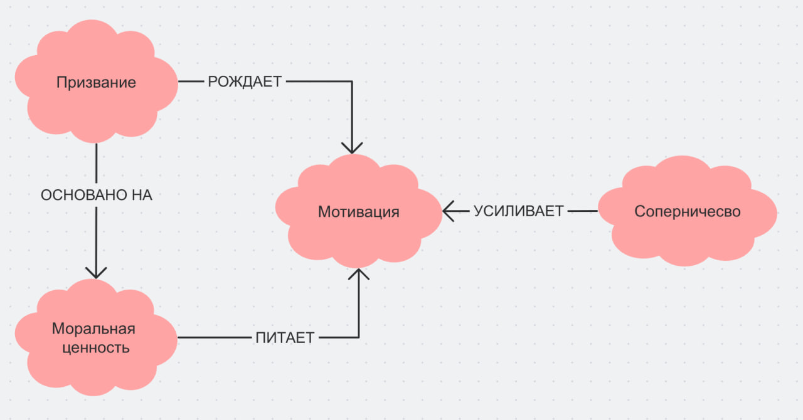

## Ответственный: Злобин Владимир (М8О-102СВ-25)

## Схема связей:


## Пример запроса:
```
SELECT ?item ?itemLabel ?description WHERE {
  VALUES ?item {
    wd:Q644302    # мотивация
    wd:Q194112    # ценности 
    wd:Q476300    # соперничество
    wd:Q829183    # призвание
  }

  SERVICE wikibase:label { bd:serviceParam wikibase:language "ru,en". }

  OPTIONAL {
    ?item schema:description ?description .
    FILTER(LANG(?description) = "ru")
  }
}
```
## Ощущения от работы
Тема мотивации поначалу казалась очень банальной — кажется, об этом написано всё и всеми. Но когда начал разбираться глубже, понял, что для подростка это совсем не банально: многие просто не знают, что апатия и отсутствие желания что-либо делать — это нормально и с этим можно работать. Приятно было находить простые, но честные формулировки для вещей, которые обычно объясняют слишком сложно.

## Сгенерированная суммаризация
В предоставленных статьях выстроена логическая цепочка: от практических механизмов запуска действия («Как заставить себя что-то делать») через анализ временно́го горизонта мотивации («Мотивация на короткую и длинную дистанцию») к работе с апатией и эмоциональным спадом («Когда ничего не хочется»), поиску источников вдохновения («Кто или что меня вдохновляет») и формированию системы внутреннего подкрепления («Похвала и награда: как себя поддерживать»). Общая суть материалов заключается в том, что мотивация — не стабильное состояние, а динамический процесс, зависящий от внешних триггеров, внутренних ценностей и качества самовосприятия. Ключевой особенностью подхода является признание нормальности мотивационных спадов и акцент на выработке навыков самоподдержки: умении замечать собственные достижения, выстраивать систему поощрений и находить источники вдохновения, не зависящие от внешней оценки.
