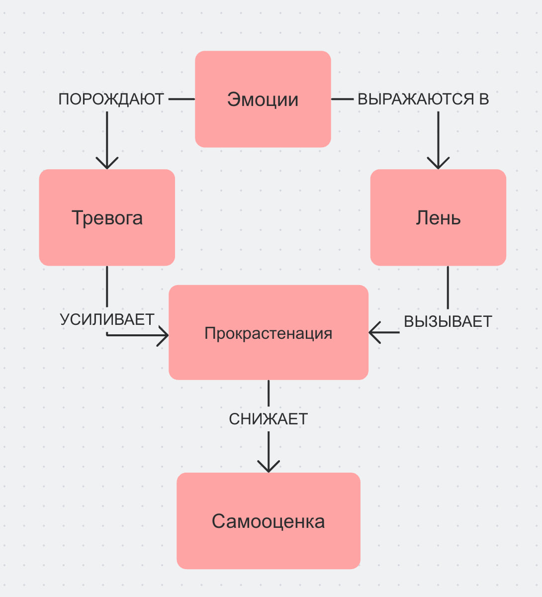

## Ответственный: Брайнингер Рудольф (М8О-102СВ-25)

## Схема связей:


## Пример запроса:
```
SELECT ?item ?itemLabel ?description WHERE {
  VALUES ?item {
    wd:Q330104    # прокрастинация
    wd:Q484       # лень 
    wd:Q154430    # тревога
    wd:Q9415      # эмоции
    wd:Q473596    # самооценка
  }

  SERVICE wikibase:label { bd:serviceParam wikibase:language "ru,en". }

  OPTIONAL {
    ?item schema:description ?description .
    FILTER(LANG(?description) = "ru")
  }
}
```
## Ощущения от работы
Работать над темой прокрастинации было немного иронично — сама тема про откладывание дел, и соблазн отложить работу над ней был весьма реальным. Зато это помогло лучше почувствовать материал изнутри. Особенно интересно было разбираться с тем, чем лень отличается от усталости — оказывается, это принципиально разные вещи, и важно, чтобы подростки это понимали, а не просто ругали себя.

## Сгенерированная суммаризация
В предоставленных статьях выстроена логическая цепочка: от описания механизма избегания важных задач («Почему я делаю всё, кроме важного») через анализ феномена откладывания на неопределённый срок («"С понедельника начну" — почему не получается») к конкретной прикладной ситуации («Как заставить себя делать уроки»), переосмыслению природы лени («Лень — это враг или защита») и обзору доказательных техник преодоления прокрастинации («Техники, которые реально работают»). Общая суть материалов заключается в том, что прокрастинация — это не порок характера, а поведенческая реакция на воспринимаемую сложность, скуку или страх неудачи, и как таковая она поддаётся управлению через изменение условий среды и структуры задачи. Ключевой особенностью подхода является разграничение лени как симптома переутомления и как устойчивой привычки избегания, а также акцент на конкретных, проверенных методах — от правила двух минут и техники Pomodoro до принципа «съешь лягушку» — как инструментах формирования продуктивного поведения.
