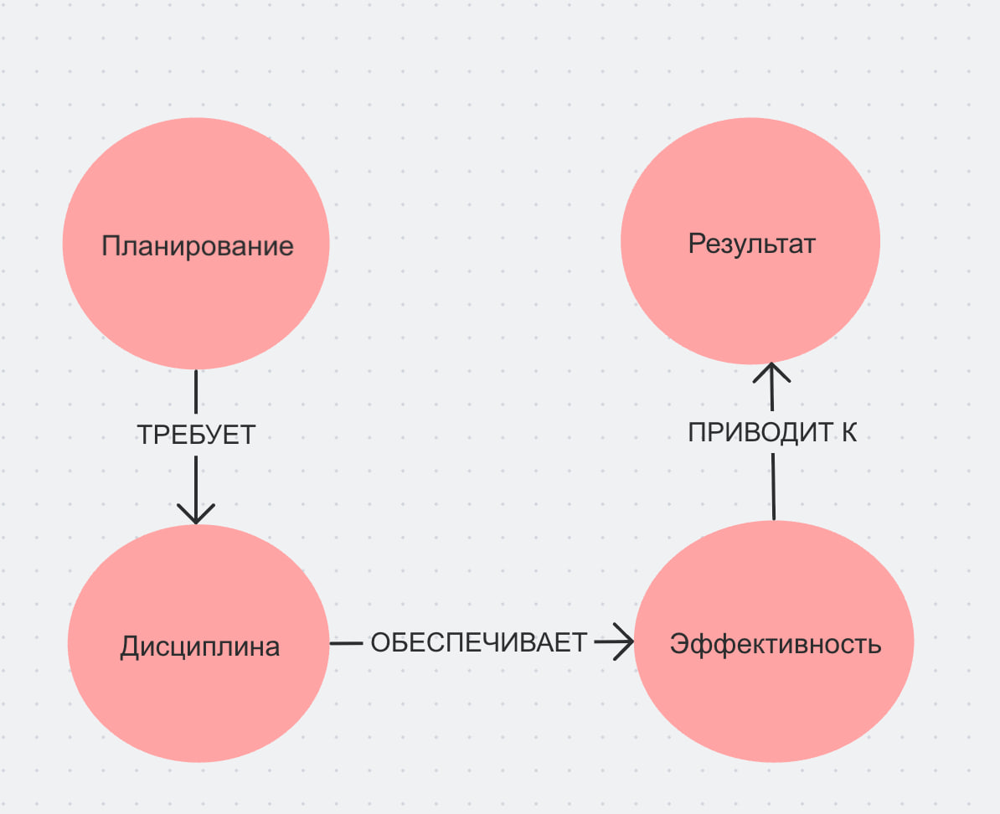

## Ответственный: Фоменков Макар (М8О-102СВ-25)

## Схема связей:


## Пример запроса:
```
SELECT ?item ?itemLabel ?description WHERE {
  VALUES ?item {
    wd:Q309100     # планирование
    wd:Q1315911    # дисциплина 
    wd:Q1034411    # эффективность
    wd:Q2995644    # результат
  }

  SERVICE wikibase:label { bd:serviceParam wikibase:language "ru,en". }

  OPTIONAL {
    ?item schema:description ?description .
    FILTER(LANG(?description) = "ru")
  }
}
```
## Ощущения от работы
Тема самоорганизации оказалась очень практичной — в процессе работы ловил себя на мысли, что многие из описанных инструментов сам использую не так эффективно, как мог бы. Было интересно сравнивать цифровые и бумажные подходы: здесь нет однозначного ответа, и это честно. Сложнее всего давался раздел про выгорание — хотелось написать не шаблонно, а так, чтобы подросток действительно узнал себя в тексте.

## Сгенерированная суммаризация
В предоставленных статьях выстроена логическая цепочка: от знакомства с инструментами фиксации задач и их целевой аудиторией («Ежедневники и планировщики — для кого это») через освоение базовых принципов управления временем в подростковом возрасте («Тайм-менеджмент для подростка») к предотвращению эмоционального истощения («Как всё успевать и не выгорать»), навыку расстановки приоритетов («Приоритеты: что важнее прямо сейчас») и сравнению цифровых и аналоговых инструментов планирования («Цифровые помощники vs бумага»). Общая суть материалов заключается в том, что самоорганизация — это не врождённая черта характера, а приобретаемый навык, опирающийся на осознанное распределение времени, умение отличать важное от срочного и способность сохранять ресурсное состояние. Ключевой особенностью подхода является отказ от универсальных рецептов в пользу подбора индивидуально подходящих инструментов, а также акцент на том, что эффективность невозможна без полноценного отдыха и чёткого понимания личных приоритетов.
