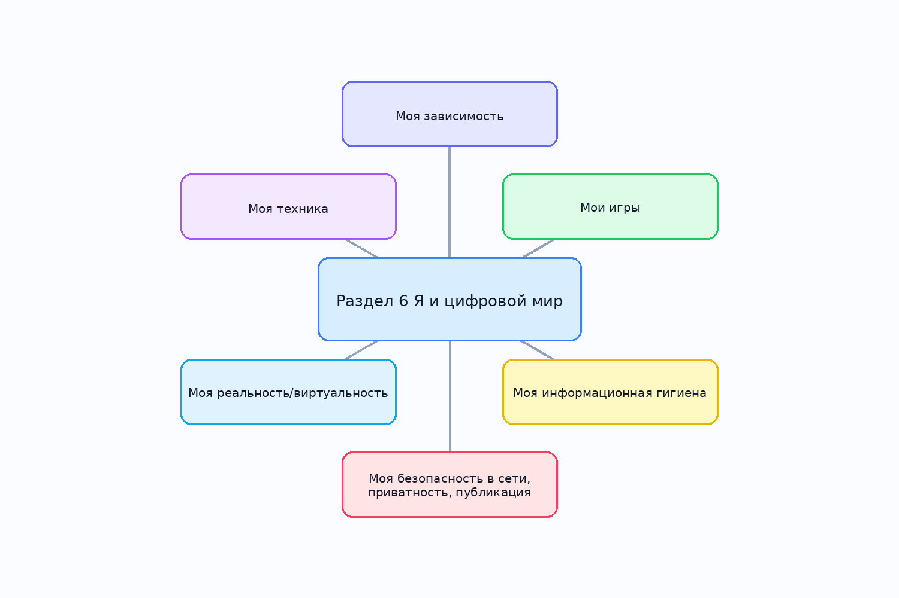

# Раздел 6. Я и цифровой мир

## 1. Кто работал над разделом

| Участник | Роль | Что делал | Статус |
|---|---|---|---|
| [Имя 1] | [капитан / аналитик / редактор / разработчик / визуализатор] | [кратко описать вклад] | [заполнить] |
| [Имя 2] | [роль] | [кратко описать вклад] | [заполнить] |
| [Имя 3] | [роль] | [кратко описать вклад] | [заполнить] |
| [Имя 4] | [роль] | [кратко описать вклад] | [заполнить] |
| [Имя 5] | [роль] | [кратко описать вклад] | [заполнить] |

## 2. Что входит в раздел

- `moya_zavisimost` — **Моя зависимость**: Тема о внимании, экранном времени, привычках и цифровой перегрузке.
- `moi_igry` — **Мои игры**: Тема об играх как хобби, развлечении, спорте и среде общения.
- `moya_informacionnaya_gigiena` — **Моя информационная гигиена**: Тема о фейках, источниках, алгоритмах рекомендаций и медиаграмотности.
- `moya_bezopasnost_v_seti` — **Моя безопасность в сети, приватность, публикация**: Тема о личных данных, приватности, цифровом следе и безопасном поведении онлайн.
- `moya_realnost_i_virtualnost` — **Моя реальность/виртуальность**: Тема об онлайн- и офлайн-жизни, самопрезентации и FOMO.
- `moya_tehnika` — **Моя техника**: Тема о выборе устройств, уходе за техникой, ремонте и апгрейде.

## 3. Общая логика раздела

Раздел **«Раздел 6. Я и цифровой мир»** собирает вместе несколько линий: внимание и привычки, игры, информационную гигиену, безопасность, самопрезентацию и технику. Идея раздела в том, чтобы показать ребёнку не только отдельные факты, но и связи между ними: как устройство влияет на поведение, как поведение влияет на безопасность, а безопасность — на репутацию, доверие и качество общения.

## 4. Схема связей между темами

Ключевые пересечения:
- тема зависимости связана с информационной гигиеной через внимание и уведомления;
- тема игр пересекается с техникой и безопасностью;
- тема реальности/виртуальности связана с публикациями, цифровым следом и FOMO;
- тема техники поддерживает весь раздел как материальная основа цифровой среды.

## 5. Как устроен репозиторий

- `WORK/ya_i_cifrovoy_mir/README.md` — общий шаблон отчёта по разделу;
- `WORK/ya_i_cifrovoy_mir/concepts.json` — общий список тем, статей и связей;
- `WORK/ya_i_cifrovoy_mir/scripts/insert_crosslinks.py` — скрипт для простановки перекрёстных ссылок;
- `WORK/ya_i_cifrovoy_mir/scripts/validate_repo.py` — проверка структуры репозитория;
- `WORK/ya_i_cifrovoy_mir/<topic>/...` — рабочие материалы по каждой теме;
- `WEB/ya_i_cifrovoy_mir/<topic>/concepts/*.md` — markdown-страницы энциклопедии.

## 6. Процесс работы

1. Выделили 6 подтем внутри раздела.
2. Для каждой подтемы собрали статьи, ключевые понятия и связи.
3. Подготовили черновые markdown-страницы.
4. Составили SPARQL-запросы к WikiData и DBpedia.
5. Добавили шаблоны под реальные выгрузки данных и общую проверку структуры.

## 7. Какие инструменты планируется использовать

- WikiData
- DBpedia
- SPARQL
- Python
- Markdown
- генеративная модель для черновиков статей
- Git / Pull Request

## 8. Что ещё нужно доделать

- [ ] Заполнить участников и роли
- [ ] Прогнать реальные запросы и обновить `data/`
- [ ] При желании уточнить онтологию после обсуждения в команде
- [ ] Вычитать тексты под единый стиль
- [ ] Перед сдачей проверить структуру через `validate_repo.py`

## 9. Личные ощущения от работы

> Здесь можно оставить короткие впечатления команды:
>
> - [Имя]: ...
> - [Имя]: ...
> - [Имя]: ...
