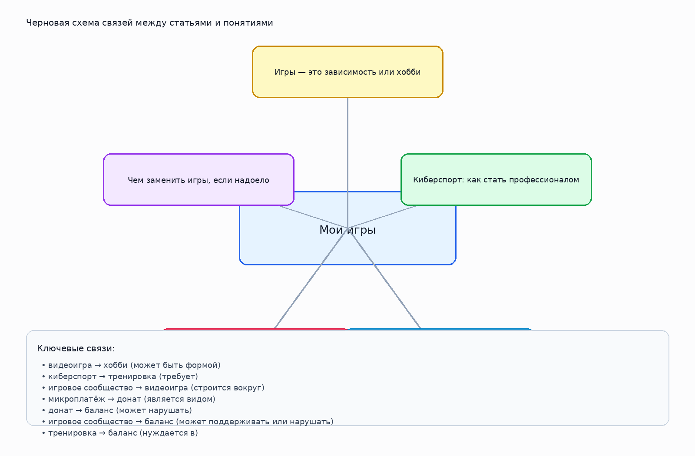

# Мои игры

## 1. Кто работал над темой
Соколов Кирилл Алексеевич М8О-103СВ-25

## 2. О чём эта тема

Тема об играх как хобби, развлечении, спорте и среде общения.

Ключевые слова: игры, киберспорт, донаты, сообщества, хобби

## 3. Какие статьи входят в тему

- `igry_hobbi_ili_zavisimost.md` — Игры — это зависимость или хобби
- `kibersport_kak_stat_professionalom.md` — Киберспорт: как стать профессионалом
- `igrovye_soobshchestva.md` — Игровые сообщества: друзья на всю жизнь
- `donaty_i_mikroplatezhi.md` — Донаты и микроплатежи — стоит ли тратить
- `chem_zamenit_igry_esli_nadoelo.md` — Чем заменить игры, если надоело

## 4. Схема связей внутри темы

Текстовое описание:
- **видеоигра** → **хобби** (может быть формой)
- **киберспорт** → **тренировка** (требует)
- **игровое сообщество** → **видеоигра** (строится вокруг)
- **микроплатёж** → **донат** (является видом)
- **донат** → **баланс** (может нарушать)
- **игровое сообщество** → **баланс** (может поддерживать или нарушать)
- **тренировка** → **баланс** (нуждается в)

## 5. Как эта тема связана с другими темами раздела

- Связана с блоком про привычки и внимание, если речь идёт о поведении человека в цифровой среде.
- Связана с блоком про безопасность, если тема затрагивает риски, личные данные и публикации.
- Связана с блоком про технику, если поведение зависит от устройств, приложений и настроек.

## 6. Примеры SPARQL-запросов

Файл с запросами: `scripts/sparql_queries.py`

В нём есть:
- запрос для поиска сущностей по меткам;
- запрос для построения локального графа по выбранным понятиям;
- запрос на поиск связанных сущностей через `instance of` / `subclass of`;

## 7. Где лежат рабочие материалы

- `concepts.json` — финализированный список статей, понятий и связей темы;
- `images/ontology.png` — схема темы;
- `scripts/sparql_queries.py` — набор SPARQL-запросов;
- `data/wikidata_export.json` — честный шаблон под будущую реальную выгрузку;

## 8. Процесс работы

1. Выделили список статей внутри темы.
2. Собрали базовые понятия и связи между ними.
3. Подготовили тексты страниц для `WEB/.../concepts/`.
4. Составили и запустили черновые запросы к WikiData.
5. Подготовили место под реальные выгрузки и визуальную схему.

## 9. Личные ощущения от работы

Работать над этой темой было интересно, потому что она близкая и понятная. Сначала игры кажутся просто развлечением, но по ходу стало видно, что вокруг них много разных вещей: общение, привычки, траты, соревнование, отдых и даже вопросы баланса.

Мне понравилось, что тему удалось разложить на связанные между собой понятия. Из-за этого вся работа стала выглядеть более цельной и понятной.

В итоге появилось ощущение, что даже такую обычную тему, как игры, можно рассмотреть глубже, если собрать связи, структуру и основные смыслы в одном месте.
