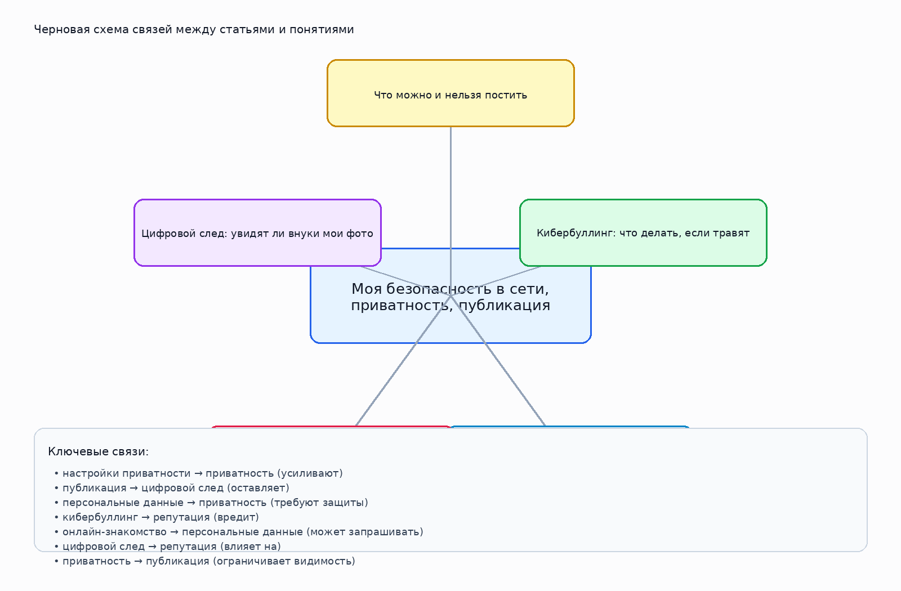

# Моя безопасность в сети, приватность, публикация

## 1. Кто работал над темой

Бережной Владимир Александрович М8О-103СВ-25

## 2. О чём эта тема

Тема о личных данных, приватности, цифровом следе и безопасном поведении онлайн.

Ключевые слова: приватность, кибербуллинг, посты, след, знакомства

## 3. Какие статьи входят в тему

- `chto_mozhno_i_nelzya_postit.md` — Что можно и нельзя постить
- `kiberbulling.md` — Кибербуллинг: что делать, если травят
- `opasnye_znakomstva_v_seti.md` — Опасные знакомства в сети
- `nastroyki_privatnosti.md` — Настройки приватности: как защититься
- `cifrovoi_sled.md` — Цифровой след: увидят ли внуки мои фото

## 4. Схема связей внутри темы

Текстовое описание:
- **настройки приватности** → **приватность** (усиливают)
- **публикация** → **цифровой след** (оставляет)
- **персональные данные** → **приватность** (требуют защиты)
- **кибербуллинг** → **репутация** (вредит)
- **онлайн-знакомство** → **персональные данные** (может запрашивать)
- **цифровой след** → **репутация** (влияет на)
- **приватность** → **публикация** (ограничивает видимость)

## 5. Как эта тема связана с другими темами раздела

- Связана с блоком про привычки и внимание, если речь идёт о поведении человека в цифровой среде.
- Связана с блоком про безопасность, если тема затрагивает риски, личные данные и публикации.
- Связана с блоком про технику, если поведение зависит от устройств, приложений и настроек.

## 6. Примеры SPARQL-запросов

Файл с запросами: `scripts/sparql_queries.py`

В нём есть:
- запрос для поиска сущностей по меткам;
- запрос для построения локального графа по выбранным понятиям;
- запрос на поиск связанных сущностей через `instance of` / `subclass of`;

## 7. Где лежат рабочие материалы

- `concepts.json` — финализированный список статей, понятий и связей темы;
- `images/ontology.png` — схема темы;
- `scripts/sparql_queries.py` — набор SPARQL-запросов;
- `data/wikidata_export.json` — честный шаблон под будущую реальную выгрузку;

## 8. Процесс работы

1. Выделили список статей внутри темы.
2. Собрали базовые понятия и связи между ними.
3. Подготовили тексты страниц для `WEB/.../concepts/`.
4. Составили и запустили черновые запросы к WikiData.
5. Подготовили место под реальные выгрузки и визуальную схему.

## 9. Личные ощущения от работы

Работать над этой темой было полезно, потому что она напрямую связана с обычной жизнью в интернете. По ходу стало понятно, что приватность, публикации, знакомства в сети и цифровой след - это части одной общей темы.

Особенно заметно стало, что многие привычные действия в интернете могут влиять на безопасность и репутацию сильнее, чем кажется сначала. Из-за этого тема воспринимается не как что-то действительно важное.

В целом работа помогла лучше увидеть связи между личными данными, поведением в сети и возможными рисками и тема стала ощущаться более понятной и цельной.