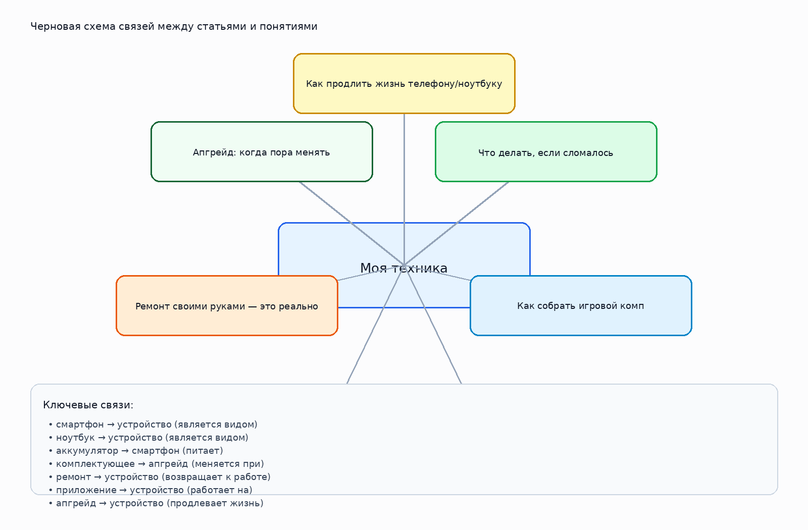

# Моя техника

> Шаблон README для рабочей папки темы. Блок с участниками и личными впечатлениями можно заполнить вручную.

## 1. Кто работал над темой

| Участник | Роль | Что делал | Статус |
|---|---|---|---|
| [Имя 1] | [капитан / аналитик / редактор / разработчик / визуализатор] | [кратко описать вклад] | [заполнить] |
| [Имя 2] | [роль] | [кратко описать вклад] | [заполнить] |
| [Имя 3] | [роль] | [кратко описать вклад] | [заполнить] |
| [Имя 4] | [роль] | [кратко описать вклад] | [заполнить] |
| [Имя 5] | [роль] | [кратко описать вклад] | [заполнить] |

## 2. О чём эта тема

Тема о выборе устройств, уходе за техникой, ремонте и апгрейде.

Ключевые слова: смартфон, ноутбук, ремонт, апгрейд, приложения

## 3. Какие статьи входят в тему

- `kak_prodlit_zhizn_telefonu_i_noutbuku.md` — Как продлить жизнь телефону/ноутбуку
- `chto_delat_esli_slomalos.md` — Что делать, если сломалось
- `kak_sobrat_igrovoy_komp.md` — Как собрать игровой комп
- `kakaya_tekhnika_nuzhna_v_tvoey_oblasti_interesov.md` — Какая техника нужна в твоей области интересов
- `poleznye_prilozheniya_ne_tolko_igry.md` — Полезные приложения (не только игры)
- `remont_svoimi_rukami.md` — Ремонт своими руками — это реально
- `apgreyd_kogda_pora_menyat.md` — Апгрейд: когда пора менять

## 4. Схема связей внутри темы

Текстовое описание:
- **смартфон** → **устройство** (является видом)
- **ноутбук** → **устройство** (является видом)
- **аккумулятор** → **смартфон** (питает)
- **комплектующее** → **апгрейд** (меняется при)
- **ремонт** → **устройство** (возвращает к работе)
- **приложение** → **устройство** (работает на)
- **апгрейд** → **устройство** (продлевает жизнь)

## 5. Как эта тема связана с другими темами раздела

- Связана с блоком про привычки и внимание, если речь идёт о поведении человека в цифровой среде.
- Связана с блоком про безопасность, если тема затрагивает риски, личные данные и публикации.
- Связана с блоком про технику, если поведение зависит от устройств, приложений и настроек.

## 6. Примеры SPARQL-запросов

Файл с запросами: `scripts/sparql_queries.py`

В нём есть:
- запрос для поиска сущностей по меткам;
- запрос для построения локального графа по выбранным понятиям;
- запрос на поиск связанных сущностей через `instance of` / `subclass of`;
- пример запроса к DBpedia.

## 7. Где лежат рабочие материалы

- `concepts.json` — финализированный список статей, понятий и связей темы;
- `images/ontology.png` — схема темы;
- `scripts/sparql_queries.py` — набор SPARQL-запросов;
- `data/wikidata_export.json` — честный шаблон под будущую реальную выгрузку;
- `data/dbpedia_export.json` — шаблон под дополнительную выгрузку из DBpedia.

## 8. Процесс работы

1. Выделили список статей внутри темы.
2. Собрали базовые понятия и связи между ними.
3. Подготовили тексты страниц для `WEB/.../concepts/`.
4. Составили черновые запросы к WikiData и DBpedia.
5. Подготовили место под реальные выгрузки и визуальную схему.

## 9. Что ещё можно улучшить

- [ ] Заменить шаблонные выгрузки реальными результатами запросов
- [ ] При необходимости уточнить названия понятий в WikiData
- [ ] Добавить больше ссылок, иллюстраций и примеров в статьи
- [ ] Согласовать стиль всех текстов внутри раздела

## 10. Личные ощущения от работы

> Заполнить позже:
>
> - [Имя]: ...
> - [Имя]: ...
> - [Имя]: ...
