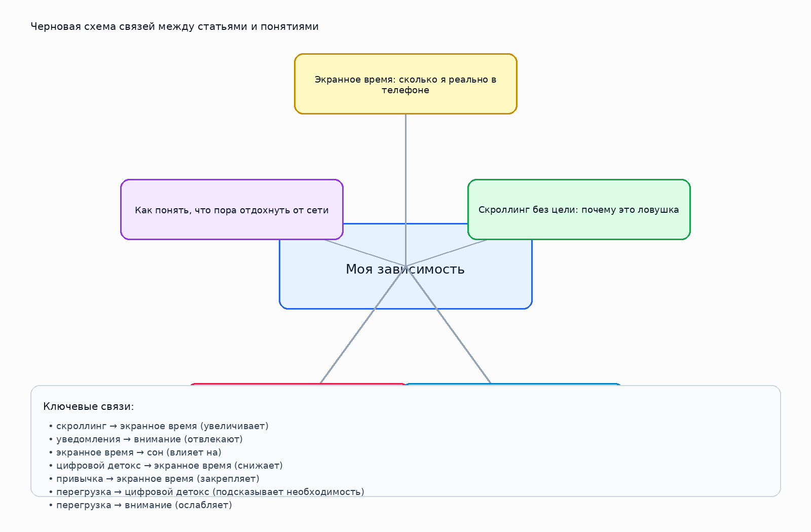

# Моя зависимость

## 1. Кто работал над темой

Лопаткин Дмитрий Кириллович М8О-103СВ-25

## 2. О чём эта тема

Тема о внимании, экранном времени, привычках и цифровой перегрузке.

Ключевые слова: экранное время, скроллинг, уведомления, сон, цифровой детокс

## 3. Какие статьи входят в тему

- `ekrannoe_vremya.md` — Экранное время: сколько я реально в телефоне
- `skrolling_i_dofamin.md` — Скроллинг без цели: почему это ловушка
- `telefon_pered_snom.md` — Телефон перед сном: что происходит с мозгом
- `cifrovoi_detoks.md` — Цифровой детокс — это пытка или кайф
- `priznaki_peregruza_ot_seti.md` — Как понять, что пора отдохнуть от сети

## 4. Схема связей внутри темы

Текстовое описание:
- **скроллинг** → **экранное время** (увеличивает)
- **уведомления** → **внимание** (отвлекают)
- **экранное время** → **сон** (влияет на)
- **цифровой детокс** → **экранное время** (снижает)
- **привычка** → **экранное время** (закрепляет)
- **перегрузка** → **цифровой детокс** (подсказывает необходимость)
- **перегрузка** → **внимание** (ослабляет)

## 5. Как эта тема связана с другими темами раздела

- Связана с блоком про привычки и внимание, если речь идёт о поведении человека в цифровой среде.
- Связана с блоком про безопасность, если тема затрагивает риски, личные данные и публикации.
- Связана с блоком про технику, если поведение зависит от устройств, приложений и настроек.

## 6. Примеры SPARQL-запросов

Файл с запросами: `scripts/sparql_queries.py`

В нём есть:
- запрос для поиска сущностей по меткам;
- запрос для построения локального графа по выбранным понятиям;
- запрос на поиск связанных сущностей через `instance of` / `subclass of`;

## 7. Где лежат рабочие материалы

- `concepts.json` — финализированный список статей, понятий и связей темы;
- `images/ontology.png` — схема темы;
- `scripts/sparql_queries.py` — набор SPARQL-запросов;
- `data/wikidata_export.json` — честный шаблон под будущую реальную выгрузку;

## 8. Процесс работы

1. Выделили список статей внутри темы.
2. Собрали базовые понятия и связи между ними.
3. Подготовили тексты страниц для `WEB/.../concepts/`.
4. Составили и запустили черновые запросы к WikiData.
5. Подготовили место под реальные выгрузки и визуальную схему.

## 9. Личные ощущения от работы

Работа над этой темой заставила по-другому посмотреть на обычные привычки, которые часто кажутся безобидными. Пока разбирали материал, стало заметно, как экранное время, уведомления, сон и постоянный скроллинг связаны между собой.

Было полезно увидеть, что цифровая перегрузка появляется не резко, а складывается из мелких ежедневных действий, на которые обычно не обращаешь внимания.

В итоге осталось ощущение, что эта тема важная, потому что она касается почти каждого и помогает чуть внимательнее относиться к своим привычкам.